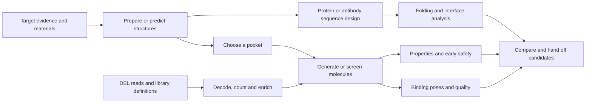
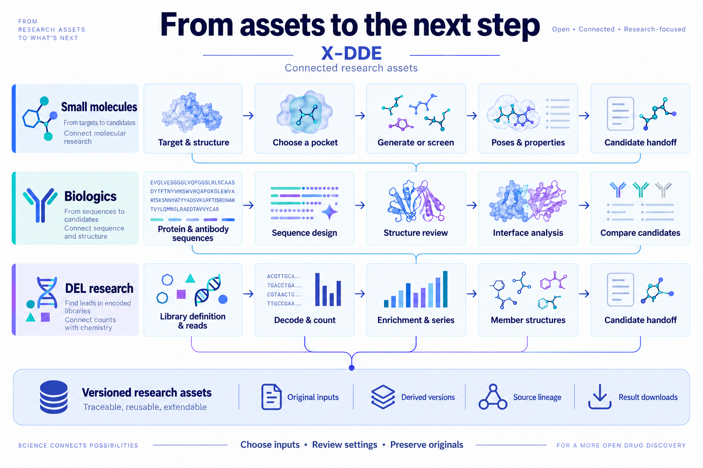

# X-DDE

[中文](README.md) · **English**

Use the links above to switch between the complete Chinese and English overviews. Both versions show actual software pages captured in the **English interface**.

**A visual research platform for early drug discovery.**

Connect scientific tools, models and research files into usable research workflows. Start with targets, structures and pockets; explore small molecules, biologics, high-throughput screening and DNA-encoded libraries. Prepare tasks, inspect results, revise materials and continue the next step in one workspace.

[Get started](#get-started) · [Actual interface](#what-the-interface-looks-like) · [Research capabilities](#what-you-can-do) · [Architecture](#how-the-architecture-works) · [Latest release](https://github.com/Victor-Xu-1/X-DDE/releases) · [Apache-2.0](LICENSE)

## Why X-DDE

Drug discovery already has many excellent open-source tools. The friction often lies between them: difficult environments, different parameters and file formats, and outputs that are hard to pass to the next tool. Researchers also need to distinguish an experimental reference, a model prediction and an input template that has not been executed.

X-DDE brings these handoffs into the platform. Medicinal chemists and biologics researchers work around research questions, while computational experts retain control over methods, settings and interpretation.

| Common research problem                                             | How X-DDE addresses it                                                                  | What changes for researchers                                                            |
| ------------------------------------------------------------------- | --------------------------------------------------------------------------------------- | --------------------------------------------------------------------------------------- |
| Separate installations and conflicting dependencies, models or data | Components organized by research use; isolated scientific environments                  | One place to choose storage, inspect readiness and maintain components                  |
| Dozens of parameters before the purpose is clear                    | One visible step at a time, recommended choices, explanations and expert controls       | Answer the research question before reviewing the settings that matter                  |
| Repeatedly moving structures, molecules and sequences between tools | Shared research assets, explicit input versions and direct handoffs                     | Use pockets for generation; pass molecules into properties and docking                  |
| Results presented as files, numbers or technical logs               | Linked candidate tables, 2D / 3D structures, sequences and analysis charts              | Select a candidate, inspect its structure, adjust the view and download results         |
| Original materials and result origins become difficult to track     | Preserve source files, derived versions and task relationships                          | Revise, compare, return to originals and continue the research                          |
| Toy examples or demonstration jobs clutter personal history         | Public research templates inside each task, with computed outcomes presented separately | Learn inputs and result interpretation from real cases, then submit a new personal task |

## What you can do

The current catalogue has **73 task entries**, organized by research workflow. Drug-modality filters overlap: biologics, chemical drugs, antibodies, proteins, peptides, small molecules, RNA and DNA. Execution depends on the selected scientific environment, model resources, input and hardware.

| Research area                   | Supported work                                                                                                                                  | Outputs or next steps                                                                       |
| ------------------------------- | ----------------------------------------------------------------------------------------------------------------------------------------------- | ------------------------------------------------------------------------------------------- |
| **Target research**             | Disease associations, target evidence, canonical sequences, public structures and measured-activity records                                     | Source-linked research materials for structure and candidate work                           |
| **Structure prediction**        | Protein and complex prediction, structure preparation, receptor alignment and comparison                                                        | Structures, native confidence, alignment results and downloadable files                     |
| **Pockets and binding modes**   | Pocket discovery, docking and rescoring, receptor/state exploration, interactions and pose quality                                              | Candidate sites, multiple poses, native scores and contact analysis                         |
| **Small-molecule design**       | Pocket-conditioned generation, analogues and local design, chemical states and unbound conformers                                               | New molecules or derived versions for properties, docking or screening                      |
| **Biologics research**          | Antibody numbering and CDRs, framework proposals, protein/peptide design, sequence scoring, folding and interface review                        | Sequences, CDR positions, structural candidates and interface results                       |
| **Induced proximity**           | Ternary assembly hypotheses and related structural exploration of degraders and bifunctional molecules                                          | Candidate assemblies and traceable structural hypotheses                                    |
| **High-throughput screening**   | Supplier-file import, library preparation, reusable sharded indexes, pocket-conditioned retrieval, diversity selection and shortlisted docking  | Candidates retaining library/supplier identifiers and actual poses                          |
| **DEL research**                | Library definitions, member structures, read decoding, UMI/counts, enrichment and controls, building-block series, research models and handoffs | Counts, enrichment evidence, series charts, candidate structures and experimental follow-up |
| **Properties and early safety** | Descriptors, 41 model endpoints, structural alerts, scaffold representatives and models from experimental data                                  | Molecular tables, native units, selected candidates and reusable molecules                  |

RNA / DNA support currently focuses on structural inputs, complex prediction and relevant feature preparation; it is not a general nucleic-acid drug-design system. Synthesis routes, retrosynthesis and wet-lab automation are outside the current scope.

### Connect individual calculations into research paths

These are connected research paths. Each handoff selects actual materials and versions; the researcher reviews the plan before running the corresponding task.

## What the interface looks like

The images below are **actual English-language pages from the running v0.4.53 software**, using public research inputs and retained native results. Structures, tables, molecules and values come directly from the application. No screenshot text has been repainted or translated in the image. Architecture illustrations are separate explanatory visuals.

### 1. Prepare tasks like a questionnaire

Choose a purpose → provide materials → select settings → review and submit → inspect results. Only the current step is visible, with Next at the lower right. Guided mode offers recommended choices; expert mode exposes scientific settings. New tasks start with new materials, and **Historical files** is an explicit choice.

**Use this template** fills real research inputs; **Example results** displays retained outputs inside the module. Loading a template does not start computation or add demonstration jobs to personal task history.

### 2. Inspect structures alongside candidate tables

Select a table row to inspect its actual structure, chains, ligand, pocket and confidence. Rotate, zoom, select atoms/residues, adjust display, inspect surfaces and download views. Original scientific files remain separately downloadable.

This is a model result from the public BRD4–JQ1 case. Model confidence is not measured binding activity. Geometric distances are not automatically hydrogen bonds, interaction energies or affinity.

### 3. Read properties and screening results through molecular structures

2D structures, candidate metrics and 3D molecules are linked. Properties retain original endpoints and units. Screening retains library identifiers and retrieval scores; shortlisted candidates can continue into independent docking.

The screening case uses 177 public research molecules. The displayed 3D structure is an unbound conformer, not a predicted binding pose or a supplier-wide/billion-scale performance benchmark.

### 4. Make DEL and biologics materials readable

DEL results retain member structures, target/control counts, enrichment intervals and replicate information. Antibody templates provide actual variable-domain sequences, adjustable CDR positions and reference-structure inspection. **Setup example** opens these prepared materials without starting a design run.

The antibody image shows a validated **input template**, without a new design run. Experimental reference structures, supplied materials and newly generated model outputs retain distinct identities.

## How the architecture works

**X-DDE owns the frontend and platform backend. Scientific software such as OpenDDE, Boltz-2, DiffSBDD and GNINA runs in independent integrated environments.**

The platform manages projects, tasks, workflows, research assets, environment deployment and result presentation. Each tool connects through an explicit adapter and retains its native methods, models, dependencies and license. The absence of one engine does not define the availability of the whole platform.

| Layer                                   | Responsibilities                                                                          | Purpose                                                              |
| --------------------------------------- | ----------------------------------------------------------------------------------------- | -------------------------------------------------------------------- |
| **Research workspace**                  | Guided tasks, method selection, 2D / 3D / sequence inspection, comparisons and downloads  | Let researchers work with research questions and visible results     |
| **X-DDE platform backend**              | Validated APIs, tasks/workflows, asset versions, deployment and result ownership          | Give multiple tools one task and data authority                      |
| **Execution and deployment adapters**   | Validate native inputs, invoke real programs, prepare isolated environments and resources | Distinguish installation from valid completed computation            |
| **Independent scientific environments** | Each tool's scientific programs, models, dependencies and native execution                | Isolate dependencies and support suitable alternatives within a task |
| **Assets and lineage**                  | Source materials, derived versions, input/output relationships and history                | Reuse exact materials, retain originals and trace changes            |

The execution path is **task form → X-DDE API → one persistent task queue and backend router → native program → platform assets and results**. Installation uses deployment adapters; scientific work uses execution adapters. The platform does not copy a competing workbench or scientific-agent loop.

### Revise assets and continue the next step

| Existing material or result                                     | Possible next step                                                    |
| --------------------------------------------------------------- | --------------------------------------------------------------------- |
| Canonical sequences, public structures or predicted models      | Structure preparation, pockets, protein design and interface analysis |
| Confirmed receptors and pockets                                 | Pocket-conditioned generation, fast screening and bounded docking     |
| New molecules, library candidates or derived molecular versions | Properties, chemical states/conformers, docking and pose quality      |
| Protein or antibody candidate sequences                         | Folding, sequence scoring, interface comparison and further design    |
| DEL enriched members and building-block series                  | Structural handoff, properties/docking and experimental follow-up     |

Edits create derived versions while source files remain available. Distances, confidence, docking scores and experimental activity are interpreted with their own meanings and units.

Large libraries use streaming preparation, sharded indexes and bounded candidate retrieval. The frontend reads results by page to control memory use. Pocket-conditioned retrieval precedes slower pose computation on shortlisted candidates. See [screening and DEL methods, scale and licensing](docs/design/screening-and-del.md).

## Get started

Download `install.ps1` for Windows or `install.sh` for Linux / WSL from [GitHub Releases](https://github.com/Victor-Xu-1/X-DDE/releases). Release packages contain the built frontend; users do not need Node.js or a frontend build.

| System             | Install                                                             | Start            |
| ------------------ | ------------------------------------------------------------------- | ---------------- |
| Windows PowerShell | `powershell -NoProfile -ExecutionPolicy Bypass -File .\install.ps1` | `X-DDE UI`       |
| Linux / WSL        | `bash install.sh`, then follow the command-path instructions        | `xdde dashboard` |

Use `xdde stop` to stop, `xdde status` to inspect status, and `xdde restart` to restart. Windows commands and startup arguments support case compatibility. Historical OpenDDE commands remain launcher aliases.

Open **Settings and help → Installation and runtime**. Choose one installation directory and prepare components by research use. Environments remain independent. Installed components show Installed; maintenance contains repair, upgrade and uninstall. Large models and databases are selected as needed.

The default Windows entry is `E:\WSL\apps\x-dde`. Linux environments, models and data follow the selected WSL storage and component directories; an E: launcher directory does not migrate an existing system disk. See the [user guide](docs/user-guide.md) for detailed installation, existing-environment connections, server access and recovery.

## Current scope and scientific use

- **Implemented interfaces/adapters**, **machine installation**, **native execution checks** and **scientific conclusions** are distinct. The 73 entries do not mean every machine already has all required resources.
- Public cases include BRD4–JQ1, trastuzumab–HER2, ABL inhibitors, MZ1 ternary assemblies, RNA–TPP and public DEL research. Calculated cases retain native outputs; input-only examples are explicitly templates. See [case provenance and identities](docs/design/research-examples.md).
- Supplier access uses official public downloads and legitimately obtained files. Catalogue entries are not possession of every commercial library, live inventory or procurement authorization. See [verified resources and coverage](docs/design/supplier-structure-files.md).
- Models, weights, third-party data and outputs can have independent restrictions, including noncommercial research terms. X-DDE's code license does not replace them.
- The current application is a single-user workbench with loopback access. Use controlled access or an SSH tunnel on servers rather than exposing it publicly without authentication.

GPU inference, server throughput, scientific accuracy and experimental conclusions need evidence from their actual environments. Screenshots do not establish those conclusions. See [server acceptance](docs/server-acceptance.md) and [independent scientific environments](docs/scientific-upgrade.md).

## Documentation

| Question                                                         | Document                                                     |
| ---------------------------------------------------------------- | ------------------------------------------------------------ |
| Installation, startup, existing environments and recovery        | [User guide](docs/user-guide.md)                             |
| Molecular dynamics, FEP and linked previews                      | [Simulation and free-energy guide](docs/simulations.md)      |
| Platform responsibilities, supported tools and native interfaces | [Architecture and capability mapping](docs/design/README.md) |
| Fast screening, supplier libraries and DEL                       | [Screening and DEL](docs/design/screening-and-del.md)        |
| Ternary complexes and bifunctional molecules                     | [Induced proximity](docs/design/proximity-design.md)         |
| Real templates, public sources and native results                | [Research cases](docs/design/research-examples.md)           |
| Native execution, hardware and scientific acceptance             | [Server acceptance](docs/server-acceptance.md)               |
| Development, focused verification and publication numbering      | [Development and release](docs/development.md)               |

This overview is available in full in both languages. Some detailed technical documents linked above currently use Chinese or mixed bilingual text.

## License and provenance

Original X-DDE code is [Apache-2.0](LICENSE), with attribution in [NOTICE](NOTICE). Integrated software, models, weights and data retain their own licenses. Historical MIT releases retain the terms distributed with those releases. The repository does not include private research data, model-service secrets or upstream large model weights.

Architecture images are explanatory illustrations. Actual interface captures retain their displayed scientific content. See [image provenance](docs/images/README.md).
