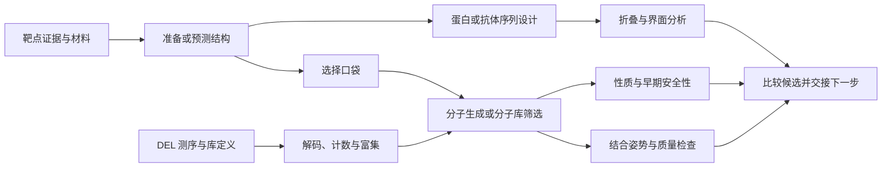
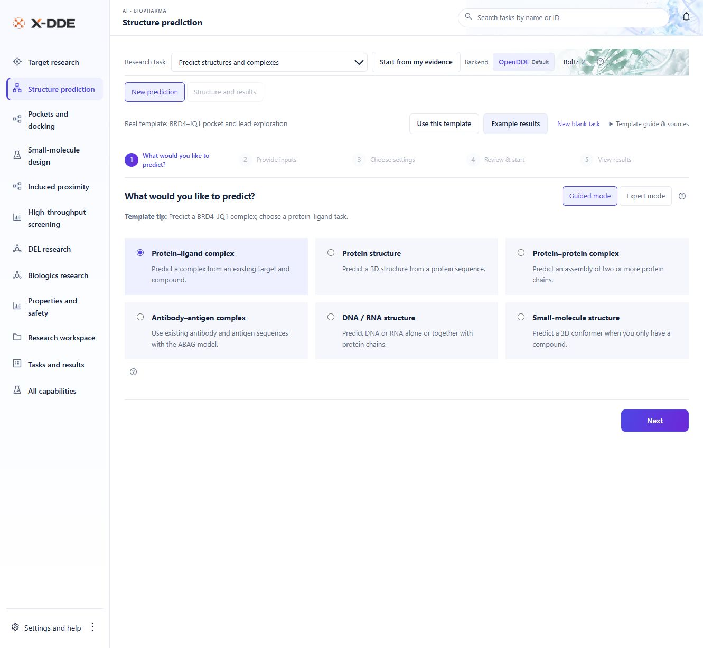
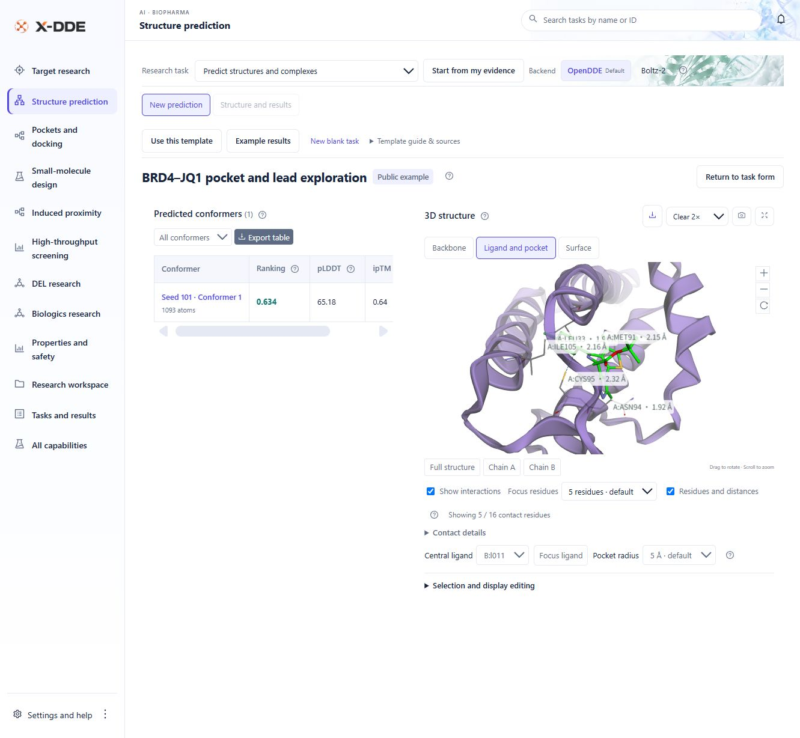
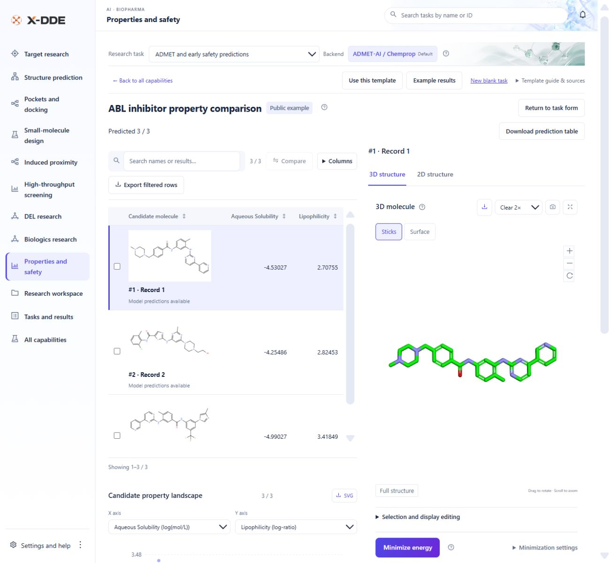
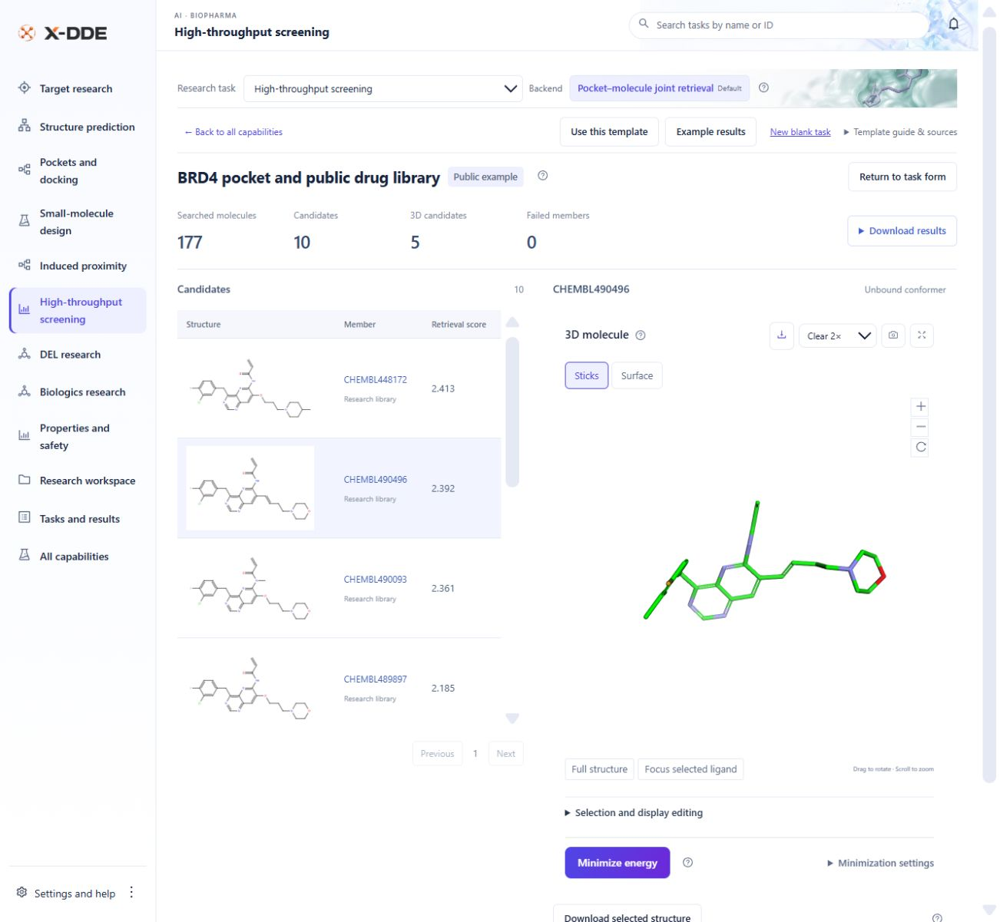
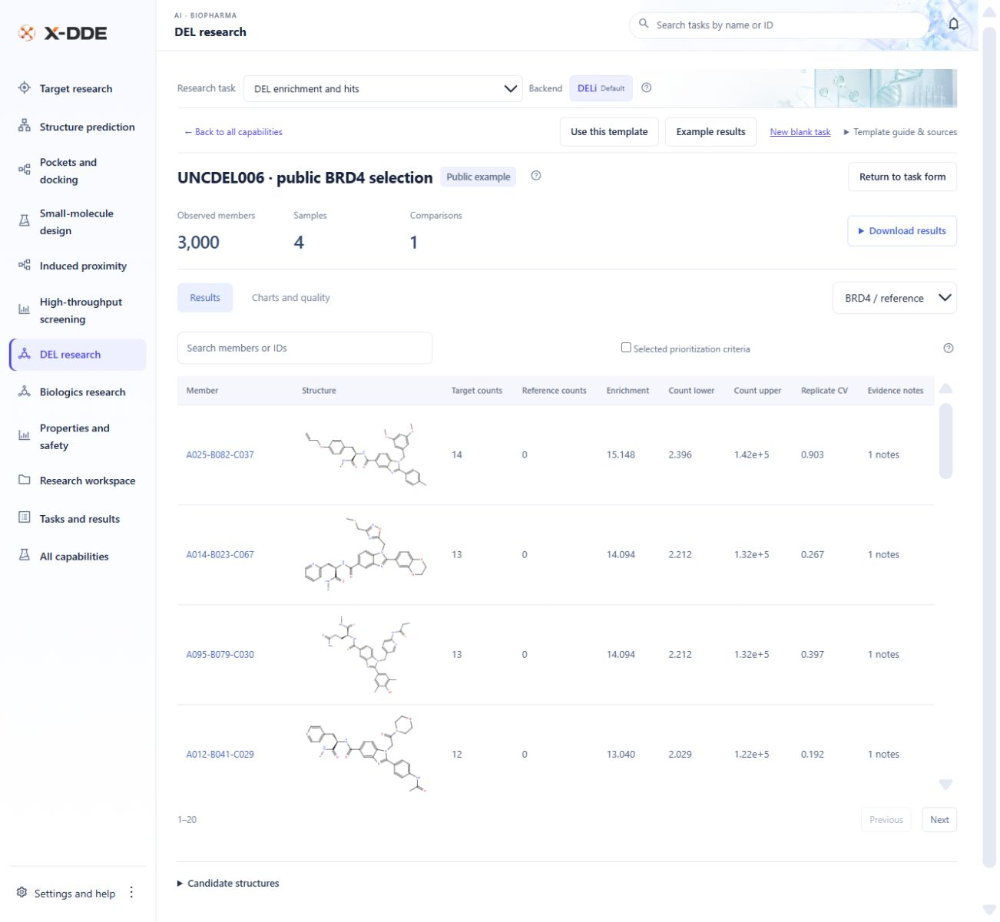
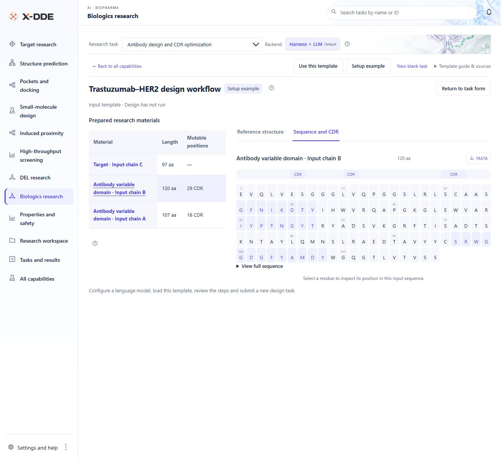
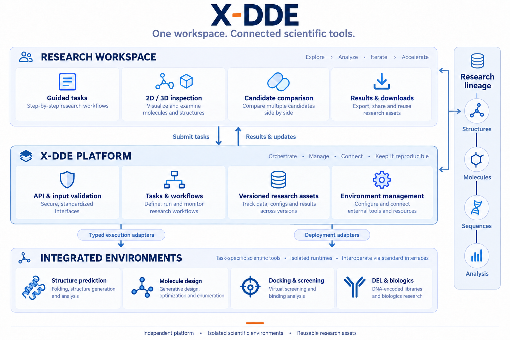
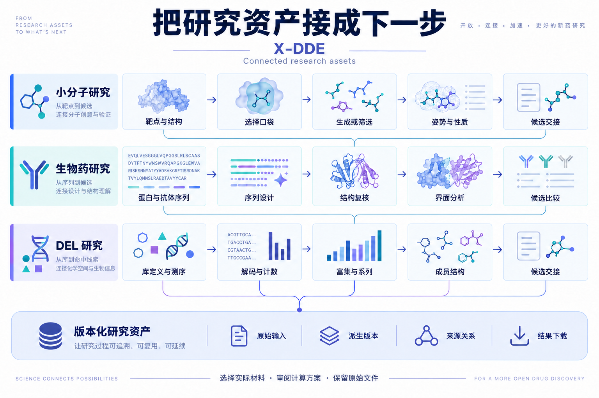
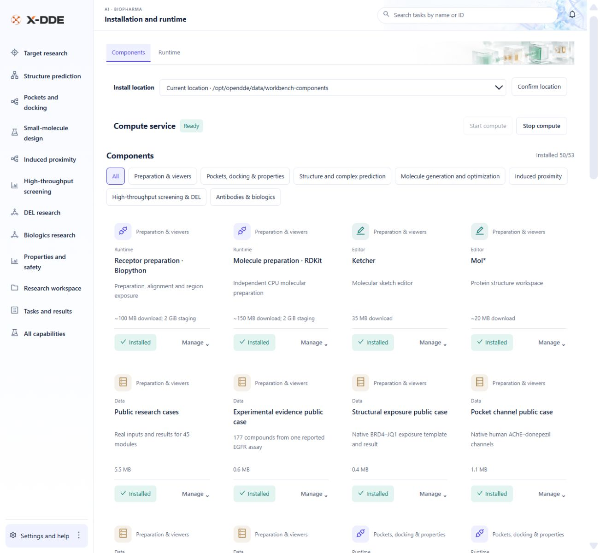

# X-DDE

**中文** · [English](README.en.md)

**面向早期药物发现的可视化研究平台。**

把分散的科学软件、模型和研究文件，组织成可以衔接的研究流程。从靶点、结构和口袋开始，开展小分子、生物药、高通量筛选与 DEL 研究；在同一工作台中准备任务、检查结果、修改材料并继续下一步。

[安装与使用](#快速开始) · [实际页面](#操作页面是什么样) · [研究能力](#能完成哪些工作) · [平台架构](#架构如何设计) · [最新发行版](https://github.com/Victor-Xu-1/X-DDE/releases) · [Apache-2.0](LICENSE)

## 为什么需要 X-DDE

药物发现已经有很多优秀的开源工具。困难往往出现在工具之间：环境难安装，参数和文件格式各不相同，一个任务的结果很难直接交给下一个任务。研究人员还需要判断，眼前看到的是原始实验结构、模型预测，还是仅供启动的输入模板。

X-DDE 把这些交接工作放到平台中，让药化和生物药研究人员围绕研究问题操作，同时让计算专家保留对方法、参数和结果的控制。

| 研究中常见的问题 | X-DDE 的处理方式 | 给研究人员带来的变化 |
| --- | --- | --- |
| 工具各自安装，依赖、模型和数据容易混在一起 | 按研究用途管理组件，科学环境独立安装 | 在一个地方选择安装位置、查看就绪状态和维护组件 |
| 界面一上来就是几十个参数 | 一页一步、推荐方案、选项说明与专家微调 | 先回答研究问题，再确认真正需要的参数 |
| 结构、分子和序列在软件间反复搬运 | 统一研究资产、明确输入版本、直接交接下一项任务 | 口袋可以用于生成，分子可以用于性质预测和对接 |
| 结果只有文件、数字或难读的日志 | 候选表格与二维、三维、序列及分析图联动 | 点击候选查看结构，调整视图，下载结果 |
| 修改后找不到原始材料，也不知道结果从哪里来 | 保留原始文件、派生版本与任务来源关系 | 可以修改、比较、回到原始版本并继续研究 |
| 示例太简单，或者演示任务挤进个人任务列表 | 每个任务提供模块内的公开研究模板；已有计算单独展示 | 用真实案例学习输入方式和结果阅读，再提交自己的新任务 |

## 能完成哪些工作

当前任务目录提供 **71 个任务入口**，按研究流程组织，也支持生物药、化药、抗体、蛋白、肽、小分子、RNA 和 DNA 等重叠分类。具体执行能力由所选科学环境、模型资源、输入和硬件决定。

| 研究方向 | 可以开展的工作 | 主要输出或下一步 |
| --- | --- | --- |
| **靶点研究** | 疾病关联与靶点证据查询、获取规范序列、公开结构和已有活性材料 | 有来源的研究材料，交给结构与候选研究 |
| **结构预测** | 蛋白与复合物预测、已有结构准备、受体构象对齐和比较 | 结构、原生置信度、对齐结果与可下载文件 |
| **口袋与结合模式** | 候选口袋、对接与重评分、多受体和分子状态探索、相互作用与姿势质控 | 候选位点、多个结合姿势、原生分数和接触分析 |
| **小分子设计** | 口袋条件生成、类似物与局部设计、分子状态和游离构象准备 | 新分子或派生版本，继续计算性质、对接或筛选 |
| **生物药研究** | 抗体编号与 CDR、框架优化、蛋白与肽设计、序列评分、折叠与界面检查 | 序列、CDR 位置、结构候选及界面结果 |
| **诱导邻近设计** | 三元复合物装配假设、降解剂及其他双功能分子的相关结构探索 | 装配候选和来源明确的结构假设 |
| **高通量筛选** | 供应商文件导入、分子库准备、可复用分片索引、口袋条件检索、多样性整理和重点候选对接 | 保留货号与库来源的候选集合及实际姿势 |
| **DEL 研究** | 库定义、成员结构、测序解码、UMI 与计数、富集与对照、砌块系列、研究模型和候选交接 | 计数、富集证据、系列图表、候选结构及实验回填 |
| **性质与早期安全性** | 基础描述符、41 个模型预测终点、结构风险提示、骨架代表选择与实验数据模型 | 分子表格、原始单位、筛选结果和可继续使用的分子 |

RNA / DNA 当前主要用于结构输入、复合物预测及相应特征准备，不代表通用核酸药物设计。合成路线、逆合成及湿实验自动化不在当前范围。

### 把单次计算接成研究流程

这些是可衔接的研究路径。每次交接选择实际材料与版本，确认方案后运行对应任务。

## 操作页面是什么样

以下是 **v0.4.49 实际运行的英文界面截图**，使用公开研究输入与归档的原生结果。结构、表格、分子和数值来自软件实际页面，未重新绘制或替换图片文字。架构插图单独用于解释设计，不代替运行截图。

### 1. 像填问卷一样准备任务

选择研究目的 → 填写或上传材料 → 选择方案 → 确认提交 → 查看结果。一页只显示当前一步，右下角进入下一步。普通模式使用推荐选项，专家模式展开参数。新任务默认使用新材料，**历史文件**需要主动选择。

模块内的 **使用此模板** 帮助填写真实研究输入；**示例结果** 展示保留的实际输出。加载模板不会直接启动计算，也不会把演示任务添加到个人任务列表。

### 2. 让结构和候选表格一起工作

点击表格中的候选，查看对应的三维结构、链、配体、口袋和置信度。支持旋转、缩放、点选、显示调整、表面着色与视图下载；原始科学文件仍可独立下载。

图中为 BRD4–JQ1 公开案例的模型结果。模型置信度不是实测结合活性；几何接触距离不自动解释成氢键、作用能或亲和力。

### 3. 用分子结构读性质，用候选结构读筛选

二维结构、候选指标和三维分子联动显示。性质保留模型原始终点与单位；筛选保留库成员编号和检索分数，重点候选再进入独立对接。

筛选图使用 177 个公开研究分子的真实案例；右侧是游离构象，不是预测结合姿势，也不代表供应商全库或十亿级性能测试。

### 4. 把 DEL 和生物药材料也变成可阅读的结果

DEL 页面保留成员结构、靶点与对照计数、富集区间和重复信息。抗体模板提供真实可变域序列与可调整的 CDR 位置，并可切换参考结构；通过 **Setup example（配置示例）** 查看材料，不会启动设计。

抗体图展示经验证的**设计输入模板**，尚未运行新的设计任务；实验参考结构、输入材料与新生成的模型结果保持区分。

## 架构如何设计

**X-DDE 负责前端与平台后端。OpenDDE、Boltz-2、DiffSBDD、GNINA 等科学软件是独立集成环境。**

平台统一管理项目、任务、工作流、研究资产、环境部署和结果展示。每个科学工具通过明确的适配器接入，保留自己的运行环境、原生方法、模型和许可证；某一个引擎缺失不会决定整个平台是否可用。

| 层次 | 负责什么 | 为什么这样划分 |
| --- | --- | --- |
| **研究工作台** | 分步任务、模型选择、2D / 3D / 序列、候选比较和下载 | 让用户按研究问题操作，避免直接面对原生命令 |
| **X-DDE 平台后端** | API 校验、任务与工作流、资产版本、部署管理和结果归属 | 多个工具共享同一套任务和数据管理 |
| **执行与部署适配器** | 校验原生输入、调用真实程序、准备独立环境与资源 | 明确区分“环境装好了”和“计算有效完成了” |
| **独立科学环境** | 各自的科学软件、模型、依赖及原生计算 | 避免依赖冲突，支持同一任务中的合适模型切换 |
| **研究资产与来源关系** | 原始材料、派生版本、输入输出关联和历史结果 | 修改可追溯，下游使用确切材料，不猜“最新文件” |

执行链路是 **任务表单 → X-DDE API → 同一持久任务队列与后端路由 → 原生程序 → 平台研究资产与结果**。环境安装走部署适配器，科学计算走执行适配器。平台不复制另一套工作台或科学代理循环。

### 资产可以修改，也可以继续使用

| 已有材料或结果 | 可以交给的下一步 |
| --- | --- |
| 规范序列、公开结构或预测模型 | 结构准备、口袋寻找、蛋白设计与界面分析 |
| 已确认的受体与口袋 | 口袋条件生成、快速筛选、明确搜索区域的对接 |
| 新分子、库候选或派生分子版本 | 性质、状态与构象准备、对接和姿势质控 |
| 蛋白或抗体候选序列 | 折叠、序列评分、界面比较及下一轮设计 |
| DEL 富集成员与砌块系列 | 结构交接、性质与对接、后续实验结果回填 |

修改产生派生版本，原始文件保留。不同科学方法的分数保留各自含义与单位，距离、置信度、对接分数和实验活性分别解释。

大分子库采用流式准备、分片索引和有界候选检索，前端按页展示结果，以控制内存占用。先做口袋条件检索，再对重点候选进行较慢的姿势计算。[高通量筛选与 DEL 的方法、规模及许可范围](docs/design/screening-and-del.md)有独立说明。

## 快速开始

从 [GitHub Releases](https://github.com/Victor-Xu-1/X-DDE/releases) 下载 Windows 的 `install.ps1` 或 Linux / WSL 的 `install.sh`。发行包已经包含构建好的前端，使用者不需要安装 Node.js 或编译页面。

| 系统 | 安装 | 启动 |
| --- | --- | --- |
| Windows PowerShell | `powershell -NoProfile -ExecutionPolicy Bypass -File .\install.ps1` | `X-DDE UI` |
| Linux / WSL | `bash install.sh`，按安装提示配置命令路径 | `xdde dashboard` |

常用命令：`xdde stop` 关闭，`xdde status` 查看状态，`xdde restart` 重启。Windows 命令及启动参数支持大小写兼容；历史 OpenDDE 命令保留为启动器别名。

启动后，在 **设置与帮助 → 安装与运行** 选择统一安装目录，按研究用途准备所需组件。各个科学环境分别管理，已有组件显示“已安装”，维护菜单提供修复、升级与卸载。大型模型与数据库按需配置。

Windows 默认入口放在 `E:\WSL\apps\x-dde`。Linux 环境、模型与数据的位置按安装时的 WSL 存储和组件目录确定；选择 E 盘入口不会自动迁移已有系统磁盘。详细步骤、已有环境连接、服务器访问和故障恢复见 [使用与运行](docs/user-guide.md)。

## 当前范围与科学使用

- **已提供的工作台与适配器**、**机器上的安装状态**、**原生程序运行验证**和**具体科学结论**是不同层次。71 个入口不表示任何一台机器已经准备好所有计算资源。
- 公开案例使用 BRD4–JQ1、曲妥珠单抗–HER2、ABL 抑制剂、MZ1 三元复合物、RNA–TPP 及公开 DEL 研究材料。已有计算保留原生结果；仅有输入的模块明确显示为模板。[案例来源与结果身份](docs/design/research-examples.md)可单独查看。
- 供应商目录支持官方公开下载和合法已有文件导入。目录条目不代表平台已获得全部商业库、实时库存或采购授权。[已核对资源与覆盖范围](docs/design/supplier-structure-files.md)有逐项记录。
- 模型、权重、第三方数据和输出可能有独立使用限制，包括非商业科研限制；X-DDE 的代码许可证不替代这些条款。
- 当前采用单用户工作台与本机环回访问。服务器部署使用受控访问或 SSH 隧道，不作为无鉴权公网服务直接暴露。

GPU 推理、服务器吞吐、模型科学准确性和具体实验结论按实际环境验收，不从页面截图推导。[服务器验收](docs/server-acceptance.md)与[独立科学环境](docs/scientific-upgrade.md)记录具体要求。

## 文档导航

| 我想了解 | 文档 |
| --- | --- |
| 安装、启动、连接已有环境和故障恢复 | [使用与运行](docs/user-guide.md) |
| 平台职责、具体能力与原生接口 | [架构与能力对照](docs/design/README.md) |
| 快速筛选、商业库与 DEL | [高通量筛选与 DEL](docs/design/screening-and-del.md) |
| 三元复合物及双功能分子 | [诱导邻近设计](docs/design/proximity-design.md) |
| 真实模板、公开来源与计算结果 | [研究案例](docs/design/research-examples.md) |
| 原生运行、硬件与科学验收 | [服务器验收](docs/server-acceptance.md) |
| 参与开发、专项检查与发布编号 | [开发与发布](docs/development.md) |

## 许可证与来源

X-DDE 自有代码采用 [Apache-2.0](LICENSE)，归属说明保留在 [NOTICE](NOTICE)。集成的软件、模型、权重和数据保留其各自的许可证；历史 MIT 发行版保留当时随包发布的条款。仓库不包含私人研究数据、模型服务密钥或上游大型权重。

架构插图是设计说明，实际页面截图保留原始显示内容。图片来源与版本见 [图片说明](docs/images/README.md)。
