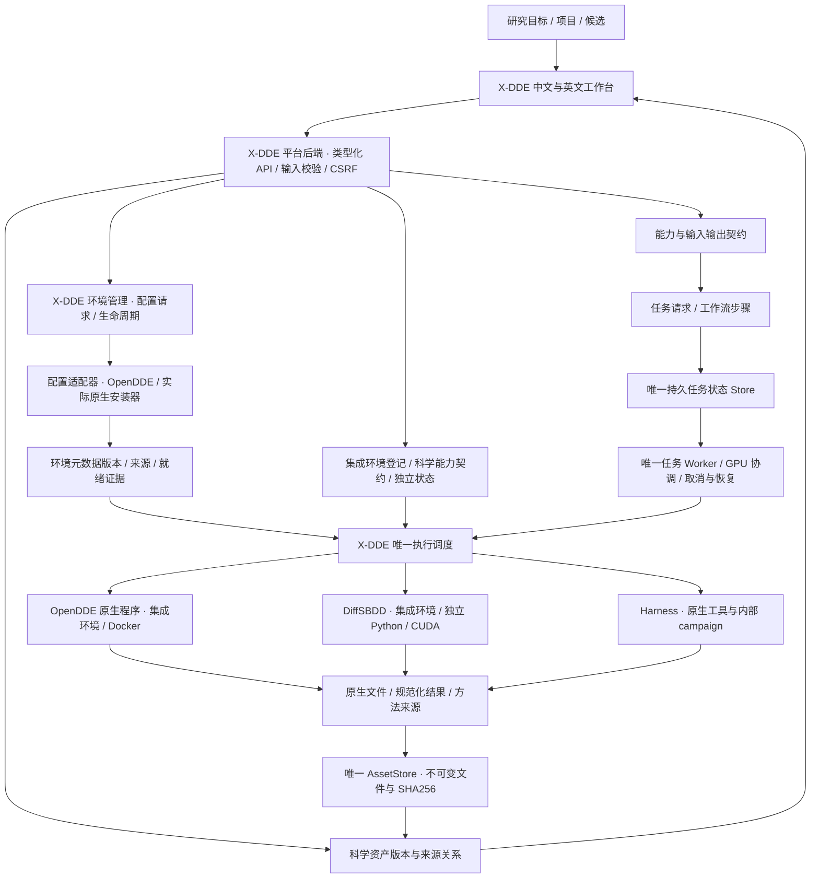
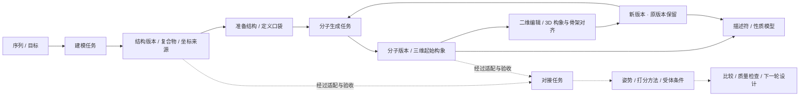
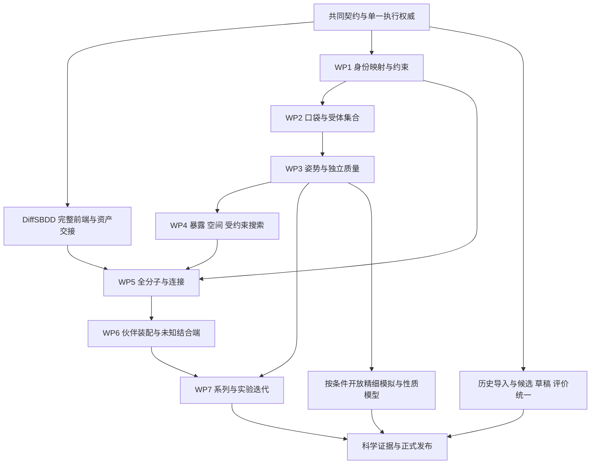

# Design direction and capability contract

The owner-provided `reference.png` remains unchanged as style inspiration only: readable scientific controls. The current owner direction supersedes its blue palette with warm paper surfaces, charcoal typography and restrained clay accents inspired by Claude Science. Its labels, project cards and plots are not feature specifications. Image SHA-256: `0d65a4b5acde90c80469a4bcc013b623d43021bbf90a2b90e29452b59f10b842` (1448 × 1086).

## Product hierarchy

**X-DDE owns the frontend and unified backend. All other software, including OpenDDE, is integrated as managed environments/components.** Platform APIs, scientific/business contracts, projects, assets, tasks, workflow plans, execution/deployment authority and evidence belong to X-DDE. Upstream scientific programs retain their genuine names, interfaces and licenses.

Environment preparation and scientific execution are distinct contracts. The product OpenDDE configuration adapter currently delegates its reviewed configuration actions to the official OpenDDE Harness installer; it is not a new upstream API or a universal preparation gateway for DiffSBDD or editors. Existing native OpenDDE prediction remains a scientific software implementation inside an integrated environment. X-DDE owns the deployment queue and process lifecycle; native configuration does not expose fictional pause, rollback or uninstall APIs.

The historical `engine_registry` maps typed task operations to integrated scientific environments; `BackendRouter` alone dispatches/cancels/recovers scientific execution. `deployment/provisioners` isolates actual native configuration calls. `EnvironmentSpec` describes a selected runtime and components; `EnvironmentRecord` binds its immutable metadata digest to the existing job database. Component provenance identifies the preparing adapter and native implementation separately from the scientific software. Unknown or unrecorded operator/legacy origins are explicitly retained as such.

Metadata snapshots do not assert immutable runtime/model contents. Native source/image/model fingerprints and scientific server acceptance remain required; managed deployment changes are blocked for active scientific tasks. Existing jobs/requests/assets remain valid. The additive `job_environments` table is created idempotently; backup both state databases before upgrade and retain them on rollback. Old versions ignore this extra table. `health.environments` is the canonical environment projection; historical `engines`/`engine` fields remain projections for existing consumers, never independent state authorities.

## Source authority

- OpenDDE commit `ddfa1df8aff1babf1fddac4247b7d2351bd0ce9f`: `runner/cli.py`, `runner/batch_inference.py`, `runner/msa_search.py`, `runner/dumper.py`, `docs/infer_json_format.md` and model manifest.
- Harness source baseline `6510a6f6f4a845193739684830931826c7ad73a9`: `core/contracts.py`, `core/runtime.py`, `core/detached.py`, `core/validation.py`, `servers/api.py`, `servers/client.py`, scientific backends and CLI. The inspected local distribution also contains previously installed UI/localization and API changes; those are not copied into this repository. Deploy the audited compatible runtime, and run server contract acceptance before changing upstream versions.
- Native model: `opendde_v1`; released general and ABAG checkpoints. Operator-registered custom checkpoints use the same model architecture contract.

## Coverage matrix

The rows below describe **implemented code paths**, not completed runtime acceptance. All new integrations require the target-server checks in `docs/server-acceptance.md`.

| Actual upstream ability | Frontend entry and controls | Execution and result path |
| --- | --- | --- |
| `pred`: protein/ligand/DNA/RNA/ion, single and mixed assemblies | Predict structures; six guided workflows and expert component controls | Typed native JSON → pinned CLI → real CIF and confidence |
| Copies, explicit chain IDs, modified residues | Per-component expert fields | Exact native `id`, `count`, `modifications` |
| SMILES, CCD, file ligands | Text or immutable uploaded SDF/MOL/MOL2/PDB | Native `FILE_` binding; multiple SDF records rejected for a single prediction ligand |
| Covalent input bonds | Native atom inspection; select atoms in the preview or searchable list | Native atom metadata → validated entity/copy/position/atom fields → `covalent_bonds` |
| Seeds, samples, cycles, steps, dtype | Presets and expert controls | Native flags; multi-seed result IDs and aligned filenames remain unique |
| TFG and atom confidence | Expert toggles with explanations | Native geometry guidance / `need_atom_confidence`; no invented potency model |
| CPU/CUDA, kernels, caching/fusion/TF32, determinism | Expert controls | CLI flags; Linux target; MPS is not a supported deployment backend here |
| FoldCP | GPU indices and distributed toggle | Native `torchrun`, DP=1, CP=device count; requires multiple server GPUs |
| Standard, ABAG, custom checkpoint | Model selection and server checkpoint registry | Read-only model mounts; no browser-supplied checkpoint paths |
| Uploaded MSA and templates / online search | Feature choices and component file pickers | Explicit network setting, managed A3M/template paths |
| `msa`, `mt`, `prep` | Feature-preparation form | Native commands and stable `prepared-input.json`, including native outputs written outside the original output directory |
| `json` | PDB/CIF import; altloc, assembly and discontinuous-bond options | Native converter; review/import resulting native inputs before prediction |
| Native multi-job inputs | JSON import, per-task review and batch submit | One transactional batch, stable idempotency keys; no partial enqueue |
| `doctor` and native data installer | Resources and diagnostics | Official command / manifest-backed helper; explicit downloads, no automatic large install during prediction |
| Native PAE/PDE/contact probabilities/atom pLDDT | Confidence panel and raw download | Actual `_full_data_sample_*.json`; bounded, labelled sampling |
| Harness antibody campaigns | VHH/scFv/VH-VL, target/scaffold/CDR/fixed positions, budget; complete expert JSON and YAML import | Native config loader and detached controller; reviewed digest, durable handoff and reconciliation |
| Design policies and tools | Expert design JSON: all native science settings, schedules, weights, parent policy, model/token limits, gates, terminal refolding | Original Harness parser remains scientific authority; credentials/URLs/executables remain operator settings |
| Campaign lifecycle | Status, phase, candidates, structure preview, stop, batch-size/reflection adjustment, recovery after browser refresh | Native task store/controller; no duplicate agent or lifecycle engine |
| ESM score | Sequence-score form | Native `/score/esm` |
| ESM2 guided proposals | Parent chains and clickable mutable positions | Native `/generate/esm2-guided` |
| SolubleMPNN | Managed structure, parent chains, mutable positions and expert settings | Native `/generate/soluble_mpnn` |
| Candidate folding and objectives | Candidate/target chain editor and expert scientific options | Native asynchronous `/fold`; polling and cancellation |
| Target MSA | Target name, chain and sequence | Native `/search/msa/target`; depth/cache metadata |
| Epitope and hotspot analysis | Structure/chain/CDR inputs, cutoff, expert hotspots; one-click campaign report | Native `/analysis/epitope` |
| PLIP analysis | Up to three structures with target/binder chains; campaign report | Native `/analysis/structure` |
| Target-aligned binder RMSD | Reference/mobile structures and chain selections | Native `/analysis/pose-rmsd` |
| Evolution, conservation and structural history | Candidate JSON input; original campaign history report preserves native structure context | Native `/analysis/evolution-tree`, including configured FoldMason dependencies |
| ProTrek sequence/structure search | Sequence or structure+chain and result count | Native search APIs; missing service is reported unavailable |
| Candidate population/top results | Campaign ranking, full candidate details, structure and population download | Native controller/client; population writes remain owned by the design workflow |
| Compare two candidate populations | Two JSON inputs, top-k and expert direction | Original `core.validation.compare_runs` used by native CLI `compare` |
| Standalone molecular descriptors (Workbench extension) | Property form, up to 500 SMILES/file records | RDKit MW/LogP/TPSA/QED/SA/HBD/HBA/rotatable bonds; actual CSV/JSON |
| Molecular display (Workbench extension) | Ligand ball/stick, ribbons, nearby residues, styles, selection, distance and overlays | Existing 3Dmol dependency and real CIF/PDB parsing |

## Current upstream integration limits

The public Harness `servers/backends/developability_filter.py` is a stub returning `available: false`. There is no objective-developability prediction card; native LLM campaign quality assessments retain their provenance. No generic small-molecule de novo, complete ADMET or calibrated-affinity model was found in the audited OpenDDE/Harness implementation. These findings constrain those integrations, not X-DDE's future capabilities through other software. Deprecated/ignored `msa_server_mode` and redundant `use_default_params` are not fake controls. Training and proprietary editor features are not part of the audited inference distribution.

Service shutdown, arbitrary population replacement, provider secrets, arbitrary command/path execution and native application administration are not scientific task modules. Operator configuration is documented rather than proxied unrestrictedly to the browser.

## Interaction rules

Chinese/English labels; guided choices first; expert controls preserve values. File inputs can come from uploads or completed task artifacts. Native fields are never silently discarded on import. Invalid inputs, missing prerequisites, partial/unavailable results and unsupported cancellation are visible.

The input preview is not a predicted pose. Visual edits preserve coordinates. Adding a covalent bond changes a new task's topology explicitly. Native confidence is not potency; proximity is not hydrogen-bond classification. No numerical result or structure originates from the reference image.

Display limits are Workbench guardrails, not model limits: 20 tasks per atomic batch; 25 MiB per uploaded file; 500 molecules per property task; at most 64 predicted conformers from the supported sample/seed controls; confidence display samples large matrices. Complete native artifacts remain available when permitted by task output limits.

## X-DDE 平台架构与资产关系

X-DDE 是完整药物研究平台，包含 X-DDE 前端和 X-DDE 平台后端。OpenDDE、DiffSBDD、Harness 及后续软件均作为集成环境/组件管理；环境内的真实科学程序通过 X-DDE 适配器执行。前端围绕研究目标、项目、候选、资产与证据组织，不按某一个开源软件的菜单组织。平台治理、资产与执行状态由 X-DDE 掌握，科学计算使用各软件的真实实现。

**实施状态必须区分：架构已设计、适配代码已实现、真实协议已验证、科学基准已通过。** 主分支已落地共享资产版本、血缘图、成功任务的产物登记、指定分子记录的性质交接和独立多后端调度。DiffSBDD 的四种设计契约、原生科学桥接与八模型安装代码也已提交；完整前端、历史导入和服务器科学验收仍在推进。下列未来引擎不会因出现在架构里而出现在可用工具卡片里。

### 一个控制平面，多个科学实现

平台服务端名称和健康身份始终为 **X-DDE**。`/api/health.platform` 表示平台任务服务；`/api/health.environments` 按集成环境返回身份与科学运行检查；`provisioners` 单独描述配置客户端，`/api/deployment.engines` 与各组件的 `engine`、`kind` 使用同一归属。历史 `health.engine` 只保留原 OpenDDE 快照供已有调用方读取，不能再用于判断整个平台是否可用。

| 层次 | 责任与边界 |
| --- | --- |
| X-DDE 前端 | 研究目标选择、输入、预览/编辑和专家参数；只通过 X-DDE API 调用 |
| X-DDE 平台后端 | 唯一项目、任务状态、安装状态、资产版本、血缘与方法来源；校验和调度 |
| 环境内的科学程序 | 集成环境中的 OpenDDE 原生程序、DiffSBDD、Harness 等；实现实际科学方法 |
| 执行与依赖环境 | Docker 或独立进程、Python/CUDA、权重和服务地址；按引擎分别部署 |
| 研究资产 | 结构、分子、序列、口袋和分析版本；属于 X-DDE，可跨兼容引擎复用 |

`Capability` 描述用户希望完成的科学活动，例如建模、生成、性质计算、姿势评估；集成环境承载实现该活动的软件及版本、模型和许可证；`ExecutionBackend` 管理 Docker 或受控本地进程的运行、终止和恢复。三者不能混成一个“已安装”状态。安装完成不代表权重就绪、GPU 可用或科学结果可靠。

前端组件不直接执行科学脚本，也不管理第二份运行队列。浏览器不能指定 Python 路径、命令、任意模型下载地址或服务器文件路径。调度器依据数据库中的已校验任务请求决定启动及停止后端，不信任任务目录里的 `request.json` 作为恢复路由依据。独立科学环境不继承 LLM / 计算服务密钥。Harness 在它自己的 campaign 内仍是唯一科学循环权威，平台只保存交接、标识、预算和可核对状态。

### 三层资产模型

| 层次 | 权威和已落地代码 | 含义 |
| --- | --- | --- |
| 不可变原始文件 | `AssetStore`、上传与任务结果保存接口 | 文件类型、格式、大小、SHA256；文件仅保存一次，被引用后受保护 |
| 科学对象版本 | `research/contracts.py`、`research/storage.py` | 分子、结构、序列、口袋、分析；文件记录/构象、版本、版本家族、父版本、来源任务、备注与人工评价 |
| 科学关系 | `research/graph.py` 与任务的 `scientific_inputs` | 谁生成、谁修改、使用哪个确切版本、结果交给哪些后续任务；投影自真实数据库，不造演示关系 |

对象版本不会覆盖旧文件。修改分子、准备蛋白或保存备注创建新版本，保留父版本与来源。不同科学对象通过实际输入输出任务联系；例如结构生成分子是跨对象研究关系，分子的编辑则属于同一版本家族。对象类型不会因 UI 菜单切换而改变。

已接入自动产物登记：唯一 Worker 在成功执行后，将可识别的分子、结构、序列和结构化结果写入同一个 AssetStore，并登记来源任务。SDF 每个记录有独立科学引用，单次登记最多 500 个分子；批量版本在同一事务中写入，文件摘要只校验一次。自动登记和手动保存复用同一 `research/outputs.py` 路径与幂等键。登记失败不会覆盖原生结果，`research_output_index` 显示部分失败的文件与原因，前端可以重新登记。

性质任务绑定指定分子版本时，只读取对应 SDF 记录；不把整份库的结果冒充这个分子的结果。未指定版本的原有批量性质流程仍计算整份输入。Ketcher 保存与研究备注保存均保留重试意图，网络返回不确定时重试不会增加重复版本。二维编辑创建新资产，但不宣称保留受体中的三维结合姿势。

这里的“建模产物”指蛋白/复合物的结构及相关置信度；计算引擎的模型权重属于独立、固定摘要的运行依赖。两者分别记录和管理。未来引擎复用研究资产时仍需真实格式转换、键型和坐标检查，不能只更换软件标签。

`MoleculeRef` 绑定资产 UUID、SHA256、记录号、构象号和可选的科学版本 UUID。`AtomRef` 绑定这份上下文及 RDKit 重原子编号；不得拿查看器数组索引当全局原子身份。残基绑定结构、模型、链、编号、插入码和替代位置。内容或拓扑改变后必须重建选择与映射。DiffSBDD 当前原生边界只接受首个 PDB 模型、一字符链、无插入码且已处理替代位置的口袋残基；不支持的身份明确拒绝，不能截断或悄悄改号。

上传/登记只证明文件身份，不证明化学有效性或三维质量。性质结果保留描述符方法；相互作用保留 ProLIF/PLIP 的规则和版本；结构置信度、对接分数、自由能和实测活性分别保存，不能写入同一个未定义的“综合分”。人工备注与评价独立于模型测量。

### 可组合研究路径

自动交接要经过四层检查：对象类型与格式 → 化学/序列与坐标有效性 → 新工具实际前提与约束支持 → 结果可解释性。OpenDDE 的 mmCIF 复合物不能仅改后缀交给只接收 PDB 的适配器；转换必须保留链/残基/原子映射，明确选择模型/构象。从复合物提取配体必须保留真实键型、立体化学及对齐坐标。二维绘图只产生分子拓扑，不默认产生受体中的结合姿势。

普通用户选择“继续设计”“计算性质”“准备结构”等目标，平台给出可复用输入、兼容软件与几个经过验证的预设；专家可检查和微调参数、约束及计算预算。缺少的环境、权重、化学数据或结构条件在提交前明确显示。尚未接入的对接后端不提供无效按钮。

### 模块边界和扩展契约

- `projects`：研究空间和项目关联；不复制科学文件。
- `assets`：唯一上传/结果文件存储；`research` 在同一个 SQLite 数据库保存对象版本及血缘。
- `requests` 与 `scientific_objects`：共享任务和科学身份契约；服务端校验确切版本与任务真实输入一致。
- `engine_registry`：集成环境身份、运行方式和唯一操作归属；未知操作不能默认派给 OpenDDE 原生程序。
- `execution_environment`：明确的环境规格、准备来源和不可覆盖的任务环境元数据绑定；不复制任务/资产权威。
- `deployment/provisioners`：专门调用已核对的原生配置接口，不参与科学业务输入、结果或任务调度。
- `backend_router`：统一启动、停止、恢复路由；`engine` 只负责 OpenDDE Docker；`local_process` 负责持久进程身份和有界终止。
- `diffsbdd`：固定源码及模型清单、契约、原生科学桥接；不搬入旧服务器、JobManager、独立网页或 DesignStore。
- `deployment`：X-DDE 管理各引擎的环境、模型和独立编辑器；组件显式声明所属引擎与 runtime/model/editor 角色，安装生命周期与科学任务状态分离。新目录为 `x-dde-managed`，旧归属目录复用且不改写原数据；冲突目录明确拒绝。
- `frontend/research`：关系图、资产说明与任务交接；编辑器和三维查看器通过明确接口接入。

新增引擎必须登记真实输入/输出 schema、软件/镜像/模型摘要、许可证、资源前提、约束支持、失败与取消语义、结果规范化和科学验证状态。原生约束、适配层约束、仅结果检查及不支持约束明确区分。刚性固定原子和保留键型不能用生成后的过滤冒充。

工作流层的后续实现将持久记录 Run/Step/Attempt、步骤依赖、输入版本、预算、幂等和恢复状态，复用同一 Worker 和 GPU 协调。缓存键包含所有科学输入、拓扑、处理条件、引擎/权重、参数、种子与约束；输入版本改变只使实际受影响的下游结果失效。此层未完成前不声称已实现跨软件自动多步编排。

### 当前和后续能力状态

| 领域 | 当前真实实现 | 尚待实施/验收 |
| --- | --- | --- |
| 结构与复合物 | OpenDDE 输入/预测/置信度/比较适配 | 目标服务器科学验收；共享对象的更多自动规范化 |
| 分子与结构编辑 | Ketcher、Mol*、3Dmol；新版本与血缘代码 | 稳定的 2D/3D 双向选择、完整约束编辑和视图迁移 |
| 分子设计 | DiffSBDD 四模式与八模型适配代码 | 完整 UI、原生历史迁移、协议与 GPU 验收 |
| 性质与评分 | RDKit 描述符、Harness 序列评分 | 经过校准的 ADMET/亲和力模型分别接入，当前不提供 |
| 抗体设计 | Harness 原生 campaign 和工具适配 | 共享候选/测量对象的完整交接 |
| 口袋与准备 | 现有口袋检查；DiffSBDD 原生筛选桥接 | P2Rank/fpocket 等只有真实适配后开放 |
| 对接与选择性 | 现有结构检查、对齐、PLIP | GNINA 三模式适配已实现；真实原生 CI 验收进行中，通用约束对接和受体集合继续实施 |
| 精修与模拟 | 尚无新模拟实现 | OpenMM/OpenFF、条件/参数化、服务器验收 |
| 多组分体系 | 原生支持范围内的混合实体建模 | TERNIFY 等须逐项验证输入、许可证、权重和基准 |
| 实验反馈 | 人工备注/评价与研究版本 | 实验条件、单位、批次、重复数和候选关联，再考虑主动学习 |

### DiffSBDD 全量迁移边界

源码固定为 `Victor-Xu-1/diffsbdd-workbench@55f365b195d126ec25f7e7ae00ff253fd4491dac`，官方模型源码为 `arneschneuing/DiffSBDD@5d0d38d16c8932a0339fd2ce3f67ade98bbdff27` 加已核对兼容补丁。源候选 `9f3a51d` 的显示/可用性改动需单独审查；不能把未并入生产的候选当成当前已迁移能力。

完整范围仍包括：generate/inpaint/diversify/optimize、所有原生参数和八模型；口袋和结构准备、真实键型与 CCD、环/稠环/骨架选择、编辑与三维对齐、有效性/连接/去重与拒绝原因、ProLIF 分析、候选/批量/导出、草稿与版本、历史导入、取消/恢复、视图与高分辨率图像，以及工作台内继续设计/性质/结构任务的交接。基础契约或一次 CI 通过不代表整个迁移完成。

旧数据只读盘点，导入前 dry-run，使用原 ID、文件摘要、引擎/权重/种子、编辑/评价/草稿 provenance 建立幂等映射；不删除或移动原目录，不受旧 API 默认 20 条分页影响。正式兼容清单须逐项对应目标模块和证据，验证替换成功后再移除确认冗余的实现。

### 验证与运维约束

本次风险链：科学引用 → 资产保护/版本持久化 → 任务提交 → 调度/停止/恢复 → 结果复用 → 图与编辑器。新增回归覆盖真实 SQLite/文件/API/CSRF、幂等、错误版本拒绝、进程组取消和前端交互。共享调度变化同时回归已有 OpenDDE/Harness 路径，不能因未修改科学算法而跳过消费者。

本机只做静态、构建、安装生命周期和浏览器检查；不下载模型或执行科学推理。测试套件在 GitHub CI 执行；真实 RDKit/ProLIF 及科学协议验证和 GPU/多 GPU/LLM/数据集验收分别记录，未运行项明确保留。不能以源码、mock 或旧软件的历史测试声称新架构的科学链路通过。

### 安装来源与回滚

DiffSBDD 的可选科学环境保留原生 MIT/LICENSE、官方 LICENSE 和第三方 notices；依赖使用源项目的 `requirements.lock --require-hashes`，官方八模型分别验证大小及 SHA256 后才可加载。X-DDE Apache-2.0 不替换模型及第三方许可证。源包 URL/摘要和官方 revision 在 `diffsbdd/manifest.py` 固定，浏览器不能覆盖。

科学版本表是对现有数据库的附加结构，现有文件和原任务不会移除。包含新 operation 的任务数据库不能交给旧版任务解析器；升级前须保存一致的 SQLite backup。回滚使用旧程序及升级前数据库快照，同时保留新任务目录/原始输出和新数据库供恢复，不直接覆盖或删除新增研究数据。本次候选预览使用独立状态目录，发布的 rc4 数据保持不变。

## 统一实施路线与未完成任务

规划日期：2026-09-30。实施现状基线为 `5db1378831a50c7528775effaaafc3d62874eca6`；下面是 **15 个工作包、76 项后续任务**。本节是未完成任务、依赖和阶段交付的权威清单；专项科学范围继续以“口袋、结合模式与双功能分子探索专项”为准，服务器实证按 [server-acceptance.md](../server-acceptance.md) 记录。后续在本节更新任务状态，不另建竞争清单。

“部分基础已有”表示有可复用代码，不代表这一整项已交付；“待实施”表示还缺实现；“条件项”表示需要先证明方法、模型或体系适用，再开放。任务验收同时包含适用的软件证据和科学证据，不能只凭模块按钮、安装成功、文件存在、mock 或普通 CI 成功勾选完成。

### 已完成基础与当前缺口

| 范围 | 当前已落地 | 尚未完成的部分 |
| --- | --- | --- |
| 平台与环境 | X-DDE 前后端身份、统一任务/资产/部署权威、独立环境检查、组件安装管理、原生配置适配 | 通用能力支持矩阵、更多真实适配器、完整内容指纹与服务器验收 |
| 资产 | 不可变文件、对象版本/血缘、产物登记、编辑保存、指定记录的性质输入交接 | 转换/编辑后的稳定原子映射、工作流自动依赖、完整历史迁移 |
| OpenDDE/Harness | 18 项能力入口及已有预测、工具、campaign 适配代码 | 原生科学/LLM 服务器验证、共享候选与测量的完整交接 |
| DiffSBDD | 固定源码/八模型管理、generate/inpaint/diversify/optimize 与化学工具的桥接代码 | 完整前端、选择/约束/候选结果链路、历史迁移、GPU/科学验收 |
| 编辑与外观 | Ketcher/Mol* 集成、基本结构检查、双语/主题、24px 透明图片品牌 | 统一 2D/3D 选区、科学编辑语义、口袋/姿势/装配联动 |
| 专项探索 | 架构、对象、八类目标与 WP1–WP7 科学边界已规划 | 新增步骤仍待实现和独立科学验收 |
| 部署与发布 | E 盘共享 WSL、启动别名、源码预览和 CI | 新增科学链路的目标服务器验收、可复现新安装包与正式发布 |

X-DDE 的任务、对象、关系、部署和证据保持单一权威。新科学软件通过真实适配器接入，复用现有 registry、BackendRouter、Store/Worker、AssetStore；不搬入另一套服务器、任务队列、DesignStore 或 Harness 循环。现有正确行为继续保留。

### 交付顺序和阶段完成标准

| 阶段 | 主要任务 | 前置依赖 | 可验收交付 |
| --- | --- | --- | --- |
| M0 共同契约与执行基础 | R01–R09；先固化 R25–R29 的契约与最低验证 | 已有平台与资产基础 | 能力/输入/输出/约束支持明确；计划及步骤可追踪、可取消、可恢复；资产引用无歧义 |
| M1 小分子完整操作闭环 | R10–R20、R21；完成 R25–R29 的界面与映射 | M0 | 从结构/口袋和分子资产发起四类 DiffSBDD 任务，检查/编辑候选，登记新版本，交给性质或下一轮设计；普通/专家两种操作方式 |
| M2 多口袋与多结合模式 | R30–R40 | M0、WP1；可与 M1 的独立 UI 工作交错推进 | 参考/已知/未知位点与结构不足四种入口；受体/化学状态与多个姿势、聚类、质量和来源可联动 |
| M3 空间要求与约束搜索 | R41–R46 | WP1–WP3 | 区域暴露、出口和空间要求可声明；只有真实支持的引导/精修/检查开放；不合格、无解和预算不足可区分 |
| M4 双功能全分子与连接 | R47–R52 | M1、WP1、WP3、WP4 | 先交付双端已知、两目标分别结合、结合端+载荷/探针；完整化学图、回接、连接几何与全分子质量可验证 |
| M5 伙伴装配与未知端探索 | R53–R56 | WP2–WP5 | 二元假设、连接与伙伴布局组合为有预算分支；保留多种装配解释，明确方法支持组件数 |
| M6 系列与实验反馈 | R57–R60；满足条件再推进 R22–R24、R61–R64 | 相关上游步骤与可验证数据/方法 | 同条件系列比较、实验关联与下一轮可追踪设计；性质模型与精细模拟分别验收 |
| M7 迁移与统一正式发布 | R65–R76 | 历史导入在 M0 稳定后可并行；发布依赖所声明范围的验收 | 旧数据完整/幂等导入，能力矩阵有证据，独立安装和升级/回滚可复现，发布附件与精确代码版本一致 |

测试、文档、安全和依赖审查从每个阶段开始做；R70–R73 随实际变化持续执行，不能等全部功能写完再测试。每阶段可交付独立可检查的候选版本，实际启用范围由验收证据决定。没有确认服务器、算力、权重、外部服务与基准前，不编造固定完成日期；服务器不可用不阻止接口、UI、数据链和 CI 的实施。

### 当前实施进展（M0 / M1）

能力目录与前端参数默认值已改为由后端契约生成，并增加 CI 漂移检查。`/api/capabilities` 分别返回配置检查、每次任务的原生预检要求和待服务器科学验收状态；不根据文件存在宣称科学功能已验证。

DiffSBDD 四类设计及口袋检查、受体内容筛选、相互作用、指定候选性质/导出已有真实前端表单。八个模型按原生兼容规则选择；简易选择与专家全部参数共用同一提交链。固定原子选择先通过真实 RDKit 任务读取特定 SDF 记录，预览使用原生解析器生成的单记录文件，固定引用始终绑定原始版本，输入变化清除选择。候选结果登记后可以继续性质计算或导出。

研究计划现已拥有不可变计划摘要、持久化运行与尝试记录、线性/分支依赖、原生结果角色到具体资产版本的输出交接、暂停后续调度/恢复/取消、任务数量及墙钟预算、有限重试与退避。调度复用唯一 Worker，任务与尝试链接在同一事务内写入；服务重启保留历史，不静默重跑被中断任务。计划与运行进入现有关系图。未核对内容指纹前不开放跨运行缓存复用；当前预算不声称已经涵盖 LLM 费用、所有模型候选数与分支总算力。

WP1 已增加可保存/复用的原生原子区域：它们引用完整分子、确切记录、文件摘要和身份解析任务，允许逻辑区域重叠，不切断化学图。局部重设计只接受与起始版本和固定原子一致的已保存核心；改动输入或选择会解除旧绑定，区域与身份依据进入共享关系图。binder/linker 等区域角色仅是标签，不宣称已经验证结合端或连接性质；跨编辑身份映射和更多约束算法仍待实施。

WP2 开始接入固定版本 P2Rank 2.5.1：它作为独立集成环境由 X-DDE 管理，使用有摘要的 Java 容器离线执行，复用现有任务、安装和资产权威。前端要求区分晶体结构和预测/NMR/冷冻电镜来源，展示多个位点假设、原生评分/概率与残基身份；可将兼容 PDB 位点继续用于 DiffSBDD。它不提供配体亲和力。只支持已核对的稳定版参数；2.6 alpha 的新增描述符等未接入。原生模型验收在远程 CPU runner 执行，本机不下载模型或执行推理。

这些代码实现不等于 M0/M1 整阶段完成。工作流、跨编辑映射、通用约束、多口袋/姿势、双功能探索、完整系列与服务器科学验证仍按下面任务继续；未完成项保留原状态。此候选的验证范围：目录/参数漂移、真实 API 契约、输入和模型组合、前端准备/切换/禁用/提交状态、远程真实 RDKit 原子顺序与记录选择、真实浏览器布局；本机只运行静态检查与构建，不运行科学推理或下载模型。

### P01 平台、能力与集成环境（M0）

| ID | 状态 | 要做的任务 | 完成标准 |
| --- | --- | --- | --- |
| R01 | 部分基础已有 | 核对每个已集成软件的真实能力、原生参数、输入/输出和版本，形成统一支持矩阵 | 每个前端入口可追到真实适配器；实现、安装、服务就绪与科学验证分别展示；无效入口清理有依据 |
| R02 | 部分基础已有 | 扩展环境/模型/服务适配契约、兼容信息与配置界面，保留 X-DDE 生命周期权威 | 新软件可独立配置；缺一个环境不影响平台和其他任务；科学程序不接收浏览器命令/任意路径 |
| R03 | 部分基础已有 | 扩展现有科学对象与关系，容纳集合、状态、姿势、区域、候选、装配和测量 | 复用同一文件库与版本库；已有对象/任务仍可读取；引用真实版本且跨对象关系可解释 |
| R04 | 部分基础已有 | 从环境元数据绑定扩展到原生源码、镜像、模型和资源的内容指纹 | 运行使用实际核对版本；未知历史来源如实标注；任务环境变化不能改写既有绑定 |
| R05 | 部分基础已有 | 统一缺失依赖、配置失败、任务失败和资源不足的可诊断双语反馈 | 药化用户得到清晰恢复选项；专家能查看安全诊断；不显示密钥/内部堆栈，不静默降级 |

### P02 工作流、预算与恢复（M0，之后逐步扩展）

| ID | 状态 | 要做的任务 | 完成标准 |
| --- | --- | --- | --- |
| R06 | 部分基础已有 | 在现有 Store/Worker 中持久化 Plan、Run、Step、Attempt 和分支/汇聚依赖 | 同一计划可刷新/重启恢复；只有一个执行权威；步骤与原生任务和外部运行引用对应 |
| R07 | 部分基础已有 | 定义并校验步骤之间的版本、格式、拓扑、坐标、条件和约束交接 | 不兼容交接在执行前拒绝；上游输入改变只重算受影响下游；缓存键含全部科学条件 |
| R08 | 部分基础已有 | 管理受体、状态、种子、姿势、候选、轮次、CPU/GPU/磁盘与中间结果预算 | 搜索有上限；进度来自实际事件；保留多个分支和淘汰原因；不无界存坐标或显示虚构百分比 |
| R09 | 部分基础已有 | 将取消、重试、幂等、GPU 资源协调和异常恢复扩展到多步骤工作流 | 断连/重启/重复提交不会重复运行；旧任务/原生 Harness campaign 不被新编排重复控制 |

### P03 DiffSBDD 完整前端与候选链路（M1）

| ID | 状态 | 要做的任务 | 完成标准 |
| --- | --- | --- | --- |
| R10 | 部分基础已有 | 为生成、局部重设计、多样化、优化补齐目标入口、普通预设和完整专家参数 | 四模式均有实际请求/结果链路；参数不丢失；模型与输入不兼容组合明确拒绝 |
| R11 | 部分基础已有 | 把结构、口袋、参考配体、初始分子、可变/保留区域接入任务表单与资产选择 | 使用精确对象版本和记录；不任意截断 SDF、链/插入码/模型；文件转换有真实映射 |
| R12 | 部分基础已有 | 将八模型的模式、表示、条件、资源前提和校验状态接到前端选择 | 按冻结实际接口给出兼容选择；已下载不冒充可推理；权重摘要错误拒绝加载 |
| R13 | 部分基础已有 | 规范化原生候选、结构、口袋、报告、失败原因和生成来源 | 产物进入同一资产库；非法/无效候选与有效候选分开；保留原生结果及种子、权重、输入版本 |
| R14 | 部分基础已有 | 实现候选表与 2D/3D 预览联动、筛选、比较、收藏、批量导出和继续设计 | 选中哪个候选就交接哪个确切记录/构象；编辑建立新版本；格式/键型/坐标校验后可复用 |
| R15 | 部分基础已有 | 补齐批量提交、取消、失败重试、恢复和资源限制的 DiffSBDD 适配/界面 | 使用 P02 的同一调度；原生终止和失败真实回传；测试协议与服务器 GPU 证据分别记录 |

### P04 药化友好的编辑、预览与操作（M1，专项阶段继续扩展）

| ID | 状态 | 要做的任务 | 完成标准 |
| --- | --- | --- | --- |
| R16 | 部分基础已有 | 统一 Ketcher/Mol*/3Dmol 事件与 2D/3D 原子/残基/区域选择协议 | 点击、框选、搜索与清除共享同一身份；跨视图选择一致；键盘/焦点/沙箱边界可验证 |
| R17 | 部分基础已有 | 分子编辑、状态/构象生成、格式转换与修改说明接入新版本和映射 | 真实键型/立体化学保留或明确改变；编辑不覆盖旧证据，不把二维拓扑冒充结合姿势 |
| R18 | 部分基础已有 | 结构链、水/离子/辅因子、替代位置和支持的科学编辑接入准备/建模任务 | 显示变更与真实科学修改区分；不支持的结构/序列编辑不伪实现；修改后校验并重算相关步骤 |
| R19 | 部分基础已有 | 实现局部口袋、姿势/受体比较、距离、相互作用、区域着色和可分享视图/图像 | 展示真实坐标和指标；变换可追踪；图例/标签/显示切换准确；图像来自实际场景 |
| R20 | 部分基础已有 | 全部新任务提供“选目标→选输入→选方案→审阅→运行”，保留专家模式和悬停说明 | 中英文、三主题与窄屏实页检查；有加载/空/失败/成功状态；说明参数目的、影响、支持范围和下一步 |

### P05 性质、评分与可验证预测（R21 随 M1；其他按模型/数据条件推进）

| ID | 状态 | 要做的任务 | 完成标准 |
| --- | --- | --- | --- |
| R21 | 部分基础已有 | 将已有 RDKit 描述符接入候选集合、指定版本计算、筛选与后续任务 | 描述符匹配真实记录与方法；逐记录错误可见；批量/单位/导出准确；不把描述符叫完整 ADMET |
| R22 | 条件项 | 筛选并接入真实 ADMET 性质模型，明确端点、物种/条件、训练来源与许可证 | 每个端点独立验证适用域、校准和局限；未实现/未验证端点不显示成功预测 |
| R23 | 条件项 | 真实亲和力/结合相关预测模型与对接打分分开接入 | 记录模型、方法、端点、单位与可验证基准；不由普通 docking 分数或 LLM 文字虚构 KD/IC50 |
| R24 | 条件项 | 加入预测不确定性、域外/缺输入标记、同条件比较及可追踪导出 | 结果来源与条件可复现；兼容端点才比较；实测、预测、规则指标和人工判断分别显示 |

### WP1 / P06 对象身份、功能区域与约束（M0 契约，M1 完整联动）

| ID | 状态 | 要做的任务 | 完成标准 |
| --- | --- | --- | --- |
| R25 | 部分基础已有 | 定义结合、连接、第二功能、可修改、保留等完整化学图上的逻辑区域 | 角色可重叠；标区域不会自动切键/片段化；选区引用不可变对象版本 |
| R26 | 部分基础已有 | 建立编辑、加氢、化学状态、文件转换与结构处理后的稳定映射/失效机制 | AtomRef/ResidueRef 使用真实身份而非查看器数组索引；不完整映射明确失效，不静默改号 |
| R27 | 部分实现 · 固定区域/搜索范围/输出边界契约与复用 | 实现 ConstraintSet 的对象/选区、参照/坐标系、范围、单位、硬软、阶段、来源与验证器 | 目标 A 与整个装配范围区分；没有证据不固定世界箭头；契约与持久化一致 |
| R28 | 部分实现 · 原生与结果条件的支持/冲突/版本检查 | 做约束支持、输入前提、冲突及可证明不可行性检查 | 原生执行/平台适配/仅结果检查/不支持分开；不支持硬条件执行前拒绝，不偷偷放宽 |
| R29 | 部分实现 · 冻结执行依据；空间范围与固定核心独立复核已接入 | 将约束选择/修改与执行证据、违反位置和最终独立复核联动 | 原生程序接受了什么可追踪；事后筛选不冒充引导搜索；硬条件失败候选不能列为合格 |

### WP2 / P07 位点、结构准备与受体集合（M2）

| ID | 状态 | 要做的任务 | 完成标准 |
| --- | --- | --- | --- |
| R30 | 部分基础已有 | 建立实验/预测结构准备、装配、缺失区、化学状态及水/离子/辅因子策略 | 处理选择与来源可回看；预测置信度/未知区域保留；不无条件删除水或补长缺失区 |
| R31 | 部分基础已有 | 接入经核对的真实口袋方法，并支持参考配体、手工残基/空间选区与多个位点 | 返回真实多位点/空结果；标明方法版本与范围；检测分数不直接当成结合证据 |
| R32 | 待实施 | 定义 ReceptorEnsemble，处理多结构/构象、对齐、质量和出现/消失位点 | 受体版本与变换可追踪；高成本柔性/隐蔽位点探索另设资源和证据门槛 |
| R33 | 待实施 | 定义 BindingSiteSet 与跨构象位点关联、表面/空间证据 | 依据结构/残基与空间关系关联，不按“第几个口袋”硬配对；不确定/不匹配关系明确显示 |
| R34 | 待实施 | 实现 A 参考结构、B 已知位点、C 未知位点、D 结构不足四类任务入口 | 共用步骤；按已知信息补前置条件；结构不足不越级声称已确定口袋或结合模式 |

### WP3 / P08 化学状态、姿势与独立质量（M2）

| ID | 状态 | 要做的任务 | 完成标准 |
| --- | --- | --- | --- |
| R35 | 待实施 | MolecularStateSet：有界质子/互变/立体与构象枚举及来源 | 保留完整图、原身份和状态映射；未知立体中心/不支持化学类型明确处理；枚举有上限 |
| R36 | 部分实现 · CPU 原生与前端已验收；GPU/CNN科研验证待服务器 | 接入冻结版本的真实对接/姿势程序与独立环境适配 | 输入、硬软条件、资源、取消、输出与方法范围有真实协议和服务器证据；无假对接按钮 |
| R37 | 待实施 | PoseEnsemble：组合位点×受体×状态×初始化并保留多个结合假设 | 每个姿势绑定配套受体与化学状态、原始方法/种子/条件；不只保存单个最低分 |
| R38 | 待实施 | 对齐、姿势/接触指纹聚类、代表结构与同条件多目标排序 | 坐标和原子映射验证；不同条件原始分数不硬合并；不同模式可并排复核 |
| R39 | 部分基础已有 | 整合真实结构/化学有效性、碰撞、接触、应变和相互作用检查 | 质量门槛独立于生成器；记录真实规则/方法与拒绝理由；缺方法/失败不输出伪指标 |
| R40 | 待实施 | 建立参考重建、重对接/跨构象、多种子、反例和失败场景基准 | 基准与科学通过标准按方法预先审核；区分程序失败、不可行、未知与预算不足 |

### WP4 / P09 暴露、出口、空间与受约束搜索（M3）

| ID | 状态 | 要做的任务 | 完成标准 |
| --- | --- | --- | --- |
| R41 | 待实施 | 区域暴露/埋藏、表面距离与测量方法，分别针对单目标和整体装配 | 量纲、探针、范围与方法条件明确；不以单一 SASA 阈值代表所有空间要求 |
| R42 | 待实施 | 连接位点/出口方向、允许生长方向与可修改区域的证据和选择 | 方向源于局部结构/键与证据；未知模式支持多方向假设；不存在无来源固定世界箭头 |
| R43 | 待实施 | 建立连接/功能区域可通行空间、路径、瓶颈、体积和障碍采样 | 探针/网格/阈值及坐标系有定义和基准；水可达不自动视为连接臂或第二端可容纳 |
| R44 | 待实施 | 在真实支持的程序/自研方法中实施搜索引导和带约束精修 | 支持等级和作用阶段准确；同时保存执行与独立最终检查证据，不能用过滤代替搜索 |
| R45 | 待实施 | 防退化与可行性：保留结合、完整化学图、局部接触和空间目标 | 远离靶标、虚假断键/拉键等反例必须失败；硬条件不被自动放宽 |
| R46 | 待实施 | 有预算分层探索、候选/分支停止条件与失败恢复选项 | 用户可选择增加受体/状态/初始化或预算；输出多个可追踪解或明确未找到/预算不足 |

### WP5 / P10 双功能、全分子与连接设计（M4）

| ID | 状态 | 要做的任务 | 完成标准 |
| --- | --- | --- | --- |
| R47 | 待实施 | 区分两目标分别结合、桥接伙伴、结合端+载荷/探针与分子胶研究模式 | 不把所有双功能分子套成 PROTAC；分子胶无双端时不套连接流程；专用化学/体系设前置门槛 |
| R48 | 待实施 | E 双端已知与 F 一端/两端未知的输入、证据及二元前置计划 | 已知端引用真实姿势；未知端明确先探索二元假设，不隐藏盲搜索或跳过前置条件 |
| R49 | 待实施 | 明确片段切口、封端、连接原子、原图关系与全分子回接 | 逻辑区域与片段计算分离；每次切开/连接都有原子映射和可验证完整图 |
| R50 | 待实施 | 用经验证方法生成连接位点/方向、长度、拓扑、刚柔、分支、环化/取代等候选 | 只开放真实生成器支持组合；连接方案有来源、多样性和预算；无虚构合成路线 |
| R51 | 待实施 | 完整分子回接、键型/价态/立体、连接几何与两端保持检查 | 全分子可真实解析、无虚拟拉长键；片段与完整分子的结论分别展示 |
| R52 | 待实施 | 完整分子构象、应变、碰撞、局部接触与支持的联合优化/设计迭代 | 基于实际全分子结果而非片段打分拼接；无合成可行性方法时明确待评估 |

### WP6 / P11 三元、多伙伴与未知结合端（M5）

| ID | 状态 | 要做的任务 | 完成标准 |
| --- | --- | --- | --- |
| R53 | 待实施 | ComplexAssembly：输入二元姿势、完整分子、伙伴身份和坐标变换/连接关系 | 原子/伙伴/状态一致，变换来源可追踪；不相容输入不能直接拼接 |
| R54 | 待实施 | 伙伴平移/旋转、连接构象、局部保持、界面和联合布局采样 | 支持真实几何/方法范围，有预算、严重碰撞门槛与独立结构检查 |
| R55 | 待实施 | 保留不同装配簇、两端接触、连接几何、质量与局限 | 几何可构建不能证明协同性、降解或体内功能；不由二元分数相加推导三元协同性 |
| R56 | 待实施 | 把 F 未知端分支与装配搜索组合，并显式限制支持组件数 | 原生方法支持与平台对象表达能力分开；多于三组件/特殊体系逐项适配验收 |

### WP7 / P12 系列、实验与下一轮计划（M6）

| ID | 状态 | 要做的任务 | 完成标准 |
| --- | --- | --- | --- |
| R57 | 待实施 | G 系列/库与多目标、同源、突变体/受体集合的同条件批量比较 | 方法、状态和条件兼容；保留多样性与选择性假设；无任意跨方法综合分 |
| R58 | 待实施 | EvidenceRecord：导入实验端点、单位、条件、批次、重复及不确定性 | KD/IC50/降解等不同端点不混用；实验与预测分别存储，矛盾和缺失数据可见 |
| R59 | 待实施 | 结构变化、接触/空间/质量与系列关系的解释及实验区分问题 | 解释引用实际候选和证据；SAR/结构假设不冒充已确定生物机制 |
| R60 | 待实施 | H 证据迭代：局部重采样、新位点/构象、连接修改与下一轮任务 | 新计划版本保留旧假设/评价；有效上游可复用；过滤与重新计算可区分，不默认自动训练 |

### P13 分层柔性与高成本复核（按实际方法条件推进）

| ID | 状态 | 要做的任务 | 完成标准 |
| --- | --- | --- | --- |
| R61 | 条件项 | 分层接入集合对接、支持的侧链采样与局部松弛/柔性流程 | 每层范围与成本明确；任意最小化不叫完整诱导契合；与姿势的受体版本匹配 |
| R62 | 条件项 | 核查配体/特殊化学类型与结构的参数化和力场前提 | 参数化失败显式返回；共价、金属、宏环、肽/膜等体系没有自动普通流程降级 |
| R63 | 条件项 | 接入经验证的精修/模拟环境与轨迹、日志、质量输出 | 复用单一调度/取消/资源管理；只对有价值候选投入成本；原生失败和原始证据保留 |
| R64 | 条件项 | 多条件/重复模拟与方法支持的稳定性/能量评价 | 单位、参考态、条件、方法与不确定性可追踪；短模拟不能证明全部隐蔽位点或药效 |

### P14 历史、共享候选与能力收尾（M0 稳定后分批推进）

| ID | 状态 | 要做的任务 | 完成标准 |
| --- | --- | --- | --- |
| R65 | 待实施 | 只读盘点旧 DiffSBDD/原生任务、文件、候选、草稿和评价，提供导入预览 | 完整分页/清单，不被旧 API 的默认条数截断；原 ID/摘要/版本与缺失来源明确 |
| R66 | 待实施 | 幂等事务导入、重复/中断恢复与版本/关系映射 | 再导入不重复；旧目录和原文件不删除移动；映射失败可恢复，保留真正未知来源 |
| R67 | 部分基础已有 | 统一 DiffSBDD/Harness 候选、草稿、人工评价、计划和外部运行引用 | 复用现有资产和关系；原生 Harness 保留自己的内部循环/历史；平台不复制运行权威 |
| R68 | 部分基础已有 | 打通结构→口袋→生成→性质/对接→编辑→下一轮的完整资产网络 | 每个节点绑定实际输入/输出和版本；重算与来源关系正确；旧对象引用继续有效 |
| R69 | 待实施 | 逐项核对源项目迁移范围，验收替代后清理确认冗余实现 | 有功能/参数/产物/历史兼容证据；仅删除已确认冗余，不把删核心能力当优化 |

### P15 软件验证、科学证据与发布（贯穿所有阶段）

| ID | 状态 | 要做的任务 | 完成标准 |
| --- | --- | --- | --- |
| R70 | 部分基础已有 | 为新增对象/适配/工作流补真实解析器、SQLite/文件/API/状态恢复等回归 | 实际运行相关测试及既有强制 CI；成功/失败、校验、幂等、取消与持久化都验证 |
| R71 | 部分基础已有 | 实际浏览器验证普通/专家任务、加载/空/失败、版本复用、主题/语言/窄屏与焦点 | UI→API→真实任务/产物→UI 全链路可复现；不只看截图/源码或 mock |
| R72 | 待实施 | 目标服务器原生矩阵：OpenDDE/Harness、兼容的 DiffSBDD 四模式×八模型、新专项与真实 LLM | 记录精确源码/模型/环境/硬件/输入/种子与结果；GPU/多 GPU/服务缺失分别未验证；本机不跑推理 |
| R73 | 部分基础已有 | 依赖/模型许可证、校验下载、路径/归档安全、密钥隔离、预算与适用远程鉴权审查 | 无任意命令/路径/模型来源、无敏感日志；共享远程部署按可信服务端做权限；所有本机工作留 E 盘 |
| R74 | 部分基础已有 | 按目标范围补齐独立克隆、配置、构建、安装、升级与回滚文档和实际检查 | 不依赖个人文件；发行版配置复用；环境可缺失但平台可启动；已有磁盘/研究资产保留 |
| R75 | 待实施 | 确定新版本、构建精确提交的安装包/校验清单、正式发布并实际安装启动检查 | 一个版本权威；新附件实际含已验收源码/UI/许可证；命令/健康/界面/升级回滚通过，不替换旧附件冒充新发布 |
| R76 | 部分基础已有 | 发布前最终能力/证据核对、源码卫生与剩余限制说明 | 每个开放能力有真实实现与适用证据；未验证状态准确；无死模块、演示计算、秘密或施工产物 |

### 实施和开放规则

- 首批实施顺序为 M0 共同契约 → M1 小分子闭环，同时推进 WP1；WP2/WP3 在共用契约稳定后接入。高级专项按依赖推进，不因为已有规划文字就开放模块。
- 普通用户以目标、已知信息和少量可解释预设做选择；专家检查完整支持参数、约束和预算。预设的资源估计由真实服务器能力决定，不写固定“几分钟必完成”。
- 本机完成代码、静态/构建和必要 UI 检查；测试套件走远程 CI；原生算法、GPU、多 GPU、真实 LLM 与科学准确性在目标服务器验证。UI/API/契约工作可以继续，缺科学证据的计算不能宣称已可运行或已可靠。
- 位点/受体/状态/姿势/全分子/装配/实验分别验收。通过软件门禁与通过科学基准是两个事实，分别保留。科学阈值和基准先审查，再执行；没有依据不发明统一准确率。
- 口袋检测、约束搜索、连接生成、三元与精细模拟的候选软件仍需按已冻结实际接口、许可证、资源和独立基准筛选；本规划不宣称任何候选现在已全面支持。
- 双功能分子包括独立双目标、桥接伙伴、结合端+载荷/探针等；分子胶、共价、宏环、肽和膜体系按专用方法前提处理。结构/几何兼容不证明药效、降解、协同性或体内行为。

## 口袋、结合模式与双功能分子探索专项

本专项属于 X-DDE 统一前后端。下表保留完整需求，全部新增探索步骤当前标为**规划/待实施和科学验收**；已有结构预测、RDKit 描述符、共享资产和 DiffSBDD 适配代码是可复用基础，不代表专项已可运行。不存在另一套口袋、对接或三元任务队列、资产库或部署服务。

研究对象是候选位点 × 受体构象 × 化学状态 × 分子构象/姿势 × 区域空间要求 × 伙伴布局。采用分层、有预算的探索，输出多个可追踪的结构假设及证据、局限和可区分它们的实验问题，不宣称计算唯一确定真实结合模式。

### 按已知信息选择任务

| 模式 | 已知输入 | 所需探索与输出 | 实施/验收边界 |
| --- | --- | --- | --- |
| A 参考结合结构 | 可靠复合物、系列或类似物 | 重建参考、保持接触/骨架、修改区域与连接方向比较 | 参考重建与系列同条件比较；不是只复用一张坐标图 |
| B 已知位点 | 大致口袋、分子，无可靠姿势 | 多状态/受体/初始构象的受约束姿势集合 | 回收已知姿势、反例与无可行解；硬约束独立复核 |
| C 位点未知 | 受体结构、分子/区域需求 | 多口袋/表面假设与结合搜索联合探索 | 保留差异位点；口袋检测分数不是结合证据 |
| D 结构不足 | 序列或低质量/不完整证据 | 结构候选、不确定区域，再进入合适位点模式 | 预测置信度不能等同位点或结合可靠性 |
| E 双端已知 | 两端姿势、伙伴、完整化学连接 | 连接几何、完整分子与伙伴组装 | 保留局部接触，检查全分子及整体装配 |
| F 双端部分/全部未知 | 一端或两端缺少结合假设 | 显式二元假设步骤，再组合布局与连接 | 不隐藏双端盲搜索或越过前置条件 |
| G 系列/库 | 分子库、多目标/同源/突变体和受体集合 | 同条件批量比较、多样性与选择性假设 | 方法/条件不兼容的原始分数不可直接比较 |
| H 证据迭代 | 已有候选、约束或实验反馈 | 局部重采样、新构象/位点、修改连接区域 | 新计划/任务版本，保留旧假设和来源；筛选与重新搜索分开 |

这些模式复用同一工作流步骤和对象；没有八个互不关联的应用。

### 科学步骤与能力矩阵

| 步骤 | 输入与职责 | 集成方向/自研边界 | 约束与输出 | 资源与验收 |
| --- | --- | --- | --- | --- |
| 准备结构 | 实验/预测结构、装配、缺失区、化学状态、水/离子/辅因子 | 核对后可接入 PDBFixer、PROPKA 等；处理策略由研究目标决定 | 受体集合、质量、不确定区域；不能无条件清空水或补长缺失区 | CPU/可选采样；链/残基/装配与映射验证 |
| 多位点 | 参考配体、选区、残基证据、几何/学习候选 | P2Rank/fpocket 为候选；平台关联位点与构象 | BindingSiteSet、空间/体积/可达性及方法来源 | 多位点保留、已知位点回收、空结果与跨构象关联 |
| 受体集合 | 多结构/构象，对齐并识别出现/消失的口袋 | 自研关联；更高成本柔性/隐蔽位点方法独立开放 | ReceptorEnsemble 与位点关系；不按口袋序号硬配对 | 分支预算；短模拟不保证找到全部隐蔽位点 |
| 化学状态/构象 | 完整图、立体化学、质子/互变等状态、未定义中心 | RDKit 等核对后适配；保持身份映射 | MolecularStateSet、构象与状态来源 | 有界枚举、化学有效性、状态和坐标映射 |
| 姿势生成 | 位点×受体×状态×初始条件 | GNINA 等为候选；能力以冻结版本和实际接口为准 | PoseEnsemble、参考骨架/接触/排斥支持声明 | 对接/重对接/跨构象、多种子、反例与预算不足 |
| 柔性与精修 | 姿势和受体，支持的约束 | 集合对接、侧链采样、局部松弛与更高成本模拟分层 | 配套受体构象、接触、应变、方法范围 | 不能把任意最小化称为完整诱导契合 |
| 暴露与出口 | 功能区域、伙伴/整体装配、参考坐标 | 平台自研；FreeSASA 可支持部分指标但不是完整通路算法 | 暴露、埋藏、表面距离、出口方向分别报告 | 分别校准探针、网格、角度和阈值；不能合成一个 SASA 门槛 |
| 可达空间 | 连接原子、允许占据体/路径、伙伴障碍 | 自研路径/方向/碰撞采样，需独立版本与基准 | 可通行空间、瓶颈、体积与局限 | 水可达不等于连接片段或第二端可容纳 |
| 受约束搜索 | 约束、初始化、分支与预算 | 自研语义/可行性/引导；只对实际支持的方法开放 | 搜索引导、带约束精修、独立最终验证 | 同时保留结合要求与空间要求，防止远离靶标的退化解 |
| 连接与全分子 | 完整分子或明确切口/封端/连接原子的片段 | DiffSBDD 与经验证生成器可提供候选；平台全图验证 | LinkerDesign、完整 CandidateSet、状态/构象、变更来源 | 回接、键型、立体、连接应变、碰撞和多样性；不拉长虚拟键骗分 |
| 三元/多伙伴 | 二元姿势、完整分子、伙伴集合、连接关系 | TERNIFY/学习式方法是待核对候选；明确前置输入 | ComplexAssembly、两端接触、界面/碰撞、连接几何、装配簇 | 几何可构建不等于协同性/功能；不由二元评分推导三元协同性 |
| 质量/比较 | 真实输出、约束、方法和条件 | PoseBusters、PLIP、暴露工具等候选/现有分析组合 | QualityAssessment、Measurement、聚类、多目标/Pareto、失败/淘汰原因 | 独立硬门槛；不同评分不直接加成“准确率” |
| 精细模拟 | 有价值的优先候选、可参数化化学类型 | OpenMM/OpenFF 等适配方向 | 已执行方法支持的稳定性/能量信息，保留失败 | 高成本可选；参数化失败不静默降级 |
| 系列与实验 | 同条件系列、assay/单位/批次/重复/不确定性 | 平台证据与迭代计划；不默认自动训练 | 结构变化/接触/空间假设、实验区分问题、下一轮计划 | 不混合端点，不把结构解释自动认作机制 |

候选软件、模型、数据库及传递依赖均须冻结版本、核查许可证与真实基准后才开放，不增加商业软件为必需步骤，不把论文可能性列为当前已验证能力。

### 功能区域和约束契约

区域是完整化学图上的逻辑选择：主要结合、连接、第二功能、可修改、保留等角色可重叠。区域标注不自动片段化或切键；确需片段计算时必须记录切口、封端、连接原子与全分子回接验证。编辑、加氢、状态枚举及文件转换后校验稳定原子/残基/对象版本映射，不能使用查看器数组索引作全局身份。

ConstraintSet 的每项包含：目标选区、参照对象/坐标系、阈值和单位、硬/软、权重、作用阶段、来源、验证器与支持等级。支持等级必须区分原生执行、平台适配、仅输出检查和不支持。作用范围是目标 A 或整个装配，不能把相对 A 暴露与对所有伙伴持续暴露混同。未知位点的约束随候选位点/表面定义；没有方向证据时不提前固定世界坐标箭头。

约束处理分为解析/冲突及支持检查、搜索期间的真实引导、带约束精修、对实际输出的独立最终复核。硬约束失败候选不列为合格；无可行解、程序/参数化失败和预算不足分别返回。研究者可选择增加构象、初始化、分支或预算，平台不能自动放宽硬约束或改写目标。事后筛选不能冒充受约束搜索。

### 双功能与伙伴装配的分支

- 两目标分别结合：两个独立结合/选择性问题，不自动要求共同组装。
- 桥接两个伙伴：两端姿势、连接几何和完整复合物联合检查。
- 结合端＋载荷/探针：局部结合、可修改区域和全分子空间兼容性。
- 分子胶：独立界面模型，没有双端/连接臂时不套双端流程。
- 共价、宏环、肽和膜体系：专用输入、参数化及验收；不默认普通对接可用。

连接设计考虑连接位点/方向、长度、拓扑、刚柔、分支、环化、取代、状态与完整构象。片段评分不得冒充完整分子的结论；没有真实方法时合成可行性仍待评估。伙伴采样保持有证据局部结合，再采样相对平移/旋转、连接构象、联合精修与界面，排除严重碰撞并保留不同装配簇。多于三个组件的科学支持逐项扩展，不因数据模型允许多组件就声称任意装配已解决。结构兼容性不能证明细胞降解、定位、运输或体内效果。

### 统一对象、步骤和工程依赖

| 契约/对象 | 与现有模块的关系 | 待实施内容 |
| --- | --- | --- |
| RegionSelection / ConstraintSet | 复用 MoleculeRef、AtomRef、ResidueRef 和不可变对象版本 | 角色重叠、参照范围、硬软/阶段/支持等级、映射失效和验证器 |
| ReceptorEnsemble / BindingSiteSet | 复用结构/口袋版本、资产与来源图 | 跨构象对齐、位点关系、质量/空结果、候选证据 |
| MolecularStateSet / PoseEnsemble | 复用分子/结构引用，不另设文件库 | 状态/构象身份、受体配套版本、接触指纹、聚类 |
| LinkerDesign / ComplexAssembly / CandidateSet | 与 DiffSBDD、编辑器及候选版本衔接 | 完整图、回接、连接/伙伴关系、修改来源、多目标多样性 |
| QualityAssessment / Measurement / EvidenceRecord | 与已有方法来源、人工评价及结果关系合并 | 单位/方法/条件/不确定性、assay、反例、冲突证据 |
| Workflow Run/Step/Attempt | 复用 Store、Worker、资源与取消权威 | 已有持久化计划、运行、尝试、依赖交接、幂等、暂停/取消和有限预算；动态分支、科学缓存与资源租约继续实现 |

步骤契约声明真实输入/输出版本、前置条件、约束支持、执行环境版本、资源/预算、原生版本、输出验证器和科学范围。环境版本不能替代科学对象版本。原生 Harness 流程通过外部运行引用和证据同步接入，不另建专项队列/资产库/部署服务。

参考链：证据与输入 → 状态/受体集合 → 多位点 → 选区/约束 → 多分支姿势或设计 → 受约束采样 → 独立质量门槛 → 聚类/多目标 → 局部精修 → 按目标进入连接与伙伴装配 → 高成本复核 → 系列/实验 → 新计划。根据已知信息跳过不必要步骤。控制候选、受体、状态、种子、轮次及 CPU/GPU/磁盘预算；只对有明确价值候选做高成本模拟。修改输入产生新计划版本，复用有效上游并重算受影响步骤；保留淘汰理由和有界摘要，不无界保存中间坐标。

| 工作包 | 依赖与软件验收 | 科学验收/状态 |
| --- | --- | --- |
| WP1 对象、映射、约束 | 同一选区的 2D/3D 身份、转换、编辑后失效、参照与阶段 | 规划；稳定身份、范围和硬软条件反例 |
| WP2 位点与受体 | WP1；多口袋/多构象、来源及跨结构关联 | 规划；参考回收、多候选与未知/不确定结果 |
| WP3 姿势与质量 | WP1/2；真实程序、聚类、独立质量和原生对照 | 规划；失败/不可行/预算不足区分，多随机种子 |
| WP4 空间与约束搜索 | WP1–3；暴露/通路/结合保持、防退化、阶段执行证据 | 规划；自研方法独立版本化基准，不能单例演示普适性 |
| WP5 全分子与连接 | WP1/3/4；切口回接、全图、立体、应变、多样性 | 规划；片段和全分子结果分别验证 |
| WP6 多伙伴 | WP3/5；二元输入、完整分子、装配/碰撞/聚类 | 规划；已知/未知两端模式和支持组件数边界 |
| WP7 系列与实验 | 上述相关工作包；同条件比较、实验关联、新计划 | 规划；无数据/矛盾证据、端点/批次/重复与不确定性 |

前端体验按目标和已知信息选择 → 2D/3D 联动选区 → 约束/冲突/支持提示 → 实际分支计划与预算 → 真实步骤进度、取消/恢复 → 候选表、结构、违反位置、相互作用/空间/质量/来源联动 → 从选中候选创建下一轮可追踪任务。未实现步骤不提供虚假成功按钮。

软件验收使用真实解析器/科学程序/数据库/API/浏览器与取消、恢复、资源、批量幂等和来源。科学验收使用公开可复现、多样的参考与反例、多种子、失败情形和版本化协议；重对接、跨构象、空间约束、全分子及装配分别评价，不用单指标覆盖全部。服务器验收需为各步骤记录实际命令、输入和通过标准；缺少 GPU 不免除代码实施，未运行的科学证据不记为通过。

## 图片品牌资源

前端 Logo 保留用户提供图片的原始图形、字体与颜色。x-dde-logo.png 为 780×970 的透明母图：仅清除原图白色背景的 alpha，保留前景 RGB 和球体内部高光。橙色标志 x-dde-mark.png 使用母图 (60,0,660,660) 像素裁切，字标 x-dde-wordmark.png 使用 (5,670,755,165) 像素裁切。favicon 和触屏图标仅对标志做尺寸采样，没有字体替换、图形重绘或矢量替代。桌面品牌为 24px 标志加 84px 字标，品牌点击区域为 44px；窄屏隐藏字标。深色主题仅用 CSS 调亮字标，橙色图形保持原色。品牌几何规则统一在 design/layout.css，原有重复覆盖已清除。原始风格参考图仍不是功能规格。

## 能力入口的药物形式分类

能力中心以药物形式作为第一层筛选：生物药、化药、RNA、DNA、抗体、蛋白、肽、小分子。类别允许重叠；抗体设计同时出现在生物药、抗体和蛋白中，小分子生成同时出现在化药和小分子中。每个入口仍引用同一能力 ID、表单和执行链，不复制任务或资产。能力页仅保留一行药物形式筛选与真实工具卡片；不再显示顶部安装横幅、重复介绍、搜索栏、用途下拉和可见数量统计。分类解释保留为悬停帮助。

分类描述实际研究对象或配套靶标流程，不声明新的科学能力。P2Rank 和受体/口袋准备注明“靶标与配套流程”；RNA/DNA 提示当前结构与输入准备范围，不能据分类声称已有通用核酸药物设计。通用导入、资源检查和研究计划在各类别可见，并明确标为通用工具。肽分类限可按蛋白序列流程表示的输入，特殊修饰依具体契约核对。

唯一分类权威为后端 capabilities/modalities.py 与 CapabilitySpec；/api/capabilities 返回同一标签和说明，前端 catalog.ts 由生成脚本投影。新增能力必须显式声明适用类别，没有默认归入全部的兜底。验收覆盖重叠分类、语言切换和返回表单状态、共享工具、核心任务直达、真实 API 与 390/768/1440 浏览器布局；这些检查不启动科学任务。

## 当前区域操作与研究入口

左侧首先提供结构预测、口袋寻找、分子生成、抗体设计、性质计算和分子编辑，直接使用同一现有表单、请求与任务链。“研究资产、研究项目、任务记录”位于后部；结果、导出、分子区域和安装配置通过管理菜单或具体任务入口访问。各页重复的介绍段落和大标题已清理，保留屏幕阅读器标题、控件标签、必要的加载/错误/依赖反馈与悬停帮助。

完整分子的区域模块支持固定核心、结合端 A/B、连接区、载荷、可修改区和自定义角色，允许重叠，最多二十个命名区域。用户选择精确 SDF 记录/构象/版本，由现有 DiffSBDD 化学解析环境的 identity 任务提供真实原子身份，在原子预览或原子按钮上选择区域，保存到现有 Store 的 research_regions。区域不切断键、不替代完整分子、不证明结合或装配有效性。读取历史区域可修改为新区域版本，parent_id 保留来源关系；不同分子版本必须重新读取身份并确认选择，不自动沿用旧原子序号。固定核心的并集可经现有局部重设计表单复用并由服务端校验。

区域 API 提供版本限定列表、角色/输入 schema、幂等创建和完整性校验；保留旧记录格式的语义重放。生成脚本投影唯一后端角色目录。身份任务的等待、失败与结果刷新通过共享前端 hook 处理；读取失败的刷新不创建第二个科学任务。区域标注和单原子身份基础已实现；跨编辑的 2D/3D 映射、通用 ConstraintSet、空间约束和装配科学方法仍按 R25–R29/WP1–WP6 继续实施。

## 2026-10-01 完整专项计划对照

用户补充的《X-DDE_口袋与结合模式及双功能分子_完整计划.txt》规划稿 1.0 已完整纳入本路线。来源内容 SHA-256：`0dd601ef8be440b8df9743c21d7e2ae495589fcaef2cc5bdbc754585f3ef5479`。下表将全部二十二章对应到既有 R01–R76，保持一个实施矩阵；不会因已有界面或单一程序烟测把整章标为完成。

| 原计划章节 | 对应实施要求 | 当前证据与下一步 |
| --- | --- | --- |
| 1 建设目标 | R01–R09、R68 | X-DDE 已拥有统一平台、资产与执行；专项完整闭环仍在实施 |
| 2 任务入口 | R20、R34、R47–R48、R56 | 核心任务直达；四类已知信息与双端前置编译待实现 |
| 3 统一对象与区域 | R03、R25–R29、R49 | 全分子重叠区域、不可变引用与修订来源已实现；状态、稳定映射与约束继续补齐 |
| 4 分子/受体准备 | R17–R18、R30、R35、R61–R62 | 已有 RDKit 解析和基本准备；PDBFixer/PROPKA、状态与参数化待真实适配 |
| 5 口袋探索 | R31–R33、R40、R61 | P2Rank 原生程序/多位点已有远程 CPU 证据；fpocket、集合关联与隐蔽位点仍待实现 |
| 6 结合模式/柔性 | R36–R40、R61–R64 | GNINA 原生对接/评分/最小化入口和独立适配已实现，原生 CI 验收进行中；PoseEnsemble 与分层柔性继续实施 |
| 7 空间约束/可达性 | R27–R29、R41–R46 | 明确参照、单位、范围与支持阶段；出口、占据体与路径算法待实现和校准 |
| 8 受约束采样 | R28–R29、R41–R46、R63 | 原生固定原子已有链路；通用编译、搜索限制、带约束精修和独立复核待补齐 |
| 9 双功能不同流程 | R47–R48、R53–R56 | 独立双靶点、桥接、结合端加探针/载荷分别保留目标，不自动等同三元装配 |
| 10 连接/完整分子设计 | R10–R15、R49–R52 | DiffSBDD 四模式基础已有；真实切口/回接、全图验证与连接候选继续实现 |
| 11 三元/多组分 | R53–R56、R61–R64 | TERNIFY 原生前提、二元姿势、全分子、伙伴采样、碰撞/界面与支持组件数待适配 |
| 12 质量/评价 | R21–R24、R38–R40、R45–R46 | 描述符、PLIP/ProLIF 基础已有；PoseBusters、FreeSASA、硬门槛和同条件排序待补齐 |
| 13 系列/实验闭环 | R57–R60 | 实验与预测分开，完整 assay/单位/重复/来源模型、选择性与反馈尚待实现 |
| 14 模块职责 | R01–R05、R67–R68 | registry/BackendRouter/Store/Worker 是现有权威；扩展领域服务，不创建专项竞争链 |
| 15 数据/存储 | R03–R04、R25–R29、R32–R33、R35、R37、R53、R58 | 文件与不可变版本、区域来源已有；集合、约束、姿势、装配和实验实体继续扩展 |
| 16 工作流/调度 | R06–R09、R15、R60 | Plan/Run/Attempt 与持久化依赖已有；有限展开、条件分支、资源租约、完整科学缓存继续实施 |
| 17 引擎/开源选型 | R01–R02、R22–R23、R30–R31、R36、R39、R50、R54、R62–R64、R73 | 各组件冻结真实版本、协议、摘要、许可与资源；前端不提交任意命令 |
| 18 前端操作 | R10–R20、R34、R68、R71 | 普通/专家输入、核心直达和真实预览已有；2D/3D 跨对象联动与专项结果继续实现 |
| 19 衔接/迁移 | R65–R69 | 复用唯一队列/资产链；历史预检、幂等导入、对账与回退尚待补齐 |
| 20 实施阶段 | M0–M7、P01–P15/WP1–WP7 | 保留五阶段完整目标与既有七里程碑依赖；不以分阶段缩小范围 |
| 21 验证/完成 | R70–R76 | 远程工程 CI 与原生证据持续更新；目标服务器科学矩阵和发布验收未完成 |
| 22 预期行为 | R34、R47–R60、R68、R72、R76 | 项目内位点→约束→完整分子/装配→实验反馈仍是整体目标，未宣称全部完成 |

独立科学适配名单包括 RDKit、P2Rank、fpocket、GNINA、PDBFixer、PROPKA、OpenMM、openmmforcefields、OpenFF Toolkit、TERNIFY、PoseBusters、FreeSASA；其许可、可支持化学范围和科学基准逐项核查。共价、宏环、肽、膜和分子胶保留专用准备/参数/基准要求；普通流程可解析输入不表示已支持这些体系。科学不可行、预算不足、参数化失败、程序失败和证据不足将分别回传。下一条关键实现链为通用约束/参照契约与真实对接、姿势和独立质量，随后空间与连接/装配。

### GNINA 结合模式执行边界（R36）

X-DDE 的 `docking` 类型任务由同一 Store/Worker/BackendRouter 分派到独立 GNINA 环境；不依赖 OpenDDE 的安装或就绪状态。冻结 GNINA v1.3.3 / commit `6fe1ce2bb9c35c8067de9f49bb9169857dfbad70`，官方 CUDA12.8 static 可执行文件 SHA256 `3340c1f49cd3c7c84d8699182a1c6af13c7fa2a22448d1204640446106f72172`。保留上游 GPL-2.0 / Apache-2.0 文件，平台许可证不替换原生程序与模型条款。

三个真实模式是对接搜索、已有姿势评分和局部最小化。输入是不可变 PDB 受体和指定 SDF 记录；搜索盒绑定确切受体引用，参考口袋配体或已有姿势要求明确坐标确认。没有隐式对齐、受体修补、质子化或实验亲和力换算。CPU 经验评分是默认有限预算；CNN/GPU 为专家设置，需服务器独立 NVIDIA 容器运行环境。只支持当前适配范围内的单连接、1–256 重原子分子；宏环、金属或特殊化学需另行验证的专用方法。

原生执行容器无网络、只读根和科学输入、非特权用户、CPU/内存/时间限制；仅自己的输出目录可写。Python3.10 化学解析环境使用单独 hash-locked `docking/native-requirements.txt`，锁源 `native-requirements.in`，与平台 Python3.12 是明确的构建边界。唯一镜像配方同时供组件安装和真实 CI 使用。平台不启动第二套任务队列。

保留完整姿势集、逐姿势 SDF、评分原单位/方向、原子映射状态、软件/解析器与输入来源。无效记录保留原因；有歧义的原子映射要求重选区域，不宣称原子索引永久稳定。用户只预览和复用所选姿势；性质、重新评分和最小化均复用它的不可变资产版本。P2Rank 的中心可带入初始搜索范围；默认 20 Å 是可调整方案，不是实测口袋边界。工作流仅允许新对接动态绑定生成分子；已有姿势跨帧自动绑定尚不允许，必须保留明确参照证据。

远程 CI 使用冻结上游 184L 示例验证真实程序、离线容器、三模式、结果归一化、SQLite/资产血缘与重启。它是工程执行证据；多受体/质子化状态、姿势基准、GPU/CNN、独立 PoseBusters/能量评价、完整 ConstraintSet、空间出口、全图连接与多伙伴装配仍按 R01–R76 推进，不能把该入口视作完整路线或科学验证已完成。

The reviewed GNINA executable dynamically links cuDNN 9 even for empirical CPU tasks. Its isolated runtime locks NVIDIA cuDNN 9.8.0.87, cuBLAS 12.8.4.1 and CUDA runtime 12.8.90, cuSPARSE 12.5.8.93, cuFFT 11.3.3.83, cuSOLVER 11.7.3.90 and nvJitLink 12.8.93 by package hashes. These libraries have NVIDIA proprietary software terms, separate from X-DDE Apache-2.0 and GNINA upstream licenses; they are downloaded by the operator's optional environment installation, not vendored into the platform wheel or repository. Installation requires approximately 4.5 GB of downloads and at least 12 GiB free staging space. The image build checks actual native linker dependencies before activation. GPU/CNN performance and scientific accuracy still require separate target-server evidence.

Pose comparison clears temporary atom-map bookkeeping on a copy and reassigns stereochemistry, so identical substituents are not distinguished by identifiers. Genuine R/S and E/Z chemistry remains part of identity validation. Published individual pose SDFs use this chemically equivalent map-free representation; original input and raw native artifacts remain retained. This does not infer a unique atom correspondence for symmetric molecules: ambiguous mappings still require selection reconfirmation.

The mixed receptor/pose preview draws polymer ribbons only on real polymer atoms and a green ball-and-stick ligand from its separate native SDF. It opens around the selected ligand, with explicit ligand/global focus controls. Unsupported multi-source editing/surface switches are omitted; atom selection and display edits remain available for single-source structures. No residue names or molecular coordinates are fabricated for rendering.

### R27–R29：统一条件版本与原生支持检查

`research/constraint_contract.py` 定义不可变 `ConstraintSet`（schema 1）：确切分子版本、选区引用、坐标参照版本/来源、Å 单位、subject/target A/target B/assembly 范围、硬/软及权重、输入/采样阶段、来源与验证器。当前提供两个有真实执行路径的条件：DiffSBDD inpainting 的固定区域，以及 GNINA 对接的显式搜索范围。固定区域复用已由原生身份任务验证的同版本选区，编译器确认其原子集合实际包含在提交的 `fixed_atoms` 中；搜索范围要求与 receptor、ligand、`search.box` 完全一致。搜索范围限定搜索设置，不声称每个结果原子必须处于盒内。

`ConstraintRecords` 在同一 SQLite 新增幂等表 `research_constraints`，内容 SHA-256、同版本修订父链与严格引用校验；旧任务的可选 `constraints` 默认空，旧资产/区域/历史不改写。修改保存新版本，不覆盖旧条件；换分子版本必须重新确认选区。`GET /api/research/constraints/schema`、分页/版本限定列表、单个版本与幂等创建提供保存和复用；`POST /api/research/constraint-support` 是带同一 CSRF 边界的只读计算，不排队、不启动科学任务，也不要求科学环境已经安装。前端契约由既有唯一生成脚本投影并在 CI 检查一致性。

编译器计算 native/adapter/result_check/unsupported 支持级别，禁止客户端自行宣称支持。当前仅两个 native 路径可执行；其他任务/范围、软权重、错版本、错参照和不同原生参数均失败关闭，不静默放宽。盒条件对同一范围重复不同边界在保存前拒绝。API 提交与唯一 Worker 开始执行前分别重新核对，冻结完整条件文档、摘要及实际原生参数至任务目录 `constraint-execution.json`。`GET /api/jobs/{id}/constraints` 验证冻结摘要/任务引用并返回依据；它证明捕获的条件和参数，不证明原生程序运行成功或最终结果合格。

局部重设计与结合模式表单内提供默认折叠的「保存与复用任务条件」：保存当前条件、保存修订、选择已有版本、应用条件、检查引擎支持；中英文提示和悬浮解释，修改参数会清除过期支持结论。原始文件、选区、条件、版本、计划与任务加入同一关系图，使用真实数据库关系。删除未被任何消费者使用的早期 `scientific_objects.Constraint` 草图，避免两套约束定义。

本阶段没有把事后筛选伪装成搜索引导，也没有新增无法运行的空间条件卡片。独立几何/键/固定核心复核、违反位置/硬条件候选隔离、方向/锥形/占据体/出口/通道/距离条件、受约束精修和装配范围执行仍属于 R29、R41–R46 后续实施，不能把本阶段标为完整空间约束或完整研究计划完成。远程验收覆盖真实 SQLite/CSRF/摘要/修订/冲突、真实浏览器保存/不匹配/应用恢复、真实 RDKit 得到受体参照中心并提交 GNINA 显式范围与冻结执行依据；GPU/CNN与科研准确性另在目标服务器验收。

### R29：独立输出空间检查与合格候选交接

新增 `spatial_bounds` 条件，阶段明确为 `result`，验证器 `rdkit_receptor_bounds_v1`，当前支持 GNINA 三种模式。条件限定确切分子和受体版本，在该受体坐标系内检查非氢原子的无权平均位置，或全部重原子的实际坐标。支持明确硬/软条件：硬条件失败排除候选；软条件保留候选并记录加权几何偏差，权重不进入 GNINA 搜索、能量或亲和力模型。数值容差显式保存在条件中（默认 0.001 Å，可在专家模式或 API 调整至 0–0.1 Å），不是隐藏放宽。超出量按已记录容差计算；同范围硬输出条件没有公共空间时在保存前拒绝。原来的 search_box 仍是搜索设置，不能被冒充最终几何条件。

单一 Worker 冻结完整条件文档；GNINA 只读挂载该快照，独立 RDKit 验证器在原生执行结束后读取真实构象，输出检查设置、单位、是否通过、违反的实际输出原子/中心坐标及超出量。Host supervisor核对请求引用、检查全集/方法/强度/权重/容差及违反坐标与条件范围，禁止缺少硬检查却宣称候选合格。化学解析失败不冒充已完成几何复核。原生完整 `poses.sdf` 保留，默认交接改为 `qualified-poses.sdf`；每个可用姿势保留原生记录和合格集合记录。硬条件失败的规范化结构保留为诊断文件，可在前端查看，但原始/诊断文件以及没有合格记录的集合不会自动登记为可复用候选，也不能绕过输出资产接口直接交给工作流。旧结果格式仍可在新代码中读取；回退旧程序不保证识别新增条件类型，应保留新增数据并前向修复，不能以删表/删资产实现回退。

任务表单默认选择是否检查中心/全部重原子，专家可调整强度、数值容差和软偏差权重；修改后的选择与保存版本不一致时拒绝提交，必须应用已有条件或保存新版本。候选表显示结果检查及违反位置，失败候选仅提供诊断预览。此方法是明确范围的几何核验，不代表结合模式、成键/键长、原子碰撞、全分子能量、固定核心或实验活性已完成独立质量验收；R29其余检查与 R35/R37/R41–R46继续实施。

验收范围：真实 RDKit 的重原子/中心/边界/非有限/二维/数值容差/硬软行为，类型与不可行性检查，真实 Chromium 的保存/应用/支持级别，实际 GNINA 的通过与强制失败结果、原始诊断文件保留、空合格集合、资产/交接拒绝。原生科学与测试套件只在远程 CI/服务器运行。本机候选构建使用 `/srv/wsl/tmp/x-dde/frontend-candidate-*` 独立输出，接受前不覆盖当前预览的前端文件。

### R29：DiffSBDD 固定区域独立复核

局部重设计完成后，X-DDE 在独立 RDKit 环境对原生已接受候选进行额外复核。
不相信原子顺序或上游有效标记；按原始不可变 SDF 记录的所选原子，进行有限预算的
一对一元素/同位素/电荷及坐标映射，并检查区域内部所有连接（包括不得多出连接）。
坐标容差采用冻结原生合约的 0.5 Å，不代表实验精度或对接可信度。
原子映射标签只作编号；清除标签并重新确认化学立体身份，避免重复取代基造成伪手性。
合格 SDF 使用相同的化学立体解释，原子顺序不变；原生文件仍保持原样。
保留键时，闭合四面体环境检查映射下的手性与实际三维方向；双键检查原始定义原子
对应的三维方向。立体定义跨越固定边界、退化几何、非受支持立体类型、映射歧义或
搜索预算耗尽明确标记无法确认，不冒充保留成功。关闭保留键仅验证原子/坐标，
不能表述为完整化学核心保留。此检查是结果阶段，不新增神经模型搜索约束。

原生 molecules.sdf 和报告保持完整；qualified-molecules.sdf 仅包含通过复核的
候选，记录原始到合格记录编号、实际原子映射、位移、方法及文件摘要。失败/无法确认
候选另存诊断结构供查看。主任务成功校验与自动/手动资产登记重复校验精确输入、
选择、设置和产物摘要；诊断与原始集合不能绕过合格候选交接保护。旧历史结果仍保留
原有有限原生状态，不追认独立复核。此阶段不代表完整 PoseBusters/应变/碰撞/出口/
可达性验收；R29 其余检查与 R32–R35、R37–R76 继续实施。模型采样需目标服务器
GPU 验收，本机仅静态构建，真实 RDKit 复核走远程 CPU CI。

固定核心验收分开记录：真实 RDKit 候选输出正反例生成受摘要保护的 CI 夹具；同一
CI 运行将其交给浏览器门禁，经过真实 SQLite、资产登记和 API 展示通过/失败、实际
映射、诊断三维结构及仅合格集合的后续入口。此门禁验证复核器和平台集成，不声称
已运行扩散模型。模型采样与 GPU 科学验收仍在目标服务器完成。
