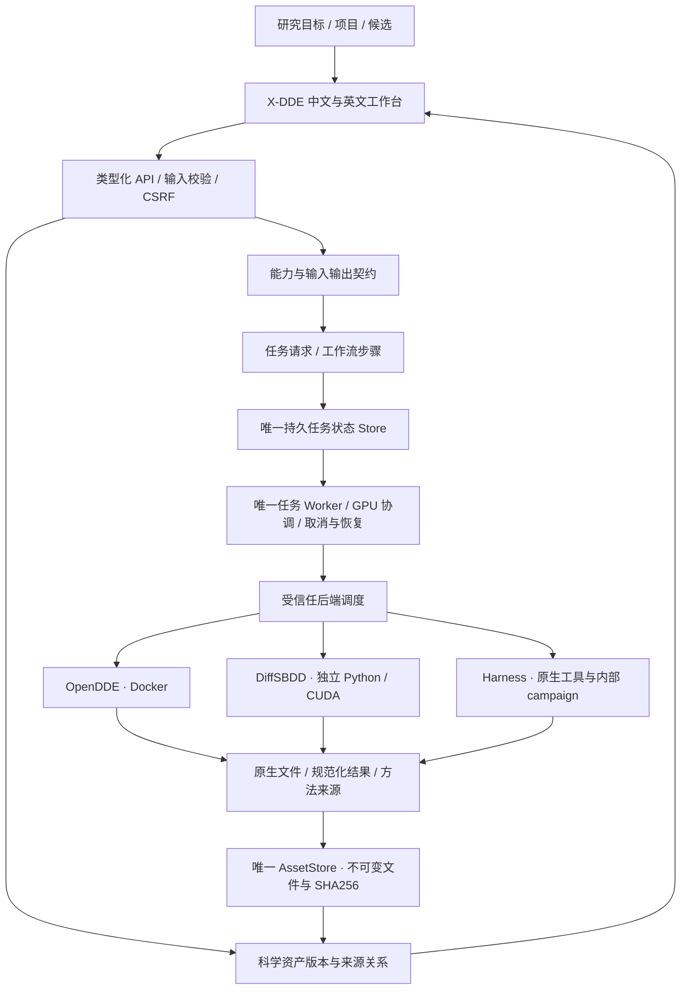
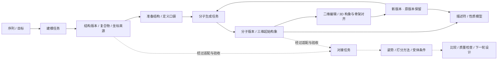

# Design direction and capability contract

The owner-provided `reference.png` remains unchanged as style inspiration only: readable scientific controls. The current owner direction supersedes its blue palette with warm paper surfaces, charcoal typography and restrained clay accents inspired by Claude Science. Its labels, project cards and plots are not feature specifications. Image SHA-256: `0d65a4b5acde90c80469a4bcc013b623d43021bbf90a2b90e29452b59f10b842` (1448 × 1086).

## Product hierarchy

**X-DDE is the platform. OpenDDE is one of its software backends.** X-DDE owns projects, tasks, assets, user interaction, deployment coordination and execution provenance. Scientific software provides capabilities through adapters beneath that platform boundary; no upstream product owns X-DDE's scope or identity.

Currently integrated scientific software includes OpenDDE, native Harness tools/campaigns and RDKit descriptors. Ketcher and Mol* are editor/inspection components. Backend installation, backend readiness and X-DDE task-service readiness are distinct states. Missing OpenDDE prerequisites must be identified as an OpenDDE problem, not a failure of the entire platform or of an unrelated editor.

The existing `Engine`/Docker path is the OpenDDE adapter, not a universal registry for every future backend. Explicit environment/capability registration and composed multi-engine workflows remain staged work below; this hierarchy does not claim those planned capabilities already exist.

## Source authority

- OpenDDE commit `ddfa1df8aff1babf1fddac4247b7d2351bd0ce9f`: `runner/cli.py`, `runner/batch_inference.py`, `runner/msa_search.py`, `runner/dumper.py`, `docs/infer_json_format.md` and model manifest.
- Harness source baseline `6510a6f6f4a845193739684830931826c7ad73a9`: `core/contracts.py`, `core/runtime.py`, `core/detached.py`, `core/validation.py`, `servers/api.py`, `servers/client.py`, scientific backends and CLI. The inspected local distribution also contains previously installed UI/localization and API changes; those are not copied into this repository. Deploy the audited compatible runtime, and run server contract acceptance before changing upstream versions.
- Native model: `opendde_v1`; released general and ABAG checkpoints. Operator-registered custom checkpoints use the same model architecture contract.

## Coverage matrix

The rows below describe **implemented code paths**, not completed runtime acceptance. All new integrations require the target-server checks in `docs/server-acceptance.md`.

| Actual upstream ability | Frontend entry and controls | Execution and result path |
| --- | --- | --- |
| `pred`: protein/ligand/DNA/RNA/ion, single and mixed assemblies | Predict structures; six guided workflows and expert component controls | Typed native JSON → pinned CLI → real CIF and confidence |
| Copies, explicit chain IDs, modified residues | Per-component expert fields | Exact native `id`, `count`, `modifications` |
| SMILES, CCD, file ligands | Text or immutable uploaded SDF/MOL/MOL2/PDB | Native `FILE_` binding; multiple SDF records rejected for a single prediction ligand |
| Covalent input bonds | Native atom inspection; select atoms in the preview or searchable list | Native atom metadata → validated entity/copy/position/atom fields → `covalent_bonds` |
| Seeds, samples, cycles, steps, dtype | Presets and expert controls | Native flags; multi-seed result IDs and aligned filenames remain unique |
| TFG and atom confidence | Expert toggles with explanations | Native geometry guidance / `need_atom_confidence`; no invented potency model |
| CPU/CUDA, kernels, caching/fusion/TF32, determinism | Expert controls | CLI flags; Linux target; MPS is not a supported deployment backend here |
| FoldCP | GPU indices and distributed toggle | Native `torchrun`, DP=1, CP=device count; requires multiple server GPUs |
| Standard, ABAG, custom checkpoint | Model selection and server checkpoint registry | Read-only model mounts; no browser-supplied checkpoint paths |
| Uploaded MSA and templates / online search | Feature choices and component file pickers | Explicit network setting, managed A3M/template paths |
| `msa`, `mt`, `prep` | Feature-preparation form | Native commands and stable `prepared-input.json`, including native outputs written outside the original output directory |
| `json` | PDB/CIF import; altloc, assembly and discontinuous-bond options | Native converter; review/import resulting native inputs before prediction |
| Native multi-job inputs | JSON import, per-task review and batch submit | One transactional batch, stable idempotency keys; no partial enqueue |
| `doctor` and native data installer | Resources and diagnostics | Official command / manifest-backed helper; explicit downloads, no automatic large install during prediction |
| Native PAE/PDE/contact probabilities/atom pLDDT | Confidence panel and raw download | Actual `_full_data_sample_*.json`; bounded, labelled sampling |
| Harness antibody campaigns | VHH/scFv/VH-VL, target/scaffold/CDR/fixed positions, budget; complete expert JSON and YAML import | Native config loader and detached controller; reviewed digest, durable handoff and reconciliation |
| Design policies and tools | Expert design JSON: all native science settings, schedules, weights, parent policy, model/token limits, gates, terminal refolding | Original Harness parser remains scientific authority; credentials/URLs/executables remain operator settings |
| Campaign lifecycle | Status, phase, candidates, structure preview, stop, batch-size/reflection adjustment, recovery after browser refresh | Native task store/controller; no duplicate agent or lifecycle engine |
| ESM score | Sequence-score form | Native `/score/esm` |
| ESM2 guided proposals | Parent chains and clickable mutable positions | Native `/generate/esm2-guided` |
| SolubleMPNN | Managed structure, parent chains, mutable positions and expert settings | Native `/generate/soluble_mpnn` |
| Candidate folding and objectives | Candidate/target chain editor and expert scientific options | Native asynchronous `/fold`; polling and cancellation |
| Target MSA | Target name, chain and sequence | Native `/search/msa/target`; depth/cache metadata |
| Epitope and hotspot analysis | Structure/chain/CDR inputs, cutoff, expert hotspots; one-click campaign report | Native `/analysis/epitope` |
| PLIP analysis | Up to three structures with target/binder chains; campaign report | Native `/analysis/structure` |
| Target-aligned binder RMSD | Reference/mobile structures and chain selections | Native `/analysis/pose-rmsd` |
| Evolution, conservation and structural history | Candidate JSON input; original campaign history report preserves native structure context | Native `/analysis/evolution-tree`, including configured FoldMason dependencies |
| ProTrek sequence/structure search | Sequence or structure+chain and result count | Native search APIs; missing service is reported unavailable |
| Candidate population/top results | Campaign ranking, full candidate details, structure and population download | Native controller/client; population writes remain owned by the design workflow |
| Compare two candidate populations | Two JSON inputs, top-k and expert direction | Original `core.validation.compare_runs` used by native CLI `compare` |
| Standalone molecular descriptors (Workbench extension) | Property form, up to 500 SMILES/file records | RDKit MW/LogP/TPSA/QED/SA/HBD/HBA/rotatable bonds; actual CSV/JSON |
| Molecular display (Workbench extension) | Ligand ball/stick, ribbons, nearby residues, styles, selection, distance and overlays | Existing 3Dmol dependency and real CIF/PDB parsing |

## Current upstream integration limits

The public Harness `servers/backends/developability_filter.py` is a stub returning `available: false`. There is no objective-developability prediction card; native LLM campaign quality assessments retain their provenance. No generic small-molecule de novo, complete ADMET or calibrated-affinity model was found in the audited OpenDDE/Harness implementation. These findings constrain those integrations, not X-DDE's future capabilities through other software. Deprecated/ignored `msa_server_mode` and redundant `use_default_params` are not fake controls. Training and proprietary editor features are not part of the audited inference distribution.

Service shutdown, arbitrary population replacement, provider secrets, arbitrary command/path execution and native application administration are not scientific task modules. Operator configuration is documented rather than proxied unrestrictedly to the browser.

## Interaction rules

Chinese/English labels; guided choices first; expert controls preserve values. File inputs can come from uploads or completed task artifacts. Native fields are never silently discarded on import. Invalid inputs, missing prerequisites, partial/unavailable results and unsupported cancellation are visible.

The input preview is not a predicted pose. Visual edits preserve coordinates. Adding a covalent bond changes a new task's topology explicitly. Native confidence is not potency; proximity is not hydrogen-bond classification. No numerical result or structure originates from the reference image.

Display limits are Workbench guardrails, not model limits: 20 tasks per atomic batch; 25 MiB per uploaded file; 500 molecules per property task; at most 64 predicted conformers from the supported sample/seed controls; confidence display samples large matrices. Complete native artifacts remain available when permitted by task output limits.

## X-DDE 平台架构与资产关系

X-DDE 是完整药物研究平台。OpenDDE、DiffSBDD、Harness 中的科学工具，以及后续经过实际适配的软件，是平台接入的实现。前端围绕研究目标、项目、候选、资产与证据组织，不按某一个开源软件的菜单组织。平台治理、资产与执行状态由 X-DDE 掌握，科学计算使用各软件的真实实现。

**实施状态必须区分：架构已设计、适配代码已实现、真实协议已验证、科学基准已通过。** 本次 `feat/platform-integration` 正在实施共享资产版本、血缘图和独立多后端调度。DiffSBDD 的四种设计契约、原生科学桥接与八模型安装代码已写入候选分支；完整前端、历史导入和服务器科学验收仍在推进。下列未来引擎不会因出现在架构里而出现在可用工具卡片里。

### 一个控制平面，多个科学实现

`Capability` 描述用户希望完成的科学活动，例如建模、生成、性质计算、姿势评估；`Engine` 是实现该活动的软件及版本、模型和许可证；`ExecutionBackend` 管理 Docker 或受控本地进程的运行、终止和恢复。三者不能混成一个“已安装”状态。安装完成不代表权重就绪、GPU 可用或科学结果可靠。

前端组件不直接执行科学脚本，也不管理第二份运行队列。浏览器不能指定 Python 路径、命令、任意模型下载地址或服务器文件路径。调度器依据数据库中的已校验任务请求决定启动及停止后端，不信任任务目录里的 `request.json` 作为恢复路由依据。独立科学环境不继承 LLM / 计算服务密钥。Harness 在它自己的 campaign 内仍是唯一科学循环权威，平台只保存交接、标识、预算和可核对状态。

### 三层资产模型

| 层次 | 权威和已落地代码 | 含义 |
| --- | --- | --- |
| 不可变原始文件 | `AssetStore`、上传与任务结果保存接口 | 文件类型、格式、大小、SHA256；文件仅保存一次，被引用后受保护 |
| 科学对象版本 | `research/contracts.py`、`research/storage.py` | 分子、结构、序列、口袋、分析；文件记录/构象、版本、版本家族、父版本、来源任务、备注与人工评价 |
| 科学关系 | `research/graph.py` 与任务的 `scientific_inputs` | 谁生成、谁修改、使用哪个确切版本、结果交给哪些后续任务；投影自真实数据库，不造演示关系 |

对象版本不会覆盖旧文件。修改分子、准备蛋白或保存备注创建新版本，保留父版本与来源。不同科学对象通过实际输入输出任务联系；例如结构生成分子是跨对象研究关系，分子的编辑则属于同一版本家族。对象类型不会因 UI 菜单切换而改变。

`MoleculeRef` 绑定资产 UUID、SHA256、记录号、构象号和可选的科学版本 UUID。`AtomRef` 绑定这份上下文及 RDKit 重原子编号；不得拿查看器数组索引当全局原子身份。残基绑定结构、模型、链、编号、插入码和替代位置。内容或拓扑改变后必须重建选择与映射。DiffSBDD 当前原生边界只接受首个 PDB 模型、一字符链、无插入码且已处理替代位置的口袋残基；不支持的身份明确拒绝，不能截断或悄悄改号。

上传/登记只证明文件身份，不证明化学有效性或三维质量。性质结果保留描述符方法；相互作用保留 ProLIF/PLIP 的规则和版本；结构置信度、对接分数、自由能和实测活性分别保存，不能写入同一个未定义的“综合分”。人工备注与评价独立于模型测量。

### 可组合研究路径

自动交接要经过四层检查：对象类型与格式 → 化学/序列与坐标有效性 → 新工具实际前提与约束支持 → 结果可解释性。OpenDDE 的 mmCIF 复合物不能仅改后缀交给只接收 PDB 的适配器；转换必须保留链/残基/原子映射，明确选择模型/构象。从复合物提取配体必须保留真实键型、立体化学及对齐坐标。二维绘图只产生分子拓扑，不默认产生受体中的结合姿势。

普通用户选择“继续设计”“计算性质”“准备结构”等目标，平台给出可复用输入、兼容软件与几个经过验证的预设；专家可检查和微调参数、约束及计算预算。缺少的环境、权重、化学数据或结构条件在提交前明确显示。尚未接入的对接后端不提供无效按钮。

### 模块边界和扩展契约

- `projects`：研究空间和项目关联；不复制科学文件。
- `assets`：唯一上传/结果文件存储；`research` 在同一个 SQLite 数据库保存对象版本及血缘。
- `requests` 与 `scientific_objects`：共享任务和科学身份契约；服务端校验确切版本与任务真实输入一致。
- `backend_router`：统一启动、停止、恢复路由；`engine` 只负责 OpenDDE Docker；`local_process` 负责持久进程身份和有界终止。
- `diffsbdd`：固定源码及模型清单、契约、原生科学桥接；不搬入旧服务器、JobManager、独立网页或 DesignStore。
- `deployment`：软件安装生命周期；与科学任务状态分离，并协调安装期间的任务提交。
- `frontend/research`：关系图、资产说明与任务交接；编辑器和三维查看器通过明确接口接入。

新增引擎必须登记真实输入/输出 schema、软件/镜像/模型摘要、许可证、资源前提、约束支持、失败与取消语义、结果规范化和科学验证状态。原生约束、适配层约束、仅结果检查及不支持约束明确区分。刚性固定原子和保留键型不能用生成后的过滤冒充。

工作流层的后续实现将持久记录 Run/Step/Attempt、步骤依赖、输入版本、预算、幂等和恢复状态，复用同一 Worker 和 GPU 协调。缓存键包含所有科学输入、拓扑、处理条件、引擎/权重、参数、种子与约束；输入版本改变只使实际受影响的下游结果失效。此层未完成前不声称已实现跨软件自动多步编排。

### 当前和后续能力状态

| 领域 | 当前真实实现 | 尚待实施/验收 |
| --- | --- | --- |
| 结构与复合物 | OpenDDE 输入/预测/置信度/比较适配 | 目标服务器科学验收；共享对象的更多自动规范化 |
| 分子与结构编辑 | Ketcher、Mol*、3Dmol；新版本与血缘代码 | 稳定的 2D/3D 双向选择、完整约束编辑和视图迁移 |
| 分子设计 | DiffSBDD 四模式与八模型的候选适配代码 | 完整 UI、原生历史迁移、协议与 GPU 验收 |
| 性质与评分 | RDKit 描述符、Harness 序列评分 | 经过校准的 ADMET/亲和力模型分别接入，当前不提供 |
| 抗体设计 | Harness 原生 campaign 和工具适配 | 共享候选/测量对象的完整交接 |
| 口袋与准备 | 现有口袋检查；DiffSBDD 原生筛选桥接 | P2Rank/fpocket 等只有真实适配后开放 |
| 对接与选择性 | 现有结构检查、对齐、PLIP | GNINA、约束对接及受体集合为待适配引擎 |
| 精修与模拟 | 尚无新模拟实现 | OpenMM/OpenFF、条件/参数化、服务器验收 |
| 多组分体系 | 原生支持范围内的混合实体建模 | TERNIFY 等须逐项验证输入、许可证、权重和基准 |
| 实验反馈 | 人工备注/评价与研究版本 | 实验条件、单位、批次、重复数和候选关联，再考虑主动学习 |

### DiffSBDD 全量迁移边界

源码固定为 `Victor-Xu-1/diffsbdd-workbench@55f365b195d126ec25f7e7ae00ff253fd4491dac`，官方模型源码为 `arneschneuing/DiffSBDD@5d0d38d16c8932a0339fd2ce3f67ade98bbdff27` 加已核对兼容补丁。源候选 `9f3a51d` 的显示/可用性改动需单独审查；不能把未并入生产的候选当成当前已迁移能力。

完整范围仍包括：generate/inpaint/diversify/optimize、所有原生参数和八模型；口袋和结构准备、真实键型与 CCD、环/稠环/骨架选择、编辑与三维对齐、有效性/连接/去重与拒绝原因、ProLIF 分析、候选/批量/导出、草稿与版本、历史导入、取消/恢复、视图与高分辨率图像，以及工作台内继续设计/性质/结构任务的交接。基础契约或一次 CI 通过不代表整个迁移完成。

旧数据只读盘点，导入前 dry-run，使用原 ID、文件摘要、引擎/权重/种子、编辑/评价/草稿 provenance 建立幂等映射；不删除或移动原目录，不受旧 API 默认 20 条分页影响。正式兼容清单须逐项对应目标模块和证据，验证替换成功后再移除确认冗余的实现。

### 验证与运维约束

本次风险链：科学引用 → 资产保护/版本持久化 → 任务提交 → 调度/停止/恢复 → 结果复用 → 图与编辑器。新增回归覆盖真实 SQLite/文件/API/CSRF、幂等、错误版本拒绝、进程组取消和前端交互。共享调度变化同时回归已有 OpenDDE/Harness 路径，不能因未修改科学算法而跳过消费者。

本机只做静态、构建、安装生命周期和浏览器检查；不下载模型或执行科学推理。测试套件在 GitHub CI 执行；真实 RDKit/ProLIF 及科学协议验证和 GPU/多 GPU/LLM/数据集验收分别记录，未运行项明确保留。不能以源码、mock 或旧软件的历史测试声称新架构的科学链路通过。

### 安装来源与回滚

DiffSBDD 的可选科学环境保留原生 MIT/LICENSE、官方 LICENSE 和第三方 notices；依赖使用源项目的 `requirements.lock --require-hashes`，官方八模型分别验证大小及 SHA256 后才可加载。X-DDE MIT 不替换模型及第三方许可证。源包 URL/摘要和官方 revision 在 `diffsbdd/manifest.py` 固定，浏览器不能覆盖。

科学版本表是对现有数据库的附加结构，现有文件和原任务不会移除。包含新 operation 的任务数据库不能交给旧版任务解析器；升级前须保存一致的 SQLite backup。回滚使用旧程序及升级前数据库快照，同时保留新任务目录/原始输出和新数据库供恢复，不直接覆盖或删除新增研究数据。本次候选预览使用独立状态目录，发布的 rc4 数据保持不变。
