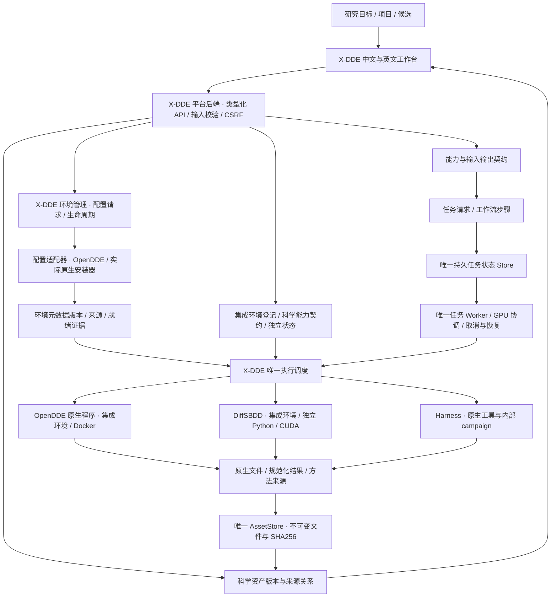
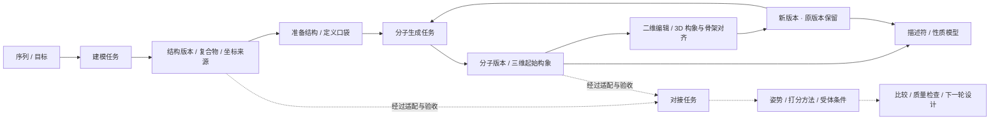

# Design direction and capability contract

The owner-provided `reference.png` remains unchanged as style inspiration only: readable scientific controls. The current owner direction supersedes its blue palette with warm paper surfaces, charcoal typography and restrained clay accents inspired by Claude Science. Its labels, project cards and plots are not feature specifications. Image SHA-256: `0d65a4b5acde90c80469a4bcc013b623d43021bbf90a2b90e29452b59f10b842` (1448 × 1086).

## Product hierarchy

**X-DDE owns the frontend and unified backend. All other software, including OpenDDE, is integrated as managed environments/components.** Platform APIs, scientific/business contracts, projects, assets, tasks, workflow plans, execution/deployment authority and evidence belong to X-DDE. Upstream scientific programs retain their genuine names, interfaces and licenses.

Environment preparation and scientific execution are distinct contracts. The product OpenDDE configuration adapter currently delegates its reviewed configuration actions to the official OpenDDE Harness installer; it is not a new upstream API or a universal preparation gateway for DiffSBDD or editors. Existing native OpenDDE prediction remains a scientific software implementation inside an integrated environment. X-DDE owns the deployment queue and process lifecycle; native configuration does not expose fictional pause, rollback or uninstall APIs.

The historical `engine_registry` maps typed task operations to integrated scientific environments; `BackendRouter` alone dispatches/cancels/recovers scientific execution. `deployment/provisioners` isolates actual native configuration calls. `EnvironmentSpec` describes a selected runtime and components; `EnvironmentRecord` binds its immutable metadata digest to the existing job database. Component provenance identifies the preparing adapter and native implementation separately from the scientific software. Unknown or unrecorded operator/legacy origins are explicitly retained as such.

Metadata snapshots do not assert immutable runtime/model contents. Native source/image/model fingerprints and scientific server acceptance remain required; managed deployment changes are blocked for active scientific tasks. Existing jobs/requests/assets remain valid. The additive `job_environments` table is created idempotently; backup both state databases before upgrade and retain them on rollback. Old versions ignore this extra table. `health.environments` is the canonical environment projection; historical `engines`/`engine` fields remain projections for existing consumers, never independent state authorities.

## Source authority

- OpenDDE commit `ddfa1df8aff1babf1fddac4247b7d2351bd0ce9f`: `runner/cli.py`, `runner/batch_inference.py`, `runner/msa_search.py`, `runner/dumper.py`, `docs/infer_json_format.md` and model manifest.
- Harness source baseline `6510a6f6f4a845193739684830931826c7ad73a9`: `core/contracts.py`, `core/runtime.py`, `core/detached.py`, `core/validation.py`, `servers/api.py`, `servers/client.py`, scientific backends and CLI. The inspected local distribution also contains previously installed UI/localization and API changes; those are not copied into this repository. Deploy the audited compatible runtime, and run server contract acceptance before changing upstream versions.
- Native model: `opendde_v1`; released general and ABAG checkpoints. Operator-registered custom checkpoints use the same model architecture contract.

## Coverage matrix

The rows below describe **implemented code paths**, not completed runtime acceptance. All new integrations require the target-server checks in `docs/server-acceptance.md`.

| Actual upstream ability | Frontend entry and controls | Execution and result path |
| --- | --- | --- |
| `pred`: protein/ligand/DNA/RNA/ion, single and mixed assemblies | Predict structures; six guided workflows and expert component controls | Typed native JSON → pinned CLI → real CIF and confidence |
| Copies, explicit chain IDs, modified residues | Per-component expert fields | Exact native `id`, `count`, `modifications` |
| SMILES, CCD, file ligands | Text or immutable uploaded SDF/MOL/MOL2/PDB | Native `FILE_` binding; multiple SDF records rejected for a single prediction ligand |
| Covalent input bonds | Native atom inspection; select atoms in the preview or searchable list | Native atom metadata → validated entity/copy/position/atom fields → `covalent_bonds` |
| Seeds, samples, cycles, steps, dtype | Presets and expert controls | Native flags; multi-seed result IDs and aligned filenames remain unique |
| TFG and atom confidence | Expert toggles with explanations | Native geometry guidance / `need_atom_confidence`; no invented potency model |
| CPU/CUDA, kernels, caching/fusion/TF32, determinism | Expert controls | CLI flags; Linux target; MPS is not a supported deployment backend here |
| FoldCP | GPU indices and distributed toggle | Native `torchrun`, DP=1, CP=device count; requires multiple server GPUs |
| Standard, ABAG, custom checkpoint | Model selection and server checkpoint registry | Read-only model mounts; no browser-supplied checkpoint paths |
| Uploaded MSA and templates / online search | Feature choices and component file pickers | Explicit network setting, managed A3M/template paths |
| `msa`, `mt`, `prep` | Feature-preparation form | Native commands and stable `prepared-input.json`, including native outputs written outside the original output directory |
| `json` | PDB/CIF import; altloc, assembly and discontinuous-bond options | Native converter; review/import resulting native inputs before prediction |
| Native multi-job inputs | JSON import, per-task review and batch submit | One transactional batch, stable idempotency keys; no partial enqueue |
| `doctor` and native data installer | Resources and diagnostics | Official command / manifest-backed helper; explicit downloads, no automatic large install during prediction |
| Native PAE/PDE/contact probabilities/atom pLDDT | Confidence panel and raw download | Actual `_full_data_sample_*.json`; bounded, labelled sampling |
| Harness antibody campaigns | VHH/scFv/VH-VL, target/scaffold/CDR/fixed positions, budget; complete expert JSON and YAML import | Native config loader and detached controller; reviewed digest, durable handoff and reconciliation |
| Design policies and tools | Expert design JSON: all native science settings, schedules, weights, parent policy, model/token limits, gates, terminal refolding | Original Harness parser remains scientific authority; credentials/URLs/executables remain operator settings |
| Campaign lifecycle | Status, phase, candidates, structure preview, stop, batch-size/reflection adjustment, recovery after browser refresh | Native task store/controller; no duplicate agent or lifecycle engine |
| ESM score | Sequence-score form | Native `/score/esm` |
| ESM2 guided proposals | Parent chains and clickable mutable positions | Native `/generate/esm2-guided` |
| SolubleMPNN | Managed structure, parent chains, mutable positions and expert settings | Native `/generate/soluble_mpnn` |
| Candidate folding and objectives | Candidate/target chain editor and expert scientific options | Native asynchronous `/fold`; polling and cancellation |
| Target MSA | Target name, chain and sequence | Native `/search/msa/target`; depth/cache metadata |
| Epitope and hotspot analysis | Structure/chain/CDR inputs, cutoff, expert hotspots; one-click campaign report | Native `/analysis/epitope` |
| PLIP analysis | Up to three structures with target/binder chains; campaign report | Native `/analysis/structure` |
| Target-aligned binder RMSD | Reference/mobile structures and chain selections | Native `/analysis/pose-rmsd` |
| Evolution, conservation and structural history | Candidate JSON input; original campaign history report preserves native structure context | Native `/analysis/evolution-tree`, including configured FoldMason dependencies |
| ProTrek sequence/structure search | Sequence or structure+chain and result count | Native search APIs; missing service is reported unavailable |
| Candidate population/top results | Campaign ranking, full candidate details, structure and population download | Native controller/client; population writes remain owned by the design workflow |
| Compare two candidate populations | Two JSON inputs, top-k and expert direction | Original `core.validation.compare_runs` used by native CLI `compare` |
| Standalone molecular descriptors (Workbench extension) | Property form, up to 500 SMILES/file records | RDKit MW/LogP/TPSA/QED/SA/HBD/HBA/rotatable bonds; actual CSV/JSON |
| Molecular display (Workbench extension) | Ligand ball/stick, ribbons, nearby residues, styles, selection, distance and overlays | Existing 3Dmol dependency and real CIF/PDB parsing |

## Current upstream integration limits

The public Harness `servers/backends/developability_filter.py` is a stub returning `available: false`. There is no objective-developability prediction card; native LLM campaign quality assessments retain their provenance. No generic small-molecule de novo, complete ADMET or calibrated-affinity model was found in the audited OpenDDE/Harness implementation. These findings constrain those integrations, not X-DDE's future capabilities through other software. Deprecated/ignored `msa_server_mode` and redundant `use_default_params` are not fake controls. Training and proprietary editor features are not part of the audited inference distribution.

Service shutdown, arbitrary population replacement, provider secrets, arbitrary command/path execution and native application administration are not scientific task modules. Operator configuration is documented rather than proxied unrestrictedly to the browser.

## Interaction rules

Chinese/English labels; guided choices first; expert controls preserve values. File inputs can come from uploads or completed task artifacts. Native fields are never silently discarded on import. Invalid inputs, missing prerequisites, partial/unavailable results and unsupported cancellation are visible.

The input preview is not a predicted pose. Visual edits preserve coordinates. Adding a covalent bond changes a new task's topology explicitly. Native confidence is not potency; proximity is not hydrogen-bond classification. No numerical result or structure originates from the reference image.

Display limits are Workbench guardrails, not model limits: 20 tasks per atomic batch; 25 MiB per uploaded file; 500 molecules per property task; at most 64 predicted conformers from the supported sample/seed controls; confidence display samples large matrices. Complete native artifacts remain available when permitted by task output limits.

## X-DDE 平台架构与资产关系

X-DDE 是完整药物研究平台，包含 X-DDE 前端和 X-DDE 平台后端。OpenDDE、DiffSBDD、Harness 及后续软件均作为集成环境/组件管理；环境内的真实科学程序通过 X-DDE 适配器执行。前端围绕研究目标、项目、候选、资产与证据组织，不按某一个开源软件的菜单组织。平台治理、资产与执行状态由 X-DDE 掌握，科学计算使用各软件的真实实现。

**实施状态必须区分：架构已设计、适配代码已实现、真实协议已验证、科学基准已通过。** 主分支已落地共享资产版本、血缘图、成功任务的产物登记、指定分子记录的性质交接和独立多后端调度。DiffSBDD 的四种设计契约、原生科学桥接与八模型安装代码也已提交；完整前端、历史导入和服务器科学验收仍在推进。下列未来引擎不会因出现在架构里而出现在可用工具卡片里。

### 一个控制平面，多个科学实现

平台服务端名称和健康身份始终为 **X-DDE**。`/api/health.platform` 表示平台任务服务；`/api/health.environments` 按集成环境返回身份与科学运行检查；`provisioners` 单独描述配置客户端，`/api/deployment.engines` 与各组件的 `engine`、`kind` 使用同一归属。历史 `health.engine` 只保留原 OpenDDE 快照供已有调用方读取，不能再用于判断整个平台是否可用。

| 层次 | 责任与边界 |
| --- | --- |
| X-DDE 前端 | 研究目标选择、输入、预览/编辑和专家参数；只通过 X-DDE API 调用 |
| X-DDE 平台后端 | 唯一项目、任务状态、安装状态、资产版本、血缘与方法来源；校验和调度 |
| 环境内的科学程序 | 集成环境中的 OpenDDE 原生程序、DiffSBDD、Harness 等；实现实际科学方法 |
| 执行与依赖环境 | Docker 或独立进程、Python/CUDA、权重和服务地址；按引擎分别部署 |
| 研究资产 | 结构、分子、序列、口袋和分析版本；属于 X-DDE，可跨兼容引擎复用 |

`Capability` 描述用户希望完成的科学活动，例如建模、生成、性质计算、姿势评估；集成环境承载实现该活动的软件及版本、模型和许可证；`ExecutionBackend` 管理 Docker 或受控本地进程的运行、终止和恢复。三者不能混成一个“已安装”状态。安装完成不代表权重就绪、GPU 可用或科学结果可靠。

前端组件不直接执行科学脚本，也不管理第二份运行队列。浏览器不能指定 Python 路径、命令、任意模型下载地址或服务器文件路径。调度器依据数据库中的已校验任务请求决定启动及停止后端，不信任任务目录里的 `request.json` 作为恢复路由依据。独立科学环境不继承 LLM / 计算服务密钥。Harness 在它自己的 campaign 内仍是唯一科学循环权威，平台只保存交接、标识、预算和可核对状态。

### 三层资产模型

| 层次 | 权威和已落地代码 | 含义 |
| --- | --- | --- |
| 不可变原始文件 | `AssetStore`、上传与任务结果保存接口 | 文件类型、格式、大小、SHA256；文件仅保存一次，被引用后受保护 |
| 科学对象版本 | `research/contracts.py`、`research/storage.py` | 分子、结构、序列、口袋、分析；文件记录/构象、版本、版本家族、父版本、来源任务、备注与人工评价 |
| 科学关系 | `research/graph.py` 与任务的 `scientific_inputs` | 谁生成、谁修改、使用哪个确切版本、结果交给哪些后续任务；投影自真实数据库，不造演示关系 |

对象版本不会覆盖旧文件。修改分子、准备蛋白或保存备注创建新版本，保留父版本与来源。不同科学对象通过实际输入输出任务联系；例如结构生成分子是跨对象研究关系，分子的编辑则属于同一版本家族。对象类型不会因 UI 菜单切换而改变。

已接入自动产物登记：唯一 Worker 在成功执行后，将可识别的分子、结构、序列和结构化结果写入同一个 AssetStore，并登记来源任务。SDF 每个记录有独立科学引用，单次登记最多 500 个分子；批量版本在同一事务中写入，文件摘要只校验一次。自动登记和手动保存复用同一 `research/outputs.py` 路径与幂等键。登记失败不会覆盖原生结果，`research_output_index` 显示部分失败的文件与原因，前端可以重新登记。

性质任务绑定指定分子版本时，只读取对应 SDF 记录；不把整份库的结果冒充这个分子的结果。未指定版本的原有批量性质流程仍计算整份输入。Ketcher 保存与研究备注保存均保留重试意图，网络返回不确定时重试不会增加重复版本。二维编辑创建新资产，但不宣称保留受体中的三维结合姿势。

这里的“建模产物”指蛋白/复合物的结构及相关置信度；计算引擎的模型权重属于独立、固定摘要的运行依赖。两者分别记录和管理。未来引擎复用研究资产时仍需真实格式转换、键型和坐标检查，不能只更换软件标签。

`MoleculeRef` 绑定资产 UUID、SHA256、记录号、构象号和可选的科学版本 UUID。`AtomRef` 绑定这份上下文及 RDKit 重原子编号；不得拿查看器数组索引当全局原子身份。残基绑定结构、模型、链、编号、插入码和替代位置。内容或拓扑改变后必须重建选择与映射。DiffSBDD 当前原生边界只接受首个 PDB 模型、一字符链、无插入码且已处理替代位置的口袋残基；不支持的身份明确拒绝，不能截断或悄悄改号。

上传/登记只证明文件身份，不证明化学有效性或三维质量。性质结果保留描述符方法；相互作用保留 ProLIF/PLIP 的规则和版本；结构置信度、对接分数、自由能和实测活性分别保存，不能写入同一个未定义的“综合分”。人工备注与评价独立于模型测量。

### 可组合研究路径

自动交接要经过四层检查：对象类型与格式 → 化学/序列与坐标有效性 → 新工具实际前提与约束支持 → 结果可解释性。OpenDDE 的 mmCIF 复合物不能仅改后缀交给只接收 PDB 的适配器；转换必须保留链/残基/原子映射，明确选择模型/构象。从复合物提取配体必须保留真实键型、立体化学及对齐坐标。二维绘图只产生分子拓扑，不默认产生受体中的结合姿势。

普通用户选择“继续设计”“计算性质”“准备结构”等目标，平台给出可复用输入、兼容软件与几个经过验证的预设；专家可检查和微调参数、约束及计算预算。缺少的环境、权重、化学数据或结构条件在提交前明确显示。尚未接入的对接后端不提供无效按钮。

### 模块边界和扩展契约

- `projects`：研究空间和项目关联；不复制科学文件。
- `assets`：唯一上传/结果文件存储；`research` 在同一个 SQLite 数据库保存对象版本及血缘。
- `requests` 与 `scientific_objects`：共享任务和科学身份契约；服务端校验确切版本与任务真实输入一致。
- `engine_registry`：集成环境身份、运行方式和唯一操作归属；未知操作不能默认派给 OpenDDE 原生程序。
- `execution_environment`：明确的环境规格、准备来源和不可覆盖的任务环境元数据绑定；不复制任务/资产权威。
- `deployment/provisioners`：专门调用已核对的原生配置接口，不参与科学业务输入、结果或任务调度。
- `backend_router`：统一启动、停止、恢复路由；`engine` 只负责 OpenDDE Docker；`local_process` 负责持久进程身份和有界终止。
- `diffsbdd`：固定源码及模型清单、契约、原生科学桥接；不搬入旧服务器、JobManager、独立网页或 DesignStore。
- `deployment`：X-DDE 管理各引擎的环境、模型和独立编辑器；组件显式声明所属引擎与 runtime/model/editor 角色，安装生命周期与科学任务状态分离。新目录为 `x-dde-managed`，旧归属目录复用且不改写原数据；冲突目录明确拒绝。
- `frontend/research`：关系图、资产说明与任务交接；编辑器和三维查看器通过明确接口接入。

新增引擎必须登记真实输入/输出 schema、软件/镜像/模型摘要、许可证、资源前提、约束支持、失败与取消语义、结果规范化和科学验证状态。原生约束、适配层约束、仅结果检查及不支持约束明确区分。刚性固定原子和保留键型不能用生成后的过滤冒充。

工作流层的后续实现将持久记录 Run/Step/Attempt、步骤依赖、输入版本、预算、幂等和恢复状态，复用同一 Worker 和 GPU 协调。缓存键包含所有科学输入、拓扑、处理条件、引擎/权重、参数、种子与约束；输入版本改变只使实际受影响的下游结果失效。此层未完成前不声称已实现跨软件自动多步编排。

### 当前和后续能力状态

| 领域 | 当前真实实现 | 尚待实施/验收 |
| --- | --- | --- |
| 结构与复合物 | OpenDDE 输入/预测/置信度/比较适配 | 目标服务器科学验收；共享对象的更多自动规范化 |
| 分子与结构编辑 | Ketcher、Mol*、3Dmol；新版本与血缘代码 | 稳定的 2D/3D 双向选择、完整约束编辑和视图迁移 |
| 分子设计 | DiffSBDD 四模式与八模型适配代码 | 完整 UI、原生历史迁移、协议与 GPU 验收 |
| 性质与评分 | RDKit 描述符、Harness 序列评分 | 经过校准的 ADMET/亲和力模型分别接入，当前不提供 |
| 抗体设计 | Harness 原生 campaign 和工具适配 | 共享候选/测量对象的完整交接 |
| 口袋与准备 | 现有口袋检查；DiffSBDD 原生筛选桥接 | P2Rank/fpocket 等只有真实适配后开放 |
| 对接与选择性 | 现有结构检查、对齐、PLIP | GNINA、约束对接及受体集合为待适配引擎 |
| 精修与模拟 | 尚无新模拟实现 | OpenMM/OpenFF、条件/参数化、服务器验收 |
| 多组分体系 | 原生支持范围内的混合实体建模 | TERNIFY 等须逐项验证输入、许可证、权重和基准 |
| 实验反馈 | 人工备注/评价与研究版本 | 实验条件、单位、批次、重复数和候选关联，再考虑主动学习 |

### DiffSBDD 全量迁移边界

源码固定为 `Victor-Xu-1/diffsbdd-workbench@55f365b195d126ec25f7e7ae00ff253fd4491dac`，官方模型源码为 `arneschneuing/DiffSBDD@5d0d38d16c8932a0339fd2ce3f67ade98bbdff27` 加已核对兼容补丁。源候选 `9f3a51d` 的显示/可用性改动需单独审查；不能把未并入生产的候选当成当前已迁移能力。

完整范围仍包括：generate/inpaint/diversify/optimize、所有原生参数和八模型；口袋和结构准备、真实键型与 CCD、环/稠环/骨架选择、编辑与三维对齐、有效性/连接/去重与拒绝原因、ProLIF 分析、候选/批量/导出、草稿与版本、历史导入、取消/恢复、视图与高分辨率图像，以及工作台内继续设计/性质/结构任务的交接。基础契约或一次 CI 通过不代表整个迁移完成。

旧数据只读盘点，导入前 dry-run，使用原 ID、文件摘要、引擎/权重/种子、编辑/评价/草稿 provenance 建立幂等映射；不删除或移动原目录，不受旧 API 默认 20 条分页影响。正式兼容清单须逐项对应目标模块和证据，验证替换成功后再移除确认冗余的实现。

### 验证与运维约束

本次风险链：科学引用 → 资产保护/版本持久化 → 任务提交 → 调度/停止/恢复 → 结果复用 → 图与编辑器。新增回归覆盖真实 SQLite/文件/API/CSRF、幂等、错误版本拒绝、进程组取消和前端交互。共享调度变化同时回归已有 OpenDDE/Harness 路径，不能因未修改科学算法而跳过消费者。

本机只做静态、构建、安装生命周期和浏览器检查；不下载模型或执行科学推理。测试套件在 GitHub CI 执行；真实 RDKit/ProLIF 及科学协议验证和 GPU/多 GPU/LLM/数据集验收分别记录，未运行项明确保留。不能以源码、mock 或旧软件的历史测试声称新架构的科学链路通过。

### 安装来源与回滚

DiffSBDD 的可选科学环境保留原生 MIT/LICENSE、官方 LICENSE 和第三方 notices；依赖使用源项目的 `requirements.lock --require-hashes`，官方八模型分别验证大小及 SHA256 后才可加载。X-DDE Apache-2.0 不替换模型及第三方许可证。源包 URL/摘要和官方 revision 在 `diffsbdd/manifest.py` 固定，浏览器不能覆盖。

科学版本表是对现有数据库的附加结构，现有文件和原任务不会移除。包含新 operation 的任务数据库不能交给旧版任务解析器；升级前须保存一致的 SQLite backup。回滚使用旧程序及升级前数据库快照，同时保留新任务目录/原始输出和新数据库供恢复，不直接覆盖或删除新增研究数据。本次候选预览使用独立状态目录，发布的 rc4 数据保持不变。

## 口袋、结合模式与双功能分子探索专项

本专项属于 X-DDE 统一前后端。下表保留完整需求，全部新增探索步骤当前标为**规划/待实施和科学验收**；已有结构预测、RDKit 描述符、共享资产和 DiffSBDD 适配代码是可复用基础，不代表专项已可运行。不存在另一套口袋、对接或三元任务队列、资产库或部署服务。

研究对象是候选位点 × 受体构象 × 化学状态 × 分子构象/姿势 × 区域空间要求 × 伙伴布局。采用分层、有预算的探索，输出多个可追踪的结构假设及证据、局限和可区分它们的实验问题，不宣称计算唯一确定真实结合模式。

### 按已知信息选择任务

| 模式 | 已知输入 | 所需探索与输出 | 实施/验收边界 |
| --- | --- | --- | --- |
| A 参考结合结构 | 可靠复合物、系列或类似物 | 重建参考、保持接触/骨架、修改区域与连接方向比较 | 参考重建与系列同条件比较；不是只复用一张坐标图 |
| B 已知位点 | 大致口袋、分子，无可靠姿势 | 多状态/受体/初始构象的受约束姿势集合 | 回收已知姿势、反例与无可行解；硬约束独立复核 |
| C 位点未知 | 受体结构、分子/区域需求 | 多口袋/表面假设与结合搜索联合探索 | 保留差异位点；口袋检测分数不是结合证据 |
| D 结构不足 | 序列或低质量/不完整证据 | 结构候选、不确定区域，再进入合适位点模式 | 预测置信度不能等同位点或结合可靠性 |
| E 双端已知 | 两端姿势、伙伴、完整化学连接 | 连接几何、完整分子与伙伴组装 | 保留局部接触，检查全分子及整体装配 |
| F 双端部分/全部未知 | 一端或两端缺少结合假设 | 显式二元假设步骤，再组合布局与连接 | 不隐藏双端盲搜索或越过前置条件 |
| G 系列/库 | 分子库、多目标/同源/突变体和受体集合 | 同条件批量比较、多样性与选择性假设 | 方法/条件不兼容的原始分数不可直接比较 |
| H 证据迭代 | 已有候选、约束或实验反馈 | 局部重采样、新构象/位点、修改连接区域 | 新计划/任务版本，保留旧假设和来源；筛选与重新搜索分开 |

这些模式复用同一工作流步骤和对象；没有八个互不关联的应用。

### 科学步骤与能力矩阵

| 步骤 | 输入与职责 | 集成方向/自研边界 | 约束与输出 | 资源与验收 |
| --- | --- | --- | --- | --- |
| 准备结构 | 实验/预测结构、装配、缺失区、化学状态、水/离子/辅因子 | 核对后可接入 PDBFixer、PROPKA 等；处理策略由研究目标决定 | 受体集合、质量、不确定区域；不能无条件清空水或补长缺失区 | CPU/可选采样；链/残基/装配与映射验证 |
| 多位点 | 参考配体、选区、残基证据、几何/学习候选 | P2Rank/fpocket 为候选；平台关联位点与构象 | BindingSiteSet、空间/体积/可达性及方法来源 | 多位点保留、已知位点回收、空结果与跨构象关联 |
| 受体集合 | 多结构/构象，对齐并识别出现/消失的口袋 | 自研关联；更高成本柔性/隐蔽位点方法独立开放 | ReceptorEnsemble 与位点关系；不按口袋序号硬配对 | 分支预算；短模拟不保证找到全部隐蔽位点 |
| 化学状态/构象 | 完整图、立体化学、质子/互变等状态、未定义中心 | RDKit 等核对后适配；保持身份映射 | MolecularStateSet、构象与状态来源 | 有界枚举、化学有效性、状态和坐标映射 |
| 姿势生成 | 位点×受体×状态×初始条件 | GNINA 等为候选；能力以冻结版本和实际接口为准 | PoseEnsemble、参考骨架/接触/排斥支持声明 | 对接/重对接/跨构象、多种子、反例与预算不足 |
| 柔性与精修 | 姿势和受体，支持的约束 | 集合对接、侧链采样、局部松弛与更高成本模拟分层 | 配套受体构象、接触、应变、方法范围 | 不能把任意最小化称为完整诱导契合 |
| 暴露与出口 | 功能区域、伙伴/整体装配、参考坐标 | 平台自研；FreeSASA 可支持部分指标但不是完整通路算法 | 暴露、埋藏、表面距离、出口方向分别报告 | 分别校准探针、网格、角度和阈值；不能合成一个 SASA 门槛 |
| 可达空间 | 连接原子、允许占据体/路径、伙伴障碍 | 自研路径/方向/碰撞采样，需独立版本与基准 | 可通行空间、瓶颈、体积与局限 | 水可达不等于连接片段或第二端可容纳 |
| 受约束搜索 | 约束、初始化、分支与预算 | 自研语义/可行性/引导；只对实际支持的方法开放 | 搜索引导、带约束精修、独立最终验证 | 同时保留结合要求与空间要求，防止远离靶标的退化解 |
| 连接与全分子 | 完整分子或明确切口/封端/连接原子的片段 | DiffSBDD 与经验证生成器可提供候选；平台全图验证 | LinkerDesign、完整 CandidateSet、状态/构象、变更来源 | 回接、键型、立体、连接应变、碰撞和多样性；不拉长虚拟键骗分 |
| 三元/多伙伴 | 二元姿势、完整分子、伙伴集合、连接关系 | TERNIFY/学习式方法是待核对候选；明确前置输入 | ComplexAssembly、两端接触、界面/碰撞、连接几何、装配簇 | 几何可构建不等于协同性/功能；不由二元评分推导三元协同性 |
| 质量/比较 | 真实输出、约束、方法和条件 | PoseBusters、PLIP、暴露工具等候选/现有分析组合 | QualityAssessment、Measurement、聚类、多目标/Pareto、失败/淘汰原因 | 独立硬门槛；不同评分不直接加成“准确率” |
| 精细模拟 | 有价值的优先候选、可参数化化学类型 | OpenMM/OpenFF 等适配方向 | 已执行方法支持的稳定性/能量信息，保留失败 | 高成本可选；参数化失败不静默降级 |
| 系列与实验 | 同条件系列、assay/单位/批次/重复/不确定性 | 平台证据与迭代计划；不默认自动训练 | 结构变化/接触/空间假设、实验区分问题、下一轮计划 | 不混合端点，不把结构解释自动认作机制 |

候选软件、模型、数据库及传递依赖均须冻结版本、核查许可证与真实基准后才开放，不增加商业软件为必需步骤，不把论文可能性列为当前已验证能力。

### 功能区域和约束契约

区域是完整化学图上的逻辑选择：主要结合、连接、第二功能、可修改、保留等角色可重叠。区域标注不自动片段化或切键；确需片段计算时必须记录切口、封端、连接原子与全分子回接验证。编辑、加氢、状态枚举及文件转换后校验稳定原子/残基/对象版本映射，不能使用查看器数组索引作全局身份。

ConstraintSet 的每项包含：目标选区、参照对象/坐标系、阈值和单位、硬/软、权重、作用阶段、来源、验证器与支持等级。支持等级必须区分原生执行、平台适配、仅输出检查和不支持。作用范围是目标 A 或整个装配，不能把相对 A 暴露与对所有伙伴持续暴露混同。未知位点的约束随候选位点/表面定义；没有方向证据时不提前固定世界坐标箭头。

约束处理分为解析/冲突及支持检查、搜索期间的真实引导、带约束精修、对实际输出的独立最终复核。硬约束失败候选不列为合格；无可行解、程序/参数化失败和预算不足分别返回。研究者可选择增加构象、初始化、分支或预算，平台不能自动放宽硬约束或改写目标。事后筛选不能冒充受约束搜索。

### 双功能与伙伴装配的分支

- 两目标分别结合：两个独立结合/选择性问题，不自动要求共同组装。
- 桥接两个伙伴：两端姿势、连接几何和完整复合物联合检查。
- 结合端＋载荷/探针：局部结合、可修改区域和全分子空间兼容性。
- 分子胶：独立界面模型，没有双端/连接臂时不套双端流程。
- 共价、宏环、肽和膜体系：专用输入、参数化及验收；不默认普通对接可用。

连接设计考虑连接位点/方向、长度、拓扑、刚柔、分支、环化、取代、状态与完整构象。片段评分不得冒充完整分子的结论；没有真实方法时合成可行性仍待评估。伙伴采样保持有证据局部结合，再采样相对平移/旋转、连接构象、联合精修与界面，排除严重碰撞并保留不同装配簇。多于三个组件的科学支持逐项扩展，不因数据模型允许多组件就声称任意装配已解决。结构兼容性不能证明细胞降解、定位、运输或体内效果。

### 统一对象、步骤和工程依赖

| 契约/对象 | 与现有模块的关系 | 待实施内容 |
| --- | --- | --- |
| RegionSelection / ConstraintSet | 复用 MoleculeRef、AtomRef、ResidueRef 和不可变对象版本 | 角色重叠、参照范围、硬软/阶段/支持等级、映射失效和验证器 |
| ReceptorEnsemble / BindingSiteSet | 复用结构/口袋版本、资产与来源图 | 跨构象对齐、位点关系、质量/空结果、候选证据 |
| MolecularStateSet / PoseEnsemble | 复用分子/结构引用，不另设文件库 | 状态/构象身份、受体配套版本、接触指纹、聚类 |
| LinkerDesign / ComplexAssembly / CandidateSet | 与 DiffSBDD、编辑器及候选版本衔接 | 完整图、回接、连接/伙伴关系、修改来源、多目标多样性 |
| QualityAssessment / Measurement / EvidenceRecord | 与已有方法来源、人工评价及结果关系合并 | 单位/方法/条件/不确定性、assay、反例、冲突证据 |
| Workflow Run/Step/Attempt | 复用 Store、Worker、资源与取消权威 | 分支/汇聚、有界迭代、重算、幂等、预算与恢复；目前仍待实现 |

步骤契约声明真实输入/输出版本、前置条件、约束支持、执行环境版本、资源/预算、原生版本、输出验证器和科学范围。环境版本不能替代科学对象版本。原生 Harness 流程通过外部运行引用和证据同步接入，不另建专项队列/资产库/部署服务。

参考链：证据与输入 → 状态/受体集合 → 多位点 → 选区/约束 → 多分支姿势或设计 → 受约束采样 → 独立质量门槛 → 聚类/多目标 → 局部精修 → 按目标进入连接与伙伴装配 → 高成本复核 → 系列/实验 → 新计划。根据已知信息跳过不必要步骤。控制候选、受体、状态、种子、轮次及 CPU/GPU/磁盘预算；只对有明确价值候选做高成本模拟。修改输入产生新计划版本，复用有效上游并重算受影响步骤；保留淘汰理由和有界摘要，不无界保存中间坐标。

| 工作包 | 依赖与软件验收 | 科学验收/状态 |
| --- | --- | --- |
| WP1 对象、映射、约束 | 同一选区的 2D/3D 身份、转换、编辑后失效、参照与阶段 | 规划；稳定身份、范围和硬软条件反例 |
| WP2 位点与受体 | WP1；多口袋/多构象、来源及跨结构关联 | 规划；参考回收、多候选与未知/不确定结果 |
| WP3 姿势与质量 | WP1/2；真实程序、聚类、独立质量和原生对照 | 规划；失败/不可行/预算不足区分，多随机种子 |
| WP4 空间与约束搜索 | WP1–3；暴露/通路/结合保持、防退化、阶段执行证据 | 规划；自研方法独立版本化基准，不能单例演示普适性 |
| WP5 全分子与连接 | WP1/3/4；切口回接、全图、立体、应变、多样性 | 规划；片段和全分子结果分别验证 |
| WP6 多伙伴 | WP3/5；二元输入、完整分子、装配/碰撞/聚类 | 规划；已知/未知两端模式和支持组件数边界 |
| WP7 系列与实验 | 上述相关工作包；同条件比较、实验关联、新计划 | 规划；无数据/矛盾证据、端点/批次/重复与不确定性 |

前端体验按目标和已知信息选择 → 2D/3D 联动选区 → 约束/冲突/支持提示 → 实际分支计划与预算 → 真实步骤进度、取消/恢复 → 候选表、结构、违反位置、相互作用/空间/质量/来源联动 → 从选中候选创建下一轮可追踪任务。未实现步骤不提供虚假成功按钮。

软件验收使用真实解析器/科学程序/数据库/API/浏览器与取消、恢复、资源、批量幂等和来源。科学验收使用公开可复现、多样的参考与反例、多种子、失败情形和版本化协议；重对接、跨构象、空间约束、全分子及装配分别评价，不用单指标覆盖全部。服务器验收需为各步骤记录实际命令、输入和通过标准；缺少 GPU 不免除代码实施，未运行的科学证据不记为通过。

## 图片品牌资源

前端 Logo 使用用户提供的原始 X-DDE 图片，保留图形、字体和颜色。frontend/public/brand/x-dde-logo.png 为外围留白裁切后的权威 PNG（780×970）；橙色标志 x-dde-mark.png 是该 PNG 的 (60,0,660,660) 像素裁切。favicon 和触屏图标仅对这个标志做尺寸采样，不使用代码重绘图形或矢量替代。窄屏使用同源标志，桌面使用完整图片；原始风格参考图仍不是功能规格。
