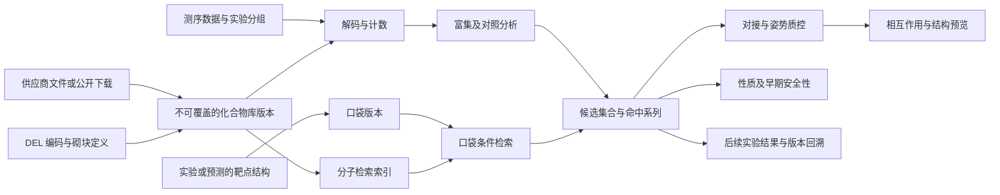

# 高通量筛选与 DEL：统一研究架构

状态：2026-10-06 的研究与目标架构；本文的新增任务、接口和组件尚未实现或部署。
当前平台基线为 v0.4.27。本文不是新模块已可运行、商业库已下载或科学验收已通过的声明。

## 1. 产品边界

X-DDE 拥有前端、平台 API、任务及部署队列、项目、研究资产和结果证据。
新增两个一级研究入口：**高通量筛选与对接**、**DEL 研究**。
商业化合物库、DEL 化学库及由研究产生的候选共用化合物与库版本，计算结果保留各自的方法和来源。
DrugCLIP、GNINA、DELi 及其他工具都是独立集成环境；不新建第二套工作台、作业队列或研究资产库。

DEL 指 DNA 编码的化学库。它可以包含小分子、宏环或肽等化学成员，不能直接替代抗体展示库、蛋白工程或 RNA 库的专用分析。
本规划涵盖计算与数据分析，不包括新增合成路线规划、逆合成、自动湿实验或自动采购。

## 2. 已核实的现状与缺口

| 当前证据 | 对设计的约束 |
| --- | --- |
| DrugCLIP 操作页有上传蛋白、定义口袋、选择库、模型及 Top_K、任务信息四个区段 | 学习其任务逻辑，X-DDE 仍采用每页一步的引导，避免长表单 |
| 口袋可由参考配体、结构中的 HET ID、中心坐标、链与残基定义 | 共用平台的口袋与坐标框架，不让用户手工重复输入位置 |
| 当前页面的自动找口袋按钮禁用 | 此按钮不作为已验证的 DrugCLIP 能力；X-DDE 可衔接现有 P2Rank |
| 页面按供应商分组显示 35 个库条目，支持搜索与多选 | 条目和网页的近似规模不能当作本地已获取数据或库存证据 |
| 自定义库用 CSV 导入，页面注明 50 MB、每人 5 个库等限制 | X-DDE 不继承 SaaS 账户限制；按本机容量和流式作业预算管理 |
| DrugCLIP 官方实现提供口袋及分子编码、检索和分片处理 | 建立独立可复用索引；检索结果不自动具有结合姿势 |
| 官方后处理参考流程依赖 Schrödinger | 保留“检索—多样性—对接验证”逻辑；开源默认衔接已有 GNINA，而不是假定安装了 Glide |
| X-DDE 的 library_screen 使用 Morgan 指纹、性质、警示、子结构和骨架选择 | 该功能不等同于口袋条件的神经网络检索，保留并复用其过滤逻辑 |
| 当前 library_screen 最多 500 条、最多保留 100 条；资产总额默认 512 MB，原生集成输入另有 25 MB 检查 | 新的大数据路径需要独立的分片契约，不能静默扩大现有小文件行为 |
| 当前没有 FASTQ、计数矩阵或 DEL 实验设计的专用资产类型 | 必须先实现数据契约及增量迁移，不能把 FASTQ 冒充蛋白序列或分子文件 |

网页配置和自定义库入口已实际查看。当前研究没有提交筛选任务，也没有完成结果页的预览、过滤和下载操作验证。
相关截图仅在所有者 E 盘研究目录保留，不向公开仓库发布账户页面或私有研究内容。

## 3. 商业库接入

用户选择的路径是**供应商公开下载 + 已有合法商业库文件导入**，不是复用 DrugCLIP 的私有服务器索引。

### 3.1 全部供应商条目的覆盖

以下为当前网页观察到的连接范围，不是已安装或已获授权的库：

| 网页来源组 | 库条目 |
| --- | --- |
| mce | comp |
| tsbiochem | AA Blocks; AIchemEco; Alinda Chemical; Analyticon; AnyMole; Apollo; Aronis; Asinex; BIONET-Key Organics; Chembridge; ChemDiv; Chemical block; ChemRar; Enamine; EvoBlocks; Eximed; FCH Group; HTS Biochemie Innovationen; Innovapharm; InterBioScreen; LabNetwork; Leadgen Labs; Lifechemicals; Maybridge; Menai Organics; Otava; PharmaBlock; Pharmeks; Princeton BioMolecal Research; Specs; TargetMol; TimTec; UkrOrgSynthesis; Vitas-M |

“mce”或“tsbiochem”是网页分组，不能仅据此认定每个条目的实际数据所有者、官方网站或许可。
供应商原始拼写作为源标签保留，规范名称单独维护；重复供应商来源不生成重复化学成员。
全部条目共用 SDF/CSV/SMILES 文件适配，不为每个品牌编造一个 HTTP API。

### 3.2 接入状态与文件契约

库状态依次为：待获取 → 导入中 → 需要处理 → 建索引中 → 可筛选。
另有失败、取消和过期索引状态。只有完成实际解析及索引验证的库才能勾选提交。

每个 LibraryVersion 包含供应商、库名、原始文件版本、数据来源、许可依据、获取时间、原始编号列、结构列、分片清单和实际有效记录数。
每个 Compound 保留立体化学、同位素、电荷、盐组分及原始结构。
标准化结构作为派生版本；盐处理、互变异构和质子化策略必须可查看、可选择。
不同供应商提供相同化合物时，化学身份和 SupplierOffer 分离，保留多个货号、目录批次和来源。
供应商目录数据不自动表示实时库存、可采购或实测活性；不在无证据时展示价格或现货状态。

导入支持逐列预览及映射、原始编号冲突检查、结构解析失败表、去重报告、大小及磁盘预算、取消和断点恢复。
原始记录号可回溯到每条拒绝记录。不能静默删除长 SMILES、错误条码或未能枚举的成员。
ZIP/GZIP 有展开大小及压缩比限制，拒绝路径穿越与链接；CSV 导出防止电子表格公式执行。
公开下载必须针对审核过的官方资源；需要登录、协议或 API 凭据的入口引导用户获取文件，不抓取登录凭据。

ChemDiv 官方资料确认 SDF/CSV/XLS 导出；Enamine、MCE、TargetMol 官方页面提供库目录。
每个实际下载资源仍要核实地址、版本、许可与校验，不将网页提供目录等同于允许批量再分发。

## 4. 高通量筛选与对接

### 4.1 面向药化人员的五步页面

1. **选择靶点**：上传新结构默认选中；历史文件可选。显示蛋白三维结构与链，保留必须的辅因子。
2. **选择口袋**：实验参考配体优先；也可选择预测口袋、点选残基或专家坐标框。右侧显示所选口袋，不要求用户理解 LMDB。
3. **选择分子库**：搜索、用途/供应商筛选、跨库多选、实际有效总量和重复数量；未就绪库给出“导入文件”动作。
4. **选择方案并确认**：快速探索、兼顾多样性、重点对接三种预设。展示检索数量、对接数量及计算预算；专家参数折叠。任务名称可自动生成。
5. **查看结果**：阶段进度和候选列表；Ketcher 二维结构、独立性质列、来源及货号。只有真正产生对接姿势后才显示受体中的三维配体和相互作用。

按钮只在最后确认页提交。上一步保留当前输入；提交后不可覆盖已运行的计划。
新任务不默认选择历史结果；真实固定示例在模块内展示，不能向个人队列添加演示作业。

### 4.2 计算阶段

| 阶段 | 产物与能力 | 关键验收 |
| --- | --- | --- |
| 库准备 | 解析与版本化、可选分子状态处理、保留来源的去重 | 总数对账、化学语义及失败原因不丢失 |
| 库编码 | 经审核的 DrugCLIP 模型编码分子，生成可复用分片索引 | 行号/化合物身份一致、模型与编码策略指纹完全匹配 |
| 口袋编码 | 真实残基与坐标框架中的口袋向量，可选受体集合 | 结构与口袋版本绑定；不把空腔坐标当作完整口袋 |
| 大库检索 | 有界内存、分片扫描与确定性 Top-K 合并 | 分片与全量参考一致；记录原始及归一化分数方法 |
| 候选整理 | 性质警示、多样性/骨架代表、可选已知配体相似度 | 过滤理由可追溯，不把警示当作实验毒性 |
| 批量对接 | 选中候选的 GNINA 对接与实际姿势文件 | 分子状态和受体版本一致；失败候选保留 |
| 姿势质控 | PoseBusters 及必要的约束优化 | 原始与处理后姿势并列，不覆盖失败证据 |
| 结果解读 | PLIP、性质与 ADMET、2D/3D、表格与分布图 | 检索分数、对接能量、模型预测和实验指标分列 |

DrugCLIP 代码为 Apache-2.0；当前官方权重、预计算嵌入及模型输出声明 CC BY-NC 4.0。
非商业研究模型不能静默成为商业研发的默认引擎。平台保留模型许可用途字段，部署时显示适用用途；商业使用需要相应许可。
“检索与对接”工作流和供应商文件管理可以独立实现，但不能把其他方法改名为 DrugCLIP，或绕过权重用途限制。

## 5. DEL 干实验的完整能力边界

### 5.1 模块划分

| 子模块 | 输入/主要职责 | 用户看见的结果 |
| --- | --- | --- |
| D1 库与编码定义 | 库 ID、周期、砌块表、条码、UMI 位置、序列方向、已知参考；编码冲突、距离及反向互补风险审查 | 周期表、砌块二维结构、编码可辨识性、有效理论库规模 |
| D2 化学成员与库空间 | 按已有经过核实的组合规则延迟枚举；保留未定义立体化学、缺失砌块、无效产物及 DNA 连接位置 | 单成员预览、结构覆盖率、周期组合与化学空间 |
| D3 实验与样本设计 | 靶点版本、靶点/空白/基质/竞争/初始库对照、轮次、重复、批次和测序文件对应；缺失设计审查 | 一张可编辑实验分组表和对照覆盖图 |
| D4 测序输入与质控 | FASTQ/FASTQ.GZ、成对文件、测序质量、接头、方向和长度；不先按常规 RNA-seq 习惯裁掉编码区 | 读段质量曲线、长度分布、样本质控漏斗 |
| D5 样本拆分及条码解码 | 已拆分文件或可靠样本索引、库识别、周期砌块匹配、有界纠错、歧义及未匹配归因 | 库/周期解码率、纠错比例、歧义与失败分类 |
| D6 UMI 与计数 | 在样本和化合物内处理 UMI，保留 raw reads 与 unique UMI、碰撞及饱和度；无 UMI 时明确 PCR 偏倚未消除 | 去重前后对比、计数矩阵、覆盖与饱和曲线 |
| D7 富集及对照 | 显式分母、测序深度、初始库及阴性对照；稀疏/零计数处理、重复及批次；不同对照分别建比较 | 富集散点、对照比较、区间/证据层级和排序表 |
| D8 命中证据与伪阳性 | 低计数、重复不一致、空白/基质偏好、竞争及跨靶点模式；聚集、反应性或化学警示作为独立证据 | 多证据筛选、重复一致性、跨靶点热图；不生成臆测的确定命中结论 |
| D9 单砌块、双砌块与系列 | 周期的 marginal enrichment、组合覆盖和计数充分性；观察到的趋势与统计不确定性 | Mono/Disynthon 热图、组合立方体切片、系列结构网格 |
| D10 结构与候选解释 | 完整成员/截短体/连接子状态分开；已解析结构、候选 docking 和已计算相互作用 | 联动 Ketcher 结构、3D 姿势、关键残基和实验对照 |
| D11 数据驱动模型 | 有足够标签时的基线和研究模型、按库/砌块/骨架隔离的验证、适用域及不确定性 | 验证分布、富集/排名指标、模型用途与失败范围 |
| D12 后续研究交接 | 从可解析成员生成独立候选集合，送性质、对接及后续实验登记；保留原 DEL 证据 | 候选表、CSV/SDF/研究报告、后续验证回填与关系图 |

没有结构或只有保密指纹的数据可以完成部分计数及模型分析，但不能伪造 SMILES、二维分子、3D 姿势或可采购候选。
测序富集不等于 KD/IC50。缺少阴性对照时只展示可支持的描述性结果和缺失条件。
初始库未测到不是该成员绝对不存在，不能给每个未出现成员随意补 0 并获得“无限富集”。
统计模型按实际实验设计和数据条件选择；置信区间、多重检验和 FDR 只能来自可核实的方法，不能由颜色或经验阈值替代。

### 5.2 默认 DEL 操作路径

一个入口提供“已有计数表”“原始测序数据”“定义/检查一个库”三个真实能力路径。
各路径独立说明必需材料，不能因为已有计数表就要求用户重新上传 FASTQ。

1. **选择材料**：默认上传新文件；提供公开真实模板以及输入预览。
2. **设置实验分组**：表格选择靶点、对照、轮次及重复；系统提示缺失的对照与无法成立的比较。
3. **选择分析方案**：标准分析、比较选择性、深入系列分析；只有原始数据路径出现解码/UMI 选项。
4. **确认提交**：显示样本数量、可用比较、数据/空间与作业预算；专家细项折叠。
5. **结果探索**：质控、命中、系列、结构四个页签。候选表与结构联动；可筛选、标记、导出并继续研究。

普通页不显示 shell 命令、YAML、内部索引 ID、日志或审计附件。
方法、科学单位、数据局限和来源从说明按钮查看。解码失败原因及研究结果文件属于必要研究信息，不能作为“内部内容”全部删去。

## 6. 开源底座与采用条件

| 能力 | 首选或复用实现 | 采用条件 |
| --- | --- | --- |
| DEL 定义、枚举、解码和基础分析 | DELi 0.2.1；MIT | 原生独立 Python >=3.13 环境，不升级 X-DDE 平台解释器；主分支仍标 Alpha，固定源码/依赖并执行专项验收 |
| 原始 FASTQ 预处理 | DELi 原生流程；按实测需要选用 cutadapt/fastp | 必须验证模板的编码区与 UMI 保留；不默认裁剪全部读段 |
| UMI | DELi 原生逻辑；需要时评估 UMI-tools | 在样本和化合物分组内验证纠错/去重策略，不能直接套用基因组坐标去重 |
| 结构解析与展示 | 现有 RDKit、Ketcher | 化学语义和 DNA-on/off 状态保留；未知结构不补画 |
| 大数据表与检索 | 分片 Parquet/Arrow 与按需查询的索引 | 这是目标基础设施，当前平台尚未提供该大文件路径 |
| 口袋检索 | DrugCLIP 官方实现 | 检查权重用途及数据许可，固定模型与编码指纹，服务器上验证检索质量 |
| 对接与解释 | 已有 GNINA、PoseBusters、PLIP、OpenMM | 复用现有任务，不以 DEL 富集生成虚构的 docking score |
| ML 基线 | DELi 基线及现有 Chemprop；按数据条件评估 LightGBM/XGBoost | 不能用同一砌块的组合随机拆分而宣称跨库泛化 |
| 新研究模型 | DELBERT、DEL-Dock 等作为独立研究候选 | 先核实各代码、模型、训练数据许可和接口；公开基准不证明适用于所有靶点，不默认替换统计证据 |

DELi 自带公开 UNCDEL006/BRD4 枚举、解码及分析输入，适合作为真实演示候选。
UNCDEL003 的公开示例注明缺少 NTC/naive；演示时保留这个限制。
输入模板、论文中的实验参考、X-DDE 实际计算结果分别标记；只有真实运行并验收的结果才固定为“示例结果”。

### 6.1 引擎选型与晋升标准

“最靠谱、最专业”是采用标准，不是对任何模型尚未验证的宣传结论。
不能以发布时间、星标数量、排行榜单项分数或一个成功例子代替选型。

每个引擎记录一个独立决策：

1. **适用性**：输入和输出是否匹配该步骤；口袋检索不冒充 docking，富集分类器不冒充实测亲和力。
2. **科学证据**：方法和对照可解释；评估数据与实际用途匹配；报告失败率、适用域和不确定性。
3. **可复现性**：官方源码、确定版本、锁定依赖、模型及数据校验；固定公共复杂案例与运行证据。
4. **工程稳定性**：接口、并行/内存、取消及恢复、错误输出、更新与回滚可控；不接受靠静默替代步骤跑通的结果。
5. **可使用性**：代码、权重、输出、数据各自许可符合当前用途；没有授权的部分保持不可用。
6. **平台兼容性**：独立环境，接入单一注册表和 Worker，复用相同资产及结果契约；升级不能改写历史记录。

状态为候选 → 接口审查通过 → 安装验证 → 原生运行验证 → 科学验收 → 推荐默认。
每个状态分别记录，不用“已安装”替代后四项。DELi 当前官方包为 Alpha，故仍是底座候选；须先验证关键解码、UMI、计数及报告链路。
DELBERT 等新研究模型只进入可选评估，不因为更晚发布就取代默认分析。

替换已有默认引擎前，在同一组、未经挑选的代表性输入上比较可用率、质量、资源和结果语义。
只在数据及方法条件允许时比较指标；不跨靶点、跨标签或跨不同数据版本比较一个所谓总分。
旧默认保留为可回滚版本，确认无消费者后再清理旧执行路径，避免多个竞争性的链路长期并存。

## 7. 资产、接口与执行架构

### 7.1 资产对象

| 目标对象 | 必需身份与关系 |
| --- | --- |
| LibraryDefinition / LibraryVersion | 来源、许可、周期、策略、内容指纹和不可覆盖版本 |
| BuildingBlock / EncodingMap | 周期、原始砌块 ID、明确结构和条码；不能跨库按短 ID 自动合并 |
| Compound / SupplierOffer | 化学身份与供应商货号分开；父库记录和所有原始来源 |
| ScreeningIndex | 精确库版本、模型文件、编码/标准化策略、分片及排序映射 |
| SelectionExperiment / SampleSheet | 靶点、对照、轮次、重复、批次、明确文件与比较定义 |
| SequencingDataset / CountMatrix | 原始数据、计数单位、样本及成员映射；raw read 和 UMI 两套计数独立 |
| AnalysisResult / HitSet | 方法、运行版本、支持范围、失败记录、实际输出与命中规则 |
| FollowupExperiment | 原 DEL 候选、off-DNA 结构状态、实验终点、单位和结果来源 |

以上是领域契约，不是新增平行数据库。内容仍由现有 AssetStore/研究资产权威管理；对象与关系通过现有研究版本系统扩展。
大文件层需要流式导入与分片清单；HTTP 请求中不一次加载整份 FASTQ/SDF，浏览器也不渲染全库百万行。
服务器管理员选择的研究目录之外不可任意读取路径；跨服务器传输通过受控上传/共享入口，浏览器只持有资产引用。

关系包括来源、派生版本、库成员、编码于、测序于、相对于对照、选入命中集合、对接于和由后续实验验证。
沿用现有关系图，保留原始文件、前一版本、原始姿势与模型独立证据。

### 7.2 建议任务契约

新增任务名称为目标设计，发布前必须注册到现有请求、环境、Worker 和结果路由权威：

- `library_import`、`library_index`、`pocket_retrieve`、`screening_campaign`。
- `del_library_validate`、`del_enumerate`、`del_decode`、`del_count`、`del_analyze`、`del_series`。
- 命中集合交给已有 `docking`、`pose_quality`、`interaction_profile`、性质和 ADMET 任务；不复制科学算法。

请求携带明确版本引用、源内容摘要、样本表、所选比较、方法及预算。
索引查询必须绑定匹配的模型与库策略，不允许读到“最新”路径后静默替换版本。
作业包含可恢复的分片及阶段清单、最大磁盘/内存/线程预算、有界重试、逐阶段取消。
完成状态要求原生进程成功、输出校验通过、计数与身份对账成立，不以生成一个 HTML 文件为完成依据。

大库或完整 DEL 不适合一次展开成数千个现有工作流节点。
复用唯一 Worker 调度有界的分片执行，并以现有 workflow 权威编排候选精筛；批量作业汇总保留每个失败分子。
增量表与协议版本必须独立于产品版本；备份状态及资产清单后迁移，旧任务请求仍可读，不回写既有结果。

## 8. 实施次序与验收

| 工作包 | 工作内容 | 完成标准 |
| --- | --- | --- |
| WP-A 基础契约 | 新数据资产、流式上传/分片、库版本/样本映射、目录及许可字段 | 大文件峰值内存受控，取消/恢复及越界输入拒绝，既有资产摘要不变 |
| WP-B 商业库管理 | 全部 35 条目的规范映射、公开资源核实、文件导入、状态与实际数量 | 导入真实供应商文件、所有原始编号可追溯；未获取条目不显示就绪 |
| WP-C 快速检索 | 审核模型、分子索引、口袋编码、Top-K 与跨库合并 | 小范围分片/全量一致；目标服务器验证速度、资源、公开靶点富集与模型用途 |
| WP-D 候选精筛 | 多样性、性质、实际批量 docking、质控、结果联动和下载 | 候选表与实际姿势匹配、失败不丢失，下载源文件及方法分数正确 |
| WP-E DEL 计数入口 | 实验设计/计数表导入、比较定义、原生 DELi 基础分析、系列可视化 | 公开真实计数案例复现；缺少对照时不展示不能支持的显著性 |
| WP-F DEL 测序入口 | 库定义、解码、UMI/计数、质控、阶段恢复 | 公开原始示例解码复现；歧义/纠错/UMI 数据对账，不放大“成功率” |
| WP-G DEL 综合分析 | 多对照与重复、选择性、系列结构、候选/后续实验交接 | 各比较的实验设计成立、结构身份保留，证据和模型结论分离 |
| WP-H 研究模型 | 有足够训练数据时评估专用模型、库/砌块隔离验证 | 预先约定的外部留出指标、适用域、模型许可；未通过则保留研究状态 |

先交付可运行的完整纵向链路，再扩展不同编码体系及大规模模型。
网页结果采用服务端分页及轻量汇总，二维结构按可见行绘制；三维和系列热图按选中对象加载。
每次发布遵守产品版本递增；代码测试限改变模块及直接消费者，禁止全局测试。
组件安装、原生运行、科学基准、用户界面验收分别记录，不将一项通过写成全模块完成。

## 9. 原始来源

- [DrugCLIP 当前筛选页](https://drugclip.com/screening/action)：本机实际查看的表单及库条目；账户服务内容未复制到公开仓库。
- [DrugCLIP 论文](https://arxiv.org/abs/2310.06367)：口袋与分子的对比检索方法。
- [官方 Drug-The-Whole-Genome](https://github.com/THU-ATOM/Drug-The-Whole-Genome)：编码、检索及分片；[权重/输出许可](https://github.com/THU-ATOM/Drug-The-Whole-Genome/blob/main/MODEL_WEIGHTS_LICENSE)。
- [官方后处理参考流程](https://github.com/THU-ATOM/DrugCLIP_screen_pipeline)：候选整理、对接验证与口袋集合；该实现依赖 Schrödinger。
- [ChemDiv 官方导出说明](https://www.chemdiv.com/catalog/how-to-search-and-order/)、[Enamine HTS](https://enamine.net/index.php?Itemid=248&id=107&option=com_content&view=article)、[MCE 库目录](https://file.medchemexpress.com/screening-libraries.html)、[TargetMol 目录](https://www.tsbiochem.com/library-sorting-1/research_field)。
- [DELi 官方实现](https://github.com/Popov-Lab-UNC/DELi)、[版本与解释器要求](https://github.com/Popov-Lab-UNC/DELi/blob/main/pyproject.toml)、[论文](https://link.springer.com/article/10.1186/s13321-026-01296-1)。
- [DELi 解码及输出契约](https://dna-encoded-library-informatics-deli.readthedocs.io/en/latest/decoding_docs/run_decode.html)、[公开真实示例](https://github.com/Popov-Lab-UNC/DELi/blob/main/examples/README.md)。
- [fastp](https://github.com/OpenGene/fastp)、[UMI-tools](https://umi-tools.readthedocs.io/en/latest/)、[DELBERT](https://github.com/bowang-lab/DELBERT)：对应可选工具或研究候选，不是已部署能力。
