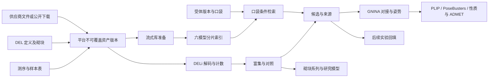

# 高通量筛选与 DEL：已实现架构与验收边界

原生计算验收基线：X-DDE v0.4.31，2026-10-07。14 个专用任务模块已实现，并通过真实原生引擎和关联接口测试；该批次补充真实供应商公开结构文件、正确 SDF 货号字段和直接选择入口，并修复已核对资源的混合文字编码。后文记录 v0.4.62 的交互统计预览扩展。功能、科学方法、服务器性能和安装状态分别记录；界面升级不扩大任意数据集的科学有效性。

X-DDE 拥有前端、平台 API、项目、任务与部署队列、研究资产、版本、工作流和结果证据。RDKit、DrugCLIP、GNINA、PLIP、DELi 是独立集成环境。本实现没有第二套工作台、队列或资产数据库。DEL 是 DNA 编码化学库分析；不代替抗体展示、蛋白工程或 RNA 专用流程。本批次不包含合成路线、逆合成、采购或湿实验自动化。

产品界面使用“高通量筛选”“口袋–分子联合检索”“六模型筛选资源”等研究用途名称。公开模板的历史材料显示案例与用途，用户自己的任务名不改动。底层引擎 ID、不可变配方、原始请求和许可记录保持真实来源；产品改名不改变科学方法或第三方条款。

## 1. 用户入口与模块

左侧提供“高通量筛选”和“DEL 研究”。所有新任务默认新文件/新任务，历史结果明确通过“历史文件”或已完成研究结果选择；固定模板和计算结果留在各自模块内，恢复案例不会在个人任务队列中添加示例计算。

每个模块采用四页问卷：选择材料 → 确认对象/范围 → 选择方案 → 确认提交；每页只展示当前一步，右下角下一步，返回保留输入。高通量筛选按靶点、口袋、分子库、方案引导，最后可自动编排库准备、六模型编码、口袋检索和重点对接。普通模式提供预设，专家参数折叠。

| 入口 | 已注册操作 | 原生环境和产物 |
| --- | --- | --- |
| 分子库管理 | `library_prepare` | RDKit 流式解析；不可覆盖库版本、来源/货号、化学身份、性质、拒绝记录 |
| 提取候选分子 | `library_subset` | 明确成员选择，生成 SDF 与来源映射 |
| 建立快速筛选库 | `drugclip_index` | 官方六模型真实编码，768 维归一化向量、分片 HDF5、精确行号/身份 SQLite |
| 高通量筛选 | `drugclip_retrieve` | 真实口袋编码、跨库 Top-K、去重、候选整理和游离构象；可衔接重点对接 |
| 候选批量对接 | `screening_dock` | GNINA 原生姿势与评分、逐成员失败记录、保留受体坐标的复合物 PDB |
| DEL 库定义 | `del_validate` | DELi 周期、砌块、条码、组合规则、理论规模与编码风险检查 |
| DEL 成员结构 | `del_enumerate` | 原生选择/有界全库枚举，化学结构、未定义立体化学及枚举失败记录 |
| 测序解码 | `del_decode` | FASTQ/GZIP、样本映射、单端/明确的双端编码读段、解码/纠错/歧义和质量 |
| UMI 与计数 | `del_count` | 样本与成员内 raw/unique/directional/cluster 计数和矩阵；无 UMI 不伪装为去重 |
| DEL 富集与命中 | `del_analyze` | 显式靶点/对照、重复、轮次、批次、深度归一化富集、区间、计数及一致性证据 |
| 砌块与系列探索 | `del_series` | 先聚合计数再计算 Mono/Disynthon 富集，组合覆盖、分页表格和热图 |
| DEL 研究模型 | `del_model` | Morgan/RF 训练、砌块周期独立留出、均值基线；模型应用保留预测、树间离散与适用域参考 |
| DEL 候选交接 | `del_candidates` | 明确成员、连接位点保留或氢封端派生结构、原 DEL 成员富集、原生化学准备和后续交接 |
| 后续实验回填 | `del_followup` | KD/IC50/EC50/抑制率或定性结合报告、单位、限定符与来源；未匹配成员保留 |

结果页优先使用真实 Ketcher 二维结构、可调整和下载的三维视图、分页表格、质量曲线、计数/对照图、系列热图、模型验证图。苯环采用键线式绘图，默认隐藏末端碳标签；三维配体采用 0.14 棒状显示。蛋白骨架保持可见，默认五个近邻残基及真实几何接触距离；原生 PLIP 化学相互作用由单独交接分析产生，不把距离称为氢键或力。

## 2. 统一数据和执行链路

- `DatasetTask` 是唯一新增请求契约；操作、原生引擎、输入角色和预算必须匹配。`scientific_inputs` 与已确认输入引用逐项一致。
- `NativeSource` 只有源任务 UUID、报告摘要和数据角色。下游使用成功源结果的确切摘要，不搜索“最新”文件替代；索引、模型和成员身份不可静默变化。
- `BackendRouter` 与现有 `Worker` 调度独立离线容器，统一启动、取消、恢复与证据。现有工作流通过明确绑定解析上游结果及候选；只有已校验成功的结果能传给下一阶段。
- `AssetStore` 负责上传与原始字节；`ScientificStore` 负责派生分子、受体、版本和关系。大表保存在任务产物的 SQLite/HDF5，前端按页读取，不加载百万行进浏览器。
- 大文件使用 4 MiB 分块上传，可暂停、重选原文件续传和取消；完成时检查每块及完整文件摘要。默认单文件 50 GiB、数据上传总额 200 GiB；旧小文件契约不静默放宽。GZIP 展开另有预算。
- 索引与分析采用流式/分片读写和有界 Top-K；CSV 导出防止公式执行。单任务产物默认 50 GiB、可配置至 200 GiB，时间上限默认一天、最多七天。上传续传不表示中断后的任意原生科学计算都能从中间点续算。
- 环境、模型、源码、参数、输入、输出摘要与失败记录由服务器保留，用户页面不展示内部命令、日志或审计清单。不得删除原始科学文件来简化界面。

实现入口：`src/opendde_workbench/datasets/`、`frontend/src/datasets/`；部署复用 `deployment/manager.py`，公开案例复用 `examples/`，工作流复用 `workflows/`。原生适配器、上传、契约、数据库、图表和问卷按职责分文件。

## 3. 商业库接入

已覆盖 DrugCLIP 页面观察到的 35 个供应商/库条目：MCE comp，以及 AA Blocks、AIchemEco、Alinda Chemical、Analyticon、AnyMole、Apollo、Aronis、Asinex、BIONET-Key Organics、Chembridge、ChemDiv、Chemical block、ChemRar、Enamine、EvoBlocks、Eximed、FCH Group、HTS Biochemie Innovationen、Innovapharm、InterBioScreen、LabNetwork、Leadgen Labs、Lifechemicals、Maybridge、Menai Organics、Otava、PharmaBlock、Pharmeks、Princeton BioMolecal Research、Specs、TargetMol、TimTec、UkrOrgSynthesis、Vitas-M。

这些是接入目录，不是平台已拥有 35 家数据。采用用户确认的“官方公开下载 + 已有合法文件导入”：统一 SDF、CSV、TSV、SMILES 及相应 GZIP 适配，明确结构列、原始编号和供应商；保留所有原始来源及重复供应商货号。只有已完成准备/真实索引的库可用于相应计算。

官方资源链接按供应商可获得性审查；需要登录或许可的库由用户获得文件。没有抓取 DrugCLIP 私有索引、账号数据或编造供应商 API。网页近似规模不写成本地实际数量。供应商目录不表示实时库存、价格、可采购或实验活性。

v0.4.30 已实际取得 9 家供应商的 16 份结构文件，共 3,841,777 条原始 SDF 记录，包括 ChemDiv 官方整库四分卷及砌块。分子库材料步骤新增“公开结构库”，自动带入确切供应商和 SDF 属性中的货号。原始数据通过既有部署队列安装到当前 AssetStore；需要后续结构准备和索引，不能把下载完成显示为已能进行向量检索。各文件范围、完整下载/许可边界、35 条目覆盖和操作见 [供应商结构文件](supplier-structure-files.md)。

## 4. 联合检索与精筛方法

固定官方源码、依赖锁和全部六个官方权重；不使用假向量、替代指纹或缺折模型冒充 DrugCLIP。分子编码按折归一化并绑定 768 维精确行身份。一次口袋编码后分块扫描已保存索引，确定性合并 Top-K，不对全库逐分子 docking。

支持平均六折余弦分数与明确校准的六折 z-score。小到不足校准要求的数据集必须选择适用方法，不取消统计检查。坐标、链、残基、参考配体与替代构象策略绑定受体版本。

候选整理可选择原始排名、多样性或骨架代表，以及明确的先导性质筛选和 PAINS/Brenk 警示。保留原始排序、过滤理由和被选结果；这些是检索后整理，不宣称属于模型的搜索约束或实验毒性。

GNINA 生成实际 SDF 姿势和全姿势能量；CNN 分数/预测与经验能量分开。受体复合物 PDB 保留原 ATOM 坐标和独立配体链。PLIP 适配器按原生原子坐标验证原始残基和坐标框架，不把内部 atom index 当作 PDB serial；不能为掩盖错误放宽距离验证。

当前索引默认上限一千万、可配置至一亿成员；查询至多 35 个明确来源索引、返回最多 1,000 个排名候选、保留/对接最多 500 个。实际受磁盘、产物预算和时间限制。真实 CPU 案例已验收；没有执行十亿级吞吐、目标服务器 GPU 或供应商全库性能基准，不宣称已达到 DrugCLIP 托管服务的吞吐。

DrugCLIP 代码为 Apache-2.0；当前官方权重、预编码数据和模型输出为 CC BY-NC 4.0。用户已确认非商业科研用途；请求仍显式校验用途。X-DDE 的 Apache-2.0 不改变第三方许可，也不再分发模型权重进本平台 wheel。

## 5. DEL 科学范围

- DELi 原生库定义、条码与化学组合为方法权威；明确库名、最多八个周期、砌块编号、反应/连接规则、UMI 和方向。缺结构或无效反应保留失败，不能用通用分子生成器猜测化学成员。
- 测序文件严格验证 FASTQ/Phred+33 和展开预算。双端输入必须显式选择承载编码的 R1/R2，核对读段身份、顺序和数量；不猜测合并，不按 RNA-seq 习惯预先剪掉条码。
- 样本可明确为靶点、初始库、无靶点、基质、竞争、反筛靶点或参考。比较绑定重复/轮次/批次；不把缺失单元写成零，不把不同实验设计混成一个分母。
- 富集使用原生深度归一化 MLE 与 3/8 伪计数，Beta-prime 95% 区间说明计数层面的不确定性，不冒充生物重复区间、FDR、KD 或 IC50。低计数、重复不一致及对照证据保留。
- Mono/Disynthon 先聚合观察计数后分析；未观察组合在热图留空，不补造计数或覆盖率。
- 研究模型使用 Morgan 指纹/随机森林，按一个砌块周期独立留出，报告与均值基线的比较。模型不优于基线时保留警示；不能因程序运行成功就把模型推荐为有效预测器。
- 模型应用只接受平台成功训练结果的确切摘要、兼容上下文和已解析结构；保留训练成员标记、参考相似度及树间离散。树间离散不是校准置信区间；训练成员预测不是外部验证。
- 连接位点保留或氢封端是明确结构派生，不表示 off-DNA 已合成或测得活性。候选列表标明原 DEL 成员富集，与派生结构的对接/实验结果分开。
- 后续实验可保存定量终点/单位/限定符或定性报告。公开 UNC11951 案例只记录论文明确报告的 ITC 结合事实，没有编造 KD，也没有伪造与输入库成员的映射。

本批次没有集成常规 RNA-seq 裁剪、湿实验自动化、主动学习自动实验、校准生物学显著性或实验亲和力预测。第三方研究候选如 DELBERT 不是已部署引擎，不能用占位控件暗示已可调用。

## 6. 固定案例与实际验收

案例包 `examples-datasets-v3` 使用模块修订 2，包含 14 个模块的真实模板、14 个固定已计算结果、15 个必要历史计算与 15 个输入资产。来源是公开 BRD4–JQ1/ChEMBL 和 UNCDEL006–BRD4 研究，不是乙醇示例。保留 SQLite、HDF5、原生模型、SDF/PDB 与科学报告全部必要字节。

仅按已审核案例、确切引用关系和摘要导出；不导出整份数据库或私人项目。还原逐文件核验、事务合并、幂等与冲突拒绝，不覆盖历史修订，不启动计算。组件通过现有部署队列向当前研究目录还原。

| 验收 | 真实结果 |
| --- | --- |
| [联合检索原生链路](https://github.com/Victor-Xu-1/X-DDE/actions/runs/37480823170) | 177 个真实复杂分子、全部六模型、18 分片；口袋检索和多样性整理。另用全新四分子库通过准备→索引→检索→GNINA 的 API/Worker 工作流 |
| [GNINA 与 PLIP](https://github.com/Victor-Xu-1/X-DDE/actions/runs/37479319542) | 两个实际复杂分子的对接、化学身份/立体化学/坐标验证、受体复合物、下载和实际 PLIP 化学相互作用 |
| [DELi 全链路](https://github.com/Victor-Xu-1/X-DDE/actions/runs/37474866652) | 原生定义/枚举、1,000 真实读段（706 解码、294 拒绝）、UMI/计数、3,000 成员和四样本富集、系列、训练/留出、3,000 成员模型应用、候选和实验报告 |
| [专项契约与算法](https://github.com/Victor-Xu-1/X-DDE/actions/runs/37502237697) | 上传/摘要/源身份/结果/工作流/恢复/直接消费者 102 项、前端关联 15 项、原生算法 12 项；安装及页面修正另跑对应检查 |
| [任务与组件布局](https://github.com/Victor-Xu-1/X-DDE/actions/runs/37501222474) | 真实 Chromium 检查桌面与 390 px 窄屏的 821 个页面状态；没有横向页面溢出或浏览器脚本错误，组件在四种屏幕宽度保持规整 |
| [模块浏览器验收](https://github.com/Victor-Xu-1/X-DDE/actions/runs/37502773334) | 隔离真实 Chromium、Ketcher、WebGL 和公共原生结果；全部 14 模块、56 问卷步骤、模块内结果、返回/下一步、绘图和实际下载；固定材料可用案例名搜索，产品界面不使用第三方检索项目品牌 |

本机遵循 E 盘存储边界，保留共享 WSL 其他应用。科学计算在隔离 CI/目标服务器执行；本机验证构建、安装、资源完整性、服务健康和页面。测试只覆盖改动模块及其直接消费者，未运行全局套件。目标服务器 GPU/大库性能与实验验证是独立验收。

## 7. 运维与升级

安装与组件提供统一安装目录，按研究用途组合部署但保持引擎隔离。已安装状态不重新派发安装；部署队列保留暂停/取消/恢复与失败证据。环境切换前检查活动任务，保留旧 wheel、科学数据库、组件清单和模型回滚路径。

所有者工作站源码/下载/证据在 `E:\WSL\management\x-dde`，Windows 入口在 `E:\WSL\apps\x-dde`；Linux 环境、数据和 Docker 在 E 盘 WSL 磁盘内。不能因路径含 opendde 就把集成环境当成平台所有者。

网络受限时，可从同一审查修订的 CI 保存运行镜像到 E 盘，核对归档 SHA-256、固定 image ID、recipe/lock 标签后导入 Docker，仍由现有组件清单和后端路由使用。权重另行从官方来源完整核验；离线导入不改共享网络、不重启 WSL，也不免除科学验收。

## 8. 原始来源

- [Drug-The-Whole-Genome](https://github.com/THU-ATOM/Drug-The-Whole-Genome)、[模型及输出许可](https://github.com/THU-ATOM/Drug-The-Whole-Genome/blob/main/MODEL_WEIGHTS_LICENSE)、[论文](https://arxiv.org/abs/2310.06367)。
- [官方后处理参考流程](https://github.com/THU-ATOM/DrugCLIP_screen_pipeline)：使用 Schrödinger；X-DDE 使用已有开源 GNINA 进行独立精筛，不声称复现 Glide。
- [GNINA](https://github.com/gnina/gnina)、[PLIP](https://github.com/pharmai/plip)、[RDKit](https://github.com/rdkit/rdkit)。
- [DELi](https://github.com/Popov-Lab-UNC/DELi)、[解码文档](https://dna-encoded-library-informatics-deli.readthedocs.io/en/latest/decoding_docs/run_decode.html)、[真实示例](https://github.com/Popov-Lab-UNC/DELi/blob/main/examples/README.md)、[2026 论文](https://link.springer.com/article/10.1186/s13321-026-01296-1)。
- [公开结果包](https://github.com/Victor-Xu-1/X-DDE/releases/tag/examples-datasets-v3)。原始输入及许可保留在案例清单中；私有 DrugCLIP 页面和账户信息不公开分发。

## Interactive statistical inspection / 交互式统计预览

Read quality, sequencing depth, sample correlation, building-block enrichment and model validation use the shared native Plotly renderer. Hover retains complete sample labels and reported values; zoom, pan, reset and the standard physical-width figure export are available. Bar plots retain every supplied row. Observed-versus-predicted plots include negative predictions and use equal axis scaling for their identity line.
测序质量、测序深度、样本相关性、砌块富集与模型验证统一使用原生 Plotly 图表。支持完整名称与数值悬停、缩放、平移、重置及实际版面尺寸导出。条形图保留全部已提供记录，预测图保留负值并以相等轴比例显示一致性参考线。

Correlation masks preserve unavailable entries as gray and keep genuine zero correlations numeric. Series maps preserve cycle identity and report the source excerpt count. Gray cells mean not reported in the current view: a top-series excerpt cannot establish that a missing combination was experimentally unobserved. Logarithmic color uses log2(1+enrichment), while hover retains raw enrichment, observed member counts and reported count-posterior intervals. Missing intervals are explicitly unreported. Model application is never relabeled independent validation.
相关性掩码保留无法计算的灰色位置，真实零相关仍为数值。系列热图区分库周期并保留截取范围；灰色表示当前视图未报告，不能从高排名系列片段推断组合未被实验观察。对数颜色为 log2(1+富集)，悬停保留原始富集、观察成员数及已报告的计数后验区间；缺失区间明确标为未报告。模型应用不改称独立验证。

SVG export keeps editable axes and labels. Native heatmaps can include a bounded, self-contained PNG cell layer; active embedded documents and external resources are rejected. UI acceptance reuses published native cases and never launches new sequencing/model tasks for layout.
SVG 保留可编辑坐标和文字；原生热图可带有受限、独立的 PNG 色块层，拒绝活动文档及外部资源。界面验收复用已发布原生案例，不为检查布局重新启动测序或模型任务。
