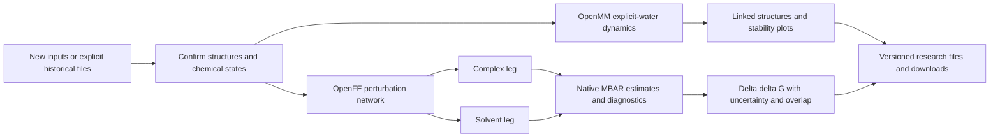

# Molecular dynamics and FEP / 分子动力学与结合自由能

X-DDE owns the questionnaire, task lifecycle, immutable inputs and linked results. OpenMM and OpenFE are independent scientific environments managed by the same platform.
X-DDE 负责问卷式提交、任务生命周期、不可覆盖输入和结果关联。OpenMM 与 OpenFE 是同一平台管理的独立科学环境。

| Study / 研究                                  | Reviewed backend / 后端                                         | Scope / 范围                                                                                                                          | Primary outputs / 主要结果                                                                                                                                                                        |
| --------------------------------------------- | --------------------------------------------------------------- | ------------------------------------------------------------------------------------------------------------------------------------- | ------------------------------------------------------------------------------------------------------------------------------------------------------------------------------------------------- |
| Molecular dynamics / 动力学                   | OpenMM 8.6.1, PDBFixer, AMBER14/TIP3P and OpenFF 2.2.1          | Complete parameterizable proteins, nucleic acids and their supported bound small molecules / 可参数化完整蛋白、核酸及支持的结合小分子 | Aligned 3D snapshots, DCD, RMSD, mass-weighted heavy-atom Rg, residue RMSF, periodic heavy-atom contact occupancy, checkpoints and portable states / 对齐结构、轨迹、稳定性、接触占有率及计算状态 |
| Relative binding free energy / 相对结合自由能 | OpenFE 1.12.0, compatible OpenMM 8.4.0, Lomap, AM1-BCC and MBAR | 2–12 aligned congeneric small molecules with unchanged net charge / 2–12 个对齐、同系列且净电荷不变的小分子                           | Perturbation network and atom maps; after calculation, both thermodynamic legs, ΔΔG, uncertainty, overlap and forward/reverse analysis / 变化网络、原子映射及双环境自由能与采样诊断               |

The four preparation pages show one step at a time; the fifth step displays results. New tasks start with new inputs. Historical files and public templates require explicit selection. The sole backend is already selected and future alternatives can use the existing method selector.
准备过程每页仅显示一步，第五步查看结果。新任务默认使用新材料；历史文件和公开模板需明确选择。唯一后端已默认选中，将来的同类后端使用现有模型选择器。

Dynamics uses native minimization, NVT equilibration and NPT production. Coordinate analysis aligns the backbone to the first production snapshot. Ligands are reimaged as connected molecules in that frame; contacts use periodic minimum-image distances. Residue RMSF uses sampled aligned heavy atoms. Contact occupancy is a geometric frequency at 4 Å, not an interaction force or energy. Original inputs and raw trajectories remain intact. Checkpoints require their matching native system, integrator and runtime; portable XML states are also exported. Automatic restart from a downloaded checkpoint is not exposed as an implemented task feature.
动力学执行原生最小化、NVT 平衡和 NPT 生产采样。分析以首个生产采样结构的骨架为参考对齐，按周期边界处理完整配体和接触距离。残基 RMSF 来自对齐重原子；接触占有率按 4 Å 距离统计，不是作用力或能量。原始材料和原始轨迹完整保留。检查点须匹配对应的体系、积分器与运行环境，同时导出可移植 XML 状态；当前任务尚未提供从下载检查点自动续跑的入口。

FEP planning performs no free-energy calculation. Calculation assigns charges once per ligand and shares them between both thermodynamic legs and repeats, then uses the native HREX/MBAR protocol. ΔΔG is B minus A, computed as complex-leg ΔG minus solvent-leg ΔG; negative values favor B. Reported uncertainty conservatively retains native MBAR uncertainty and independent-repeat spread. A single repeat does not have an empirical repeat spread. Missing convergence analysis, low overlap and large uncertainty remain visible rather than being converted to a confident ranking.
FEP 规划阶段不计算自由能。执行时同一配体的电荷在双环境和重复之间一致，调用原生 HREX/MBAR 协议。ΔΔG 为 B 相对 A 的变化，由复合物环境减去溶液环境获得；负值更有利于 B。误差保留原生 MBAR 估计与重复间波动；单次重复不能给出重复间经验波动。采样不足、重叠较低或误差较大时保留诊断状态，不转换成可靠排序。

Net-charge-changing transformations, missing residues, unsupported covalent/cofactor/metal chemistry and unparameterized modifications are rejected. Membrane protocols, absolute binding free energies, automatic force-field replacement and experimental scientific acceptance are outside these two reviewed task interfaces. The OpenFE hybrid-topology protocol also retains the scientific limitations documented upstream; a pipeline smoke test is not a benchmark of binding-affinity accuracy.
当前接口拒绝净电荷改变、残基缺失、不支持的共价/辅因子/金属化学或未参数化修饰。膜体系专用协议、绝对结合自由能、自动替换力场及实验科学验收不属于这两个接口的已实现范围。OpenFE 混合拓扑协议仍具有上游说明的科学限制；短计算链路检查不能证明亲和力预测准确性。

Resource limits remain in the existing worker. MD defaults to 24 hours and 8 GiB of outputs; FEP defaults to seven days and 32 GiB. Individual direct downloads are limited to 1 GiB. Computation can be cancelled through the normal task interface; partial files remain available for diagnosis. All environments, data and caches stay under the chosen deployment root.
资源限制使用现有任务执行器。动力学默认 24 小时与 8 GiB 输出，FEP 默认七天与 32 GiB 输出，单个直接下载文件限 1 GiB。可通过正常任务界面取消计算，并保留部分文件用于检查。环境、研究数据和缓存保存在统一选择的部署目录。

Public templates use the deposited BRD4/JQ1 case and the official OpenFE TYK2 inhibitor series, with immutable source checksums and source licensing. Remote tests separately validate contracts, native execution, original-byte preservation, actual browser previews and downloads. CPU smoke calculations do not establish production sampling convergence or GPU performance; target-server scientific validation remains separate.
公开模板使用 BRD4/JQ1 沉积结构与 OpenFE 官方 TYK2 抑制剂系列，固定源文件校验值和来源许可。远端分别检查任务契约、原生执行、原始文件保留、真实浏览器预览和下载。CPU 短计算不证明生产采样已收敛或 GPU 性能；目标服务器科学验收仍为独立步骤。

Primary implementation sources: [OpenMM user guide](https://docs.openmm.org/latest/userguide/application/02_running_sims.html), [OpenFE 1.12 RBFE tutorial](https://docs.openfree.energy/en/v1.12.0/tutorials/rbfe_python_tutorial.html), [OpenFE protocol and limitations](https://docs.openfree.energy/en/v1.12.0/guide/protocols/relativehybridtopology.html), [immutable TYK2 inputs](https://github.com/OpenFreeEnergy/ExampleNotebooks/tree/d083c283b96e976d2e90c03d94e57e3ef6bc2c8c/rbfe_tutorial).
