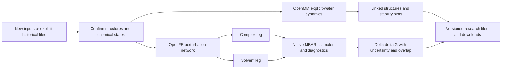

# Molecular dynamics and FEP / 分子动力学与结合自由能

X-DDE owns the questionnaire, task lifecycle, immutable inputs and linked results. OpenMM, GROMACS and OpenFE are independent scientific environments managed by the same platform. Choose OpenMM or GROMACS in the same dynamics module; the selection changes the actual executor, not a cosmetic label.
X-DDE 负责问卷式提交、任务生命周期、不可覆盖输入和结果关联。OpenMM、GROMACS 与 OpenFE 是同一平台管理的独立科学环境。动力学模块可切换 OpenMM 或 GROMACS，切换后调用所选引擎的真实执行程序。

| Study / 研究                                  | Reviewed backend / 后端                                         | Scope / 范围                                                                                                                          | Primary outputs / 主要结果                                                                                                                                                                        |
| --------------------------------------------- | --------------------------------------------------------------- | ------------------------------------------------------------------------------------------------------------------------------------- | ------------------------------------------------------------------------------------------------------------------------------------------------------------------------------------------------- |
| Molecular dynamics / 动力学                   | OpenMM 8.6.1, PDBFixer, AMBER14/TIP3P and OpenFF 2.2.1          | Complete parameterizable proteins, nucleic acids and their supported bound small molecules / 可参数化完整蛋白、核酸及支持的结合小分子 | Aligned 3D snapshots, DCD, RMSD, mass-weighted heavy-atom Rg, residue RMSF, periodic heavy-atom contact occupancy, checkpoints and portable states / 对齐结构、轨迹、稳定性、接触占有率及计算状态 |
| Alternative dynamics / 可切换动力学           | GROMACS 2026.3 CUDA build, ParmEd 4.3.1, MDTraj 1.11.0          | Same prepared AMBER14/TIP3P/OpenFF 2.2.1 systems; independent execution / 使用一致的参数化体系，独立执行                              | Native TRR/CPT/TPR/EDR, original atom identities and shared stability analysis / 原生轨迹、检查点、体系、能量与统一稳定性分析                                                                     |
| Relative binding free energy / 相对结合自由能 | OpenFE 1.12.0, compatible OpenMM 8.4.0, Lomap, AM1-BCC and MBAR | 2–12 aligned congeneric small molecules with unchanged net charge / 2–12 个对齐、同系列且净电荷不变的小分子                           | Perturbation network and atom maps; after calculation, both thermodynamic legs, ΔΔG, uncertainty, overlap and forward/reverse analysis / 变化网络、原子映射及双环境自由能与采样诊断               |

The four preparation pages show one step at a time; the fifth step displays results. New tasks start with new inputs. Historical files and public templates require explicit selection. OpenMM retains the reviewed default; GROMACS uses the same method selector and independently reported environment readiness. FEP selects OpenFE and offers LoMap or Kartograf atom mapping under Expert adjustments. The historical LoMap default remains unchanged in canonical task bytes.
准备过程每页仅显示一步，第五步查看结果。新任务默认使用新材料；历史文件和公开模板需明确选择。OpenMM 保留当前默认，GROMACS 使用同一后端选择器并单独报告环境准备状态。FEP 默认选中 OpenFE，专家设置可选择 LoMap 或 Kartograf 原子映射；历史 LoMap 默认不会改变原任务校验身份。

Before submission, the review shows the selected source filenames, study system, actual backend and compute device. Dynamics and FEP calculations report the chosen equilibration, temperature and production sampling. A FEP planning request shows the selected atom mapper and network without presenting future sampling or free-energy estimates as completed work. Source filenames are read from the existing asset metadata API and checked against the selected file identity; an unavailable or mismatched record offers an explicit retry. Reviewing inputs never creates a scientific task.

提交前，确认页显示所选原始文件名、研究对象、实际后端和计算设备。动力学及 FEP 计算显示已选择的平衡时长、温度和生产采样条件；FEP 网络规划显示原子映射与连接方案，不把未来模拟或自由能结果显示成已完成工作。文件名通过现有材料元数据接口读取，并校验所选文件身份；读取失败或身份不一致时可明确重试。查看确认页不会创建计算任务。

The installation page presents OpenMM, GROMACS and OpenFE together in the dynamics/free-energy group. Primary visibility is independent of the recommended installation: the default bundle remains OpenMM plus OpenFE, while GROMACS is selected explicitly. Optional model resources remain separate, and Installed never requests a reinstall.

安装页面在动力学与自由能分组中并排展示 OpenMM、GROMACS 和 OpenFE。主要展示项与推荐安装方案分别管理：推荐组合仍为 OpenMM 与 OpenFE，GROMACS 需明确选择。可选模型资源保留独立选择，“已安装”不会触发重新安装。

The native MD/FEP binding view focuses the selected ligand, with both alternatives included when an overlay is selected. Original receptor context feeds Molstar's least-obstructed camera heuristic; it changes the viewing direction and framing, never molecular coordinates or physical scores. The camera settles immediately for frame-linked export, while manual rotation and zoom remain available. A missing B selection does not silently focus A, and overlays do not fabricate cross-ligand contacts.

原生动力学与 FEP 结合视图定位当前选中的配体；叠合模式包含两个候选。Molstar 根据原始受体环境选择较少遮挡的观察方向，仅调整相机，不修改分子坐标或物理分数。相机即时定位以保持轨迹帧导出一致，仍可手动旋转和缩放；缺失 B 时不会自动定位 A，叠合也不会生成跨配体的虚假接触。

## Backend responsibilities / 后端工具职责

| Responsibility / 职责                               | Integrated tool / 工具                          | Boundary / 边界                                                                                                                                                               |
| --------------------------------------------------- | ----------------------------------------------- | ----------------------------------------------------------------------------------------------------------------------------------------------------------------------------- |
| Physical dynamics / 动力学计算                      | OpenMM or GROMACS                               | Two real executors, one task lifecycle; no silent engine or device fallback / 两种真实执行引擎，共用生命周期，不自动降级引擎或设备                                            |
| Preparation and parameterization / 体系准备与参数化 | PDBFixer, AMBER14/TIP3P, OpenFF/AmberTools      | Resolve supported atoms, water, ions and ligand parameters; unsupported chemistry fails explicitly / 准备支持的原子、水、离子和配体参数；不支持化学明确报错                   |
| GROMACS topology transfer / GROMACS 拓扑转换        | ParmEd                                          | Retain parameterized bonds/charges, reject unknown force forms and changed atom order / 保留参数化键和电荷，拒绝未知力场形式及原子顺序变化                                    |
| Trajectory observations / 轨迹观测                  | Native OpenMM observations or MDTraj TRR reader | Original timestamps and coordinates; shared alignment, RMSD/RMSF/Rg and contact definitions / 原生时间与坐标，统一对齐和稳定性指标定义                                        |
| Relative free-energy workflow / 相对自由能流程      | OpenFE, GUFE, compatible OpenMM/OpenMMTools     | Both thermodynamic legs, independent repeats, native HREX; OpenFE's compatible OpenMM 8.4.0 stays isolated / 双环境、独立重复和原生 HREX；OpenFE 兼容的 OpenMM 8.4.0 独立保留 |
| Atom correspondence / 原子对应                      | LoMap or Kartograf                              | Explicit choice, original atom maps and bounded congeneric networks / 明确选择、原子映射和有界同系列变化网络                                                                  |
| Charges and uncertainty / 电荷与误差                | OpenFF/AmberTools AM1-BCC; native MBAR          | Charge assignment shared between legs; signed estimates, uncertainty, overlap and convergence retained / 双环境一致电荷；保留正负号、误差、重叠和收敛诊断                     |

GROMACS uses native steepest-descent minimization, V-rescale NVT equilibration and C-rescale NPT production. Its integrator and thermostat differ from OpenMM's Langevin protocol; matched systems do not imply identical trajectories. Prepared force fields are transferred through ParmEd, with explicit rejection of unsupported force expressions or changed atom/coordinate ordering. Trajectory molecules are made whole before the existing coordinate analysis; reported energies are matched to native saved-frame timestamps without interpolation. Production samples must fit the regular output stride. Native warnings remain errors; no `-maxwarn` bypass is used.
GROMACS 执行原生最小化、V-rescale NVT 平衡和 C-rescale NPT 生产采样，与 OpenMM 的 Langevin 协议具有方法差异，不能据此承诺轨迹相同。ParmEd 转换时检查力场表达、原子顺序及初始坐标。轨迹先恢复周期盒中的完整分子，再进入现有坐标分析；势能与原生帧时间对应，不插值。生产采样须符合固定保存间隔；原生警告保持失败处理，不使用 `-maxwarn` 绕过。

The reviewed GROMACS recipe pins the available conda-forge 2026.3 CUDA build and every package checksum. Upstream 2026.4 is newer, but is not silently substituted for the reviewed package. MDTraj 1.11.0 retains compatibility with the existing NumPy 1.26 preparation environment. Runtime verification covers installation, version, CLI and Python bindings without running dynamics; CPU/GPU trajectory acceptance and a matched-system comparison remain target-server requirements. A public BRD4/JQ1 input template does not claim a computed GROMACS result.
GROMACS 配方固定 conda-forge 已发布的 2026.3 CUDA 构建及全部包校验值；上游 2026.4 较新，不自动替换已审查包。MDTraj 1.11.0 保持与现有 NumPy 1.26 准备环境兼容。环境检查验证安装、版本、命令接口和 Python 绑定，不运行动力学；CPU/GPU 轨迹与同体系比较仍须目标服务器验收。BRD4/JQ1 公开输入模板不代表已有 GROMACS 计算结果。

Inside the managed GROMACS image, Python parameterization and the CUDA engine occupy separate locked prefixes. This resolves incompatible Kerberos dependencies between RDKit/PostgreSQL libraries and CUDA profiling tools without downgrading the existing OpenMM/OpenFE environments or silently removing GPU support. X-DDE still manages one GROMACS component and one task; engine-specific library paths apply only to its native subprocess.
GROMACS 受管镜像中，Python 参数化环境与 CUDA 引擎使用独立的固定运行目录。这样隔离 RDKit/PostgreSQL 库与 CUDA 分析工具对 Kerberos 的冲突要求，无须降级原有 OpenMM/OpenFE 环境或移除 GPU 支持。工作台仍管理一个 GROMACS 组件和一个任务；引擎库目录只作用于其原生子进程。

## Interactive research previews / 网页交互预览

The native Plotly chart authority is now shared under `frontend/src/presentation/plots`, including the generated, locked native stylesheet. Dynamics, FEP and DEL statistics use the same interaction, data-loading and figure-export boundary. Scientific methods, input/output authorities and managed environments remain independent.
原生 Plotly 图表统一位于 `frontend/src/presentation/plots`，包括由固定依赖生成的样式。动力学、FEP 与 DEL 统计复用同一交互、数据加载和图件导出组件；科学方法、研究数据权威与独立集成环境保持原有职责。

Selecting a dynamics trace resolves its actual independent repeat before selecting the nearest saved time; the displayed structure and frame download follow that repeat. RMSF hover includes the exact chain/residue identity, and selecting it focuses that residue in the corresponding repeat. No coordinates or observations are interpolated.
点击动力学曲线时，先定位实际点击的独立重复，再选择最接近的已保存采样时间；三维结构与下载结构属于同一次重复。RMSF 悬停显示链与残基身份，点击后聚焦对应重复中的残基，不插值结构或观测值。

Completed FEP reports additionally expose the two thermodynamic legs and reported final ΔΔG in an interactive uncertainty plot, alongside native per-repeat estimates, minimum adjacent overlap and convergence. These displays preserve signed values and reported uncertainty. Missing diagnostics and single-repeat empirical spread remain unreported. The completed-result browser display contract uses explicitly controlled diagnostic values with retained TYK2 structures; it is not a native calculation or scientific acceptance result.
完成计算后的 FEP 报告增加双环境及原生 ΔΔG 的误差图、逐重复估计、最低相邻采样重叠与收敛视图，保留原始正负号及报告误差。缺失诊断与单次重复的经验波动显示为未报告。完成结果页面的浏览器检查采用明确标注的受控诊断数值和已保存 TYK2 结构，不能表述为原生计算通过或科学验收。

Figure export uses real print widths (89 or 183 mm), 300/600 dpi native PNG rendering and editable SVG plots with 7–9 pt type. PNG files include physical-resolution metadata without resampling their pixels. Native 3D cameras and graph positions are retained; trajectory playback pauses for export. Plot exports preserve the current ranges, original values, error bars and units. Transparent backgrounds are optional. These presets support figure preparation; the destination journal's requirements and scientific validity still need checking.
文献图导出支持 89/183 mm 实际版面宽度、300/600 dpi 原生 PNG 渲染及 7–9 pt 可编辑 SVG 图表。PNG 写入物理分辨率信息，不对原始渲染像素重新采样。保留三维视角与网络位置；导出时暂停轨迹播放。图表保留当前坐标范围、原始数值、误差与单位，可选择透明背景。预设用于整理图件，目标期刊规范和科学结论仍需单独核对。

Shared questionnaire and result-tab entry transitions retain the same fields and scientific objects. Reduced-motion preferences disable these entry animations; keyboard navigation remains available. Native capture failures, source changes and oversized output remain explicit errors, without synthetic fallback images.
问卷步骤和结果标签页切换保留原有输入与科学对象；减少动态效果的系统设置会关闭过渡动画，键盘操作仍可用。原生渲染失败、材料变化或超出导出尺寸会明确报错，不生成替代的假图件。

Protein ribbons remain opaque and distinguish helices, sheets and loops; bound ligands retain contrasting sticks. Ligand-containing trajectories initially focus on the pocket, with an overview action for the complete structure. Figure dialogs remain closable during rendering, refuse duplicate native captures and bound the wait to 30 seconds. Closing or changing the source suppresses late downloads; renderer cleanup restores the live view.
蛋白骨架保持可见，螺旋、折叠片和环分别着色，配体用不同颜色的棒状结构呈现。含配体的轨迹初始聚焦口袋，可通过“全景”查看完整结构。渲染期间仍可关闭导出对话框，禁止重复提交，等待上限为 30 秒；关闭或更换材料后不会继续下载过时的图件，渲染结束会恢复原有视图。

| Responsibility / 职责                       | Implementation / 实现                                                       | Research interaction / 研究操作                                                                                                                                                        |
| ------------------------------------------- | --------------------------------------------------------------------------- | -------------------------------------------------------------------------------------------------------------------------------------------------------------------------------------- |
| 3D structures and trajectories / 三维与轨迹 | Mol* 5.13.0, MIT; same reviewed version as the existing structure workspace | Native sampled-frame playback, rotation, zoom, ligand/pocket focus, residue selection, A/B pose overlay and view export / 原生采样帧播放、旋转缩放、口袋聚焦、残基定位、姿势叠合与导出 |
| Quantitative plots / 定量图表               | Plotly.js cartesian 4.1.2, MIT                                              | Hover values, zoom/pan, time-to-frame selection, native error bars, MBAR heatmaps and SVG export / 悬停数值、缩放平移、时间联动、误差线、重叠热图与导出                                |
| FEP network / FEP 网络                      | Cytoscape.js 3.34.3, MIT                                                    | Drag nodes, zoom, select transformations, link exact molecular structures and export a network view / 拖动节点、缩放、选择变化、关联精确结构与导出                                     |
| 2D chemistry / 二维化学结构                 | Existing managed Ketcher                                                    | Explicit bonds and native structures; existing chemical editing and research-file authorities / 原生结构与显式键型，沿用化学编辑及研究文件管理                                         |

These are live data-driven browser components, not screenshot previews. Only selected modules load their graphics bundles. MD reads exact sampled PDB frames on demand and keeps three recently used parsed frames plus the reference model; each file is bounded to 64 MiB and atom-order/topology changes are rejected. Native DCDs, all snapshots and scientific reports remain separately downloadable. Playback uses the actual sampling time; it does not create interpolated conformations or start a simulation.
这些组件直接在网页中交互，由实际结果数据驱动；选中相关模块后才加载图形库。动力学按需读取精确采样帧，保留三个近期解析帧及参考模型，单文件限制 64 MiB，拒绝原子顺序或拓扑变化。原始 DCD、所有结构帧与研究报告仍可完整下载。播放采用实际采样时间，不生成插值构象或启动计算。

The native Plotly base styles are generated from its locked distribution into a same-origin CSS asset with `scripts/generate-plotly-css.py`; release checks enforce parity. The platform keeps its existing strict style policy. Protein surfaces reuse the existing red/white/blue partial-charge approximation and gray missing-data legend; this is not PB/APBS potential. FEP opens around the bound ligand with green/cyan A/B pose labels, and the entire receptor remains reachable through Overview.
通过 `scripts/generate-plotly-css.py` 将固定版本 Plotly 的原生基础样式生成站内 CSS，发布时检查一致性，保留平台现有严格样式安全策略。蛋白表面复用已有红/白/蓝部分电荷近似及灰色缺失数据图例，不表述为 PB/APBS 电势。FEP 默认聚焦结合位点，以绿/青区分 A/B 姿势，全景按钮可返回整个受体。

The MD/FEP pages replace their prior 3Dmol snapshot renderer and hand-built chart/network implementations. NGL and a second trajectory service are not added. Other X-DDE structure pages retain the reviewed 3Dmol selection, editing and electrostatics contracts until equivalent behavior is migrated and verified; removing them early would discard existing research functionality. The shared Mol* version remains pinned in the frontend lock and managed component catalogue.
动力学和 FEP 页面替换原先的 3Dmol 单帧渲染及手工图表、网络实现，不引入 NGL 或第二套轨迹服务。其他结构页面的 3Dmol 选区、编辑及电性功能在等价迁移并检查前保留，避免丢失研究功能。前端与组件管理使用同一固定 Mol* 版本。

Software checks reuse retained native MD results and a genuine OpenFE TYK2 plan. New scientific calculation runs are deferred under the current software-first instruction. The last FEP calculation smoke run did not pass its periodic-box cutoff check; the adapter now retains the reviewed upstream 1.5 nm solvent padding, and target-server calculation acceptance remains pending. An interactive planned network must never be presented as a calculated binding free energy.
软件检查复用已保存的原生动力学结果与真实 OpenFE TYK2 变化计划。依照当前“先完成软件”的要求，新科学计算暂缓。上次 FEP 短计算未通过周期盒截断距离检查，适配器现恢复上游固定版本的 1.5 nm 溶剂缓冲设置；目标服务器计算验收仍待进行。交互式变化计划不能被表述为已计算的结合自由能。

Dynamics uses native minimization, NVT equilibration and NPT production. Coordinate analysis aligns the backbone to the first production snapshot. Ligands are reimaged as connected molecules in that frame; contacts use periodic minimum-image distances. Residue RMSF uses sampled aligned heavy atoms. Contact occupancy is a geometric frequency at 4 Å, not an interaction force or energy. Original inputs and raw trajectories remain intact. Checkpoints require their matching native system, integrator and runtime; portable XML states are also exported. Automatic restart from a downloaded checkpoint is not exposed as an implemented task feature.
动力学执行原生最小化、NVT 平衡和 NPT 生产采样。分析以首个生产采样结构的骨架为参考对齐，按周期边界处理完整配体和接触距离。残基 RMSF 来自对齐重原子；接触占有率按 4 Å 距离统计，不是作用力或能量。原始材料和原始轨迹完整保留。检查点须匹配对应的体系、积分器与运行环境，同时导出可移植 XML 状态；当前任务尚未提供从下载检查点自动续跑的入口。

FEP planning performs no free-energy calculation. Calculation assigns charges once per ligand and shares them between both thermodynamic legs and repeats, then uses the native HREX/MBAR protocol. ΔΔG is B minus A, computed as complex-leg ΔG minus solvent-leg ΔG; negative values favor B. Reported uncertainty conservatively retains native MBAR uncertainty and independent-repeat spread. A single repeat does not have an empirical repeat spread. Missing convergence analysis, low overlap and large uncertainty remain visible rather than being converted to a confident ranking.
FEP 规划阶段不计算自由能。执行时同一配体的电荷在双环境和重复之间一致，调用原生 HREX/MBAR 协议。ΔΔG 为 B 相对 A 的变化，由复合物环境减去溶液环境获得；负值更有利于 B。误差保留原生 MBAR 估计与重复间波动；单次重复不能给出重复间经验波动。采样不足、重叠较低或误差较大时保留诊断状态，不转换成可靠排序。

Net-charge-changing transformations, missing residues, unsupported covalent/cofactor/metal chemistry and unparameterized modifications are rejected. Membrane protocols, absolute binding free energies, automatic force-field replacement and experimental scientific acceptance are outside these two reviewed task interfaces. The OpenFE hybrid-topology protocol also retains the scientific limitations documented upstream; a pipeline smoke test is not a benchmark of binding-affinity accuracy.
当前接口拒绝净电荷改变、残基缺失、不支持的共价/辅因子/金属化学或未参数化修饰。膜体系专用协议、绝对结合自由能、自动替换力场及实验科学验收不属于这两个接口的已实现范围。OpenFE 混合拓扑协议仍具有上游说明的科学限制；短计算链路检查不能证明亲和力预测准确性。

Resource limits remain in the existing worker. MD defaults to 24 hours and 8 GiB of outputs; FEP defaults to seven days and 32 GiB. Individual direct downloads are limited to 1 GiB. Computation can be cancelled through the normal task interface; partial files remain available for diagnosis. All environments, data and caches stay under the chosen deployment root.
资源限制使用现有任务执行器。动力学默认 24 小时与 8 GiB 输出，FEP 默认七天与 32 GiB 输出，单个直接下载文件限 1 GiB。可通过正常任务界面取消计算，并保留部分文件用于检查。环境、研究数据和缓存保存在统一选择的部署目录。

Public templates use the deposited BRD4/JQ1 case and the official OpenFE TYK2 inhibitor series, with immutable source checksums and source licensing. Remote tests separately validate contracts, native execution, original-byte preservation, actual browser previews and downloads. CPU smoke calculations do not establish production sampling convergence or GPU performance; target-server scientific validation remains separate.
公开模板使用 BRD4/JQ1 沉积结构与 OpenFE 官方 TYK2 抑制剂系列，固定源文件校验值和来源许可。远端分别检查任务契约、原生执行、原始文件保留、真实浏览器预览和下载。CPU 短计算不证明生产采样已收敛或 GPU 性能；目标服务器科学验收仍为独立步骤。

Primary implementation sources: [OpenMM user guide](https://docs.openmm.org/latest/userguide/application/02_running_sims.html), [GROMACS native execution](https://manual.gromacs.org/documentation/current/user-guide/mdrun-performance.html), [reviewed GROMACS packages](https://anaconda.org/conda-forge/gromacs/files), [ParmEd parameter transfer](https://parmed.github.io/ParmEd/html/openmmobj/parmed.openmm.load_topology.html), [Kartograf mapping](https://kartograf.openfree.energy/en/latest/api/kartograf.mappers.html), [OpenFE 1.12 RBFE tutorial](https://docs.openfree.energy/en/v1.12.0/tutorials/rbfe_python_tutorial.html), [OpenFE protocol and limitations](https://docs.openfree.energy/en/v1.12.0/guide/protocols/relativehybridtopology.html), [immutable TYK2 inputs](https://github.com/OpenFreeEnergy/ExampleNotebooks/tree/d083c283b96e976d2e90c03d94e57e3ef6bc2c8c/rbfe_tutorial).
